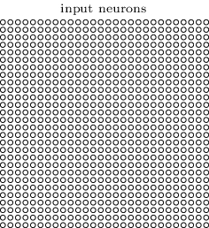
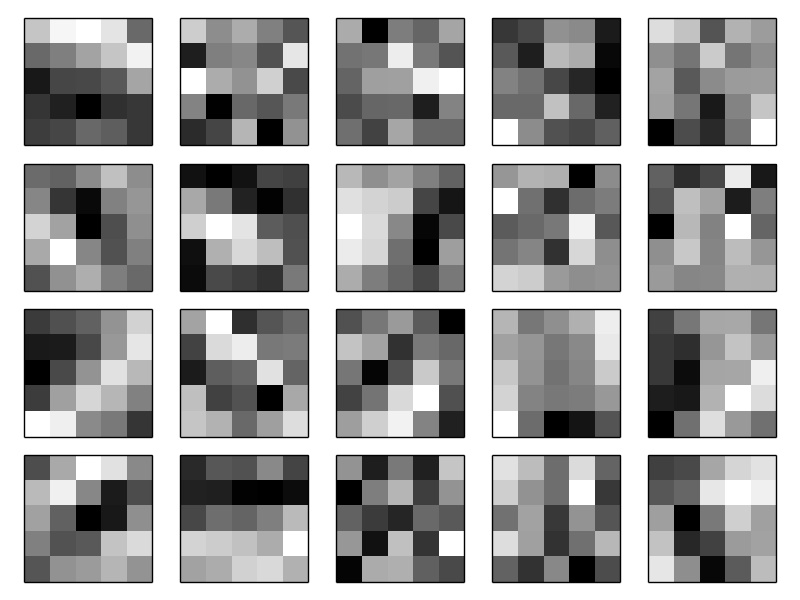

#Deep learning

In the [last chapter](http://neuralnetworksanddeeplearning.com/chap5.html) we learned that deep neural networks are often much harder to train than shallow neural networks. That's unfortunate, since we have good reason to believe that *if* we could train deep nets they'd be much more powerful than shallow nets. But while the news from the last chapter is discouraging, we won't let it stop us. In this chapter, we'll develop techniques which can be used to train deep networks, and apply them in practice. We'll also look at the broader picture, briefly reviewing recent progress on using deep nets for image recognition, speech recognition, and other applications. And we'll take a brief, speculative look at what the future may hold for neural nets, and for artificial intelligence.

The chapter is a long one. To help you navigate, let's take a tour. The sections are only loosely coupled, so provided you have some basic familiarity with neural nets, you can jump to whatever most interests you.

The [main part of the chapter](http://neuralnetworksanddeeplearning.com/chap6.html#convolutional_networks) is an introduction to one of the most widely used types of deep network: deep convolutional networks. We'll work through a detailed example - code and all - of using convolutional nets to solve the problem of classifying handwritten digits from the MNIST data set:

We'll start our account of convolutional networks with the shallow networks used to attack this problem earlier in the book. Through many iterations we'll build up more and more powerful networks. As we go we'll explore many powerful techniques: convolutions, pooling, the use of GPUs to do far more training than we did with our shallow networks, the algorithmic expansion of our training data (to reduce overfitting), the use of the dropout technique (also to reduce overfitting), the use of ensembles of networks, and others. The result will be a system that offers near-human performance. Of the 10,000 MNIST test images - images not seen during training! - our system will classify 9,967 correctly. Here's a peek at the 33 images which are misclassified. Note that the correct classification is in the top right; our program's classification is in the bottom right:

Many of these are tough even for a human to classify. Consider, for example, the third image in the top row. To me it looks more like a "9" than an "8", which is the official classification. Our network also thinks it's a "9". This kind of "error" is at the very least understandable, and perhaps even commendable. We conclude our discussion of image recognition with a [survey of some of the spectacular recent progress](http://neuralnetworksanddeeplearning.com/chap6.html#recent_progress_in_image_recognition) using networks (particularly convolutional nets) to do image recognition.

The remainder of the chapter discusses deep learning from a broader and less detailed perspective. We'll [briefly survey other models of neural networks](http://neuralnetworksanddeeplearning.com/chap6.html#things_we_didn't_cover_but_which_you'll_eventually_want_to_know), such as recurrent neural nets and long short-term memory units, and how such models can be applied to problems in speech recognition, natural language processing, and other areas. And we'll [speculate about the future of neural networks and deep learning](http://neuralnetworksanddeeplearning.com/chap6.html#on_the_future_of_neural_networks), ranging from ideas like intention-driven user interfaces, to the role of deep learning in artificial intelligence.

The chapter builds on the earlier chapters in the book, making use of and integrating ideas such as backpropagation, regularization, the softmax function, and so on. However, to read the chapter you don't need to have worked in detail through all the earlier chapters. It will, however, help to have read [Chapter 1](http://neuralnetworksanddeeplearning.com/chap1.html), on the basics of neural networks. When I use concepts from Chapters 2 to 5, I provide links so you can familiarize yourself, if necessary.

It's worth noting what the chapter is not. It's not a tutorial on the latest and greatest neural networks libraries. Nor are we going to be training deep networks with dozens of layers to solve problems at the very leading edge. Rather, the focus is on understanding some of the core principles behind deep neural networks, and applying them in the simple, easy-to-understand context of the MNIST problem. Put another way: the chapter is not going to bring you right up to the frontier. Rather, the intent of this and earlier chapters is to focus on fundamentals, and so to prepare you to understand a wide range of current work.

## Introducing convolutional networks

In earlier chapters, we taught our neural networks to do a pretty good job recognizing images of handwritten digits:

We did this using networks in which adjacent network layers are fully connected to one another. That is, every neuron in the network is connected to every neuron in adjacent layers:

In particular, for each pixel in the input image, we encoded the pixel's intensity as the value for a corresponding neuron in the input layer. For the 28×28 pixel images we've been using, this means our network has 784 (=28×28) input neurons. We then trained the network's weights and biases so that the network's output would - we hope! - correctly identify the input image: '0', '1', '2', ..., '8', or '9'.

Our earlier networks work pretty well: we've [obtained a classification accuracy better than 98 percent](http://neuralnetworksanddeeplearning.com/chap3.html#98percent), using training and test data from the[MNIST handwritten digit data set](http://neuralnetworksanddeeplearning.com/chap1.html#learning_with_gradient_descent). But upon reflection, it's strange to use networks with fully-connected layers to classify images. The reason is that such a network architecture does not take into account the spatial structure of the images. For instance, it treats input pixels which are far apart and close together on exactly the same footing. Such concepts of spatial structure must instead be inferred from the training data. But what if, instead of starting with a network architecture which is *tabula rasa*, we used an architecture which tries to take advantage of the spatial structure? In this section I describe *convolutional neural networks* *. These networks use a special architecture which is particularly well-adapted to classify images. Using this architecture makes convolutional networks fast to train. This, in turn, helps us train deep, many-layer networks, which are very good at classifying images. Today, deep convolutional networks or some close variant are used in most neural networks for image recognition.

> \* The origins of convolutional neural networks go back to the 1970s. But the seminal paper establishing the modern subject of convolutional networks was a 1998 paper, ["Gradient-based learning applied to document recognition"](http://yann.lecun.com/exdb/publis/pdf/lecun-98.pdf), by Yann LeCun, Léon Bottou, Yoshua Bengio, and Patrick Haffner. LeCun has since made an interesting [remark](https://www.facebook.com/yann.lecun/posts/10152348155137143) on the terminology for convolutional nets: "The [biological] neural inspiration in models like convolutional nets is very tenuous. That's why I call them 'convolutional nets' not 'convolutional neural nets', and why we call the nodes 'units' and not 'neurons' ". Despite this remark, convolutional nets use many of the same ideas as the neural networks we've studied up to now: ideas such as backpropagation, gradient descent, regularization, non-linear activation functions, and so on. And so we will follow common practice, and consider them a type of neural network. I will use the terms "convolutional neural network" and "convolutional net(work)" interchangeably. I will also use the terms "[artificial] neuron" and "unit" interchangeably.

Convolutional neural networks use three basic ideas: *local receptive fields*, *shared weights*, and *pooling*. Let's look at each of these ideas in turn.

**Local receptive fields:** In the fully-connected layers shown earlier, the inputs were depicted as a vertical line of neurons. In a convolutional net, it'll help to think instead of the inputs as a 28×2828×28 square of neurons, whose values correspond to the 28×2828×28 pixel intensities we're using as inputs:

As per usual, we'll connect the input pixels to a layer of hidden neurons. But we won't connect every input pixel to every hidden neuron. Instead, we only make connections in small, localized regions of the input image.

To be more precise, each neuron in the first hidden layer will be connected to a small region of the input neurons, say, for example, a 5×5 region, corresponding to 25 input pixels. So, for a particular hidden neuron, we might have connections that look like this:

That region in the input image is called the *local receptive field* for the hidden neuron. It's a little window on the input pixels. Each connection learns a weight. And the hidden neuron learns an overall bias as well. You can think of that particular hidden neuron as learning to analyze its particular local receptive field.

We then slide the local receptive field across the entire input image. For each local receptive field, there is a different hidden neuron in the first hidden layer. To illustrate this concretely, let's start with a local receptive field in the top-left corner:

Then we slide the local receptive field over by one pixel to the right (i.e., by one neuron), to connect to a second hidden neuron:

And so on, building up the first hidden layer. Note that if we have a 28×28 input image, and 5×5 local receptive fields, then there will be 24×24 neurons in the hidden layer. This is because we can only move the local receptive field 23 neurons across (or 23 neurons down), before colliding with the right-hand side (or bottom) of the input image.

I've shown the local receptive field being moved by one pixel at a time. In fact, sometimes a different *stride length* is used. For instance, we might move the local receptive field 2 pixels to the right (or down), in which case we'd say a stride length of 2 is used. In this chapter we'll mostly stick with stride length 1, but it's worth knowing that people sometimes experiment with different stride lengths *.

> \* As was done in earlier chapters, if we're interested in trying different stride lengths then we can use validation data to pick out the stride length which gives the best performance. For more details, see the[earlier discussion](http://neuralnetworksanddeeplearning.com/chap3.html#how_to_choose_a_neural_network's_hyper-parameters) of how to choose hyper-parameters in a neural network. The same approach may also be used to choose the size of the local receptive field - there is, of course, nothing special about using a 5×5 local receptive field. In general, larger local receptive fields tend to be helpful when the input images are significantly larger than the 28×28 pixel MNIST images.

**Shared weights and biases:** I've said that each hidden neuron has a bias and 5×5 weights connected to its local receptive field. What I did not yet mention is that we're going to use the *same* weights and bias for each of the 24×24 hidden neurons. In other words, for the $j,k$th hidden neuron, the output is:
$$
\sigma \biggl( b + \sum_{l=0}^4\sum_{m=0}^4 w_{l,m} a_{j+l,k+m} \biggr)  \tag{125}
$$
Here, $\sigma$ is the neural activation function - perhaps the [sigmoid function](http://neuralnetworksanddeeplearning.com/chap1.html#sigmoid_neurons) we used in earlier chapters. $b$ is the shared value for the bias. $w_{l,m}$ is a 5×5 array of shared weights. And, finally, we use $a_{x,y}$ to denote the input activation at position $x,y$.

This means that all the neurons in the first hidden layer detect exactly the same feature *, just at different locations in the input image. 

> \* I haven't precisely defined the notion of a feature. Informally, think of the feature detected by a hidden neuron as the kind of input pattern that will cause the neuron to activate: it might be an edge in the image, for instance, or maybe some other type of shape.

To see why this makes sense, suppose the weights and bias are such that the hidden neuron can pick out, say, a vertical edge in a particular local receptive field. That ability is also likely to be useful at other places in the image. And so it is useful to apply the same feature detector everywhere in the image. To put it in slightly more abstract terms, convolutional networks are well adapted to the translation invariance of images: move a picture of a cat (say) a little ways, and it's still an image of a cat *.

> \* In fact, for the MNIST digit classification problem we've been studying, the images are centered and size-normalized. So MNIST has less translation invariance than images found "in the wild", so to speak. Still, features like edges and corners are likely to be useful across much of the input space.

For this reason, we sometimes call the map from the input layer to the hidden layer a *feature map*. We call the weights defining the feature map the *shared weights*. And we call the bias defining the feature map in this way the *shared bias*. The shared weights and bias are often said to define a *kernel* or *filter*. In the literature, people sometimes use these terms in slightly different ways, and for that reason I'm not going to be more precise; rather, in a moment, we'll look at some concrete examples.

The network structure I've described so far can detect just a single kind of localized feature. To do image recognition we'll need more than one feature map. And so a complete convolutional layer consists of several different feature maps:

In the example shown, there are 3 feature maps. Each feature map is defined by a set of 5×5 shared weights, and a single shared bias. The result is that the network can detect 3 different kinds of features, with each feature being detectable across the entire image.

I've shown just 3 feature maps, to keep the diagram above simple. However, in practice convolutional networks may use more (and perhaps many more) feature maps. One of the early convolutional networks, LeNet-5, used 6 feature maps, each associated to a 5×5 local receptive field, to recognize MNIST digits. So the example illustrated above is actually pretty close to LeNet-5. In the examples we develop later in the chapter we'll use convolutional layers with 20 and 40 feature maps. Let's take a quick peek at some of the features which are learned * :

> \* The feature maps illustrated come from the final convolutional network we train, see [here](http://neuralnetworksanddeeplearning.com/chap6.html#final_conv).

The 20 images correspond to 20 different feature maps (or filters, or kernels). Each map is represented as a 5×5 block image, corresponding to the 5×5 weights in the local receptive field. Whiter blocks mean a smaller (typically, more negative) weight, so the feature map responds less to corresponding input pixels. Darker blocks mean a larger weight, so the feature map responds more to the corresponding input pixels. Very roughly speaking, the images above show the type of features the convolutional layer responds to.

So what can we conclude from these feature maps? It's clear there is spatial structure here beyond what we'd expect at random: many of the features have clear sub-regions of light and dark. That shows our network really is learning things related to the spatial structure. However, beyond that, it's difficult to see what these feature detectors are learning. Certainly, we're not learning (say) the [Gabor filters](http://en.wikipedia.org/wiki/Gabor_filter) which have been used in many traditional approaches to image recognition. In fact, there's now a lot of work on better understanding the features learnt by convolutional networks. If you're interested in following up on that work, I suggest starting with the paper [Visualizing and Understanding Convolutional Networks](http://arxiv.org/abs/1311.2901) by Matthew Zeiler and Rob Fergus (2013).

A big advantage of sharing weights and biases is that it greatly reduces the number of parameters involved in a convolutional network. For each feature map we need 25=5×5 shared weights, plus a single shared bias. So each feature map requires 26 parameters. If we have 20 feature maps that's a total of 20×26=520 parameters defining the convolutional layer. By comparison, suppose we had a fully connected first layer, with 784=28×28 input neurons, and a relatively modest 30 hidden neurons, as we used in many of the examples earlier in the book. That's a total of 784×30 weights, plus an extra 30 biases, for a total of 23,550 parameters. In other words, the fully-connected layer would have more than 40 times as many parameters as the convolutional layer.

Of course, we can't really do a direct comparison between the number of parameters, since the two models are different in essential ways. But, intuitively, it seems likely that the use of translation invariance by the convolutional layer will reduce the number of parameters it needs to get the same performance as the fully-connected model. That, in turn, will result in faster training for the convolutional model, and, ultimately, will help us build deep networks using convolutional layers.

Incidentally, the name *convolutional* comes from the fact that the operation in Equation (125) is sometimes known as a *convolution*. A little more precisely, people sometimes write that equation as $a^1=\sigma(b + w * a^0)$, where $a^1$ denotes the set of output activations from one feature map, $a^0$ is the set of input activations, and $∗$ is called a convolution operation. We're not going to make any deep use of the mathematics of convolutions, so you don't need to worry too much about this connection. But it's worth at least knowing where the name comes from.

**Pooling layers:** In addition to the convolutional layers just described, convolutional neural networks also contain *pooling layers*. Pooling layers are usually used immediately after convolutional layers. What the pooling layers do is simplify the information in the output from the convolutional layer.

In detail, a pooling layer takes each feature map * output from the convolutional layer and prepares a condensed feature map. 

>\* The nomenclature is being used loosely here. In particular, I'm using "feature map" to mean not the function computed by the convolutional layer, but rather the activation of the hidden neurons output from the layer. This kind of mild abuse of nomenclature is pretty common in the research literature.

For instance, each unit in the pooling layer may summarize a region of (say) 2×2 neurons in the previous layer. As a concrete example, one common procedure for pooling is known as *max-pooling*. In max-pooling, a pooling unit simply outputs the maximum activation in the 2×2 input region, as illustrated in the following diagram:

Note that since we have 24×24 neurons output from the convolutional layer, after pooling we have 12×12 neurons.

As mentioned above, the convolutional layer usually involves more than a single feature map. We apply max-pooling to each feature map separately. So if there were three feature maps, the combined convolutional and max-pooling layers would look like:

We can think of max-pooling as a way for the network to ask whether a given feature is found anywhere in a region of the image. It then throws away the exact positional information. The intuition is that once a feature has been found, its exact location isn't as important as its rough location relative to other features. A big benefit is that there are many fewer pooled features, and so this helps reduce the number of parameters needed in later layers.

Max-pooling isn't the only technique used for pooling. Another common approach is known as *L2 pooling*. Here, instead of taking the maximum activation of a 2×2 region of neurons, we take the square root of the sum of the squares of the activations in the 2×2 region. While the details are different, the intuition is similar to max-pooling: L2 pooling is a way of condensing information from the convolutional layer. In practice, both techniques have been widely used. And sometimes people use other types of pooling operation. If you're really trying to optimize performance, you may use validation data to compare several different approaches to pooling, and choose the approach which works best. But we're not going to worry about that kind of detailed optimization.

**Putting it all together:** We can now put all these ideas together to form a complete convolutional neural network. It's similar to the architecture we were just looking at, but has the addition of a layer of 10 output neurons, corresponding to the 10 possible values for MNIST digits ('0', '1', '2', *etc*):

The network begins with 28×28 input neurons, which are used to encode the pixel intensities for the MNIST image. This is then followed by a convolutional layer using a 5×5 local receptive field and 3 feature maps. The result is a layer of 3×24×24 hidden feature neurons. The next step is a max-pooling layer, applied to 2×2 regions, across each of the 33feature maps. The result is a layer of 3×12×12 hidden feature neurons.

The final layer of connections in the network is a fully-connected layer. That is, this layer connects *every* neuron from the max-pooled layer to every one of the 10 output neurons. This fully-connected architecture is the same as we used in earlier chapters. Note, however, that in the diagram above, I've used a single arrow, for simplicity, rather than showing all the connections. Of course, you can easily imagine the connections.

This convolutional architecture is quite different to the architectures used in earlier chapters. But the overall picture is similar: a network made of many simple units, whose behaviors are determined by their weights and biases. And the overall goal is still the same: to use training data to train the network's weights and biases so that the network does a good job classifying input digits.

In particular, just as earlier in the book, we will train our network using stochastic gradient descent and backpropagation. This mostly proceeds in exactly the same way as in earlier chapters. However, we do need to make a few modifications to the backpropagation procedure. The reason is that our earlier [derivation of backpropagation](http://neuralnetworksanddeeplearning.com/chap2.html) was for networks with fully-connected layers. Fortunately, it's straightforward to modify the derivation for convolutional and max-pooling layers. If you'd like to understand the details, then I invite you to work through the following problem. Be warned that the problem will take some time to work through, unless you've really internalized the [earlier derivation of backpropagation](http://neuralnetworksanddeeplearning.com/chap2.html) (in which case it's easy).

#### [Problem](http://neuralnetworksanddeeplearning.com/chap6.html#problem_214396)

- **Backpropagation in a convolutional network** The core equations of backpropagation in a network with fully-connected layers are (BP1)-(BP4) ([link](http://neuralnetworksanddeeplearning.com/chap2.html#backpropsummary)). Suppose we have a network containing a convolutional layer, a max-pooling layer, and a fully-connected output layer, as in the network discussed above. How are the equations of backpropagation modified?
  > BP1:        $ \delta_j^L = \frac{\partial C}{\partial a_j^L} \sigma'(z_j^L)$
  >
  > BP4:        $\frac{\partial C}{\partial w_{jk}^l} = a_k^{l-1} \delta_j^l$

### Convolutional neural networks in practice