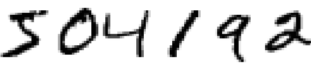
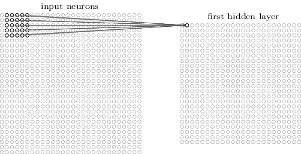
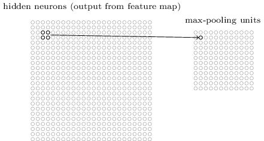
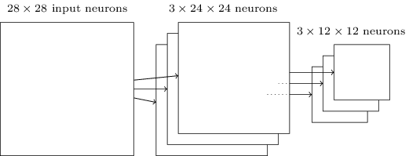

#Deep learning

In the [last chapter](http://neuralnetworksanddeeplearning.com/chap5.html) we learned that deep neural networks are often much harder to train than shallow neural networks. That's unfortunate, since we have good reason to believe that *if* we could train deep nets they'd be much more powerful than shallow nets. But while the news from the last chapter is discouraging, we won't let it stop us. In this chapter, we'll develop techniques which can be used to train deep networks, and apply them in practice. We'll also look at the broader picture, briefly reviewing recent progress on using deep nets for image recognition, speech recognition, and other applications. And we'll take a brief, speculative look at what the future may hold for neural nets, and for artificial intelligence.

The chapter is a long one. To help you navigate, let's take a tour. The sections are only loosely coupled, so provided you have some basic familiarity with neural nets, you can jump to whatever most interests you.

The [main part of the chapter](http://neuralnetworksanddeeplearning.com/chap6.html#convolutional_networks) is an introduction to one of the most widely used types of deep network: deep convolutional networks. We'll work through a detailed example - code and all - of using convolutional nets to solve the problem of classifying handwritten digits from the MNIST data set:



We'll start our account of convolutional networks with the shallow networks used to attack this problem earlier in the book. Through many iterations we'll build up more and more powerful networks. As we go we'll explore many powerful techniques: convolutions, pooling, the use of GPUs to do far more training than we did with our shallow networks, the algorithmic expansion of our training data (to reduce overfitting), the use of the dropout technique (also to reduce overfitting), the use of ensembles of networks, and others. The result will be a system that offers near-human performance. Of the 10,000 MNIST test images - images not seen during training! - our system will classify 9,967 correctly. Here's a peek at the 33 images which are misclassified. Note that the correct classification is in the top right; our program's classification is in the bottom right:


Many of these are tough even for a human to classify. Consider, for example, the third image in the top row. To me it looks more like a "9" than an "8", which is the official classification. Our network also thinks it's a "9". This kind of "error" is at the very least understandable, and perhaps even commendable. We conclude our discussion of image recognition with a [survey of some of the spectacular recent progress](http://neuralnetworksanddeeplearning.com/chap6.html#recent_progress_in_image_recognition) using networks (particularly convolutional nets) to do image recognition.

The remainder of the chapter discusses deep learning from a broader and less detailed perspective. We'll [briefly survey other models of neural networks](http://neuralnetworksanddeeplearning.com/chap6.html#things_we_didn't_cover_but_which_you'll_eventually_want_to_know), such as recurrent neural nets and long short-term memory units, and how such models can be applied to problems in speech recognition, natural language processing, and other areas. And we'll [speculate about the future of neural networks and deep learning](http://neuralnetworksanddeeplearning.com/chap6.html#on_the_future_of_neural_networks), ranging from ideas like intention-driven user interfaces, to the role of deep learning in artificial intelligence.

The chapter builds on the earlier chapters in the book, making use of and integrating ideas such as backpropagation, regularization, the softmax function, and so on. However, to read the chapter you don't need to have worked in detail through all the earlier chapters. It will, however, help to have read [Chapter 1](http://neuralnetworksanddeeplearning.com/chap1.html), on the basics of neural networks. When I use concepts from Chapters 2 to 5, I provide links so you can familiarize yourself, if necessary.

It's worth noting what the chapter is not. It's not a tutorial on the latest and greatest neural networks libraries. Nor are we going to be training deep networks with dozens of layers to solve problems at the very leading edge. Rather, the focus is on understanding some of the core principles behind deep neural networks, and applying them in the simple, easy-to-understand context of the MNIST problem. Put another way: the chapter is not going to bring you right up to the frontier. Rather, the intent of this and earlier chapters is to focus on fundamentals, and so to prepare you to understand a wide range of current work.

## Introducing convolutional networks

In earlier chapters, we taught our neural networks to do a pretty good job recognizing images of handwritten digits:


We did this using networks in which adjacent network layers are fully connected to one another. That is, every neuron in the network is connected to every neuron in adjacent layers:


In particular, for each pixel in the input image, we encoded the pixel's intensity as the value for a corresponding neuron in the input layer. For the 28×28 pixel images we've been using, this means our network has 784 (=28×28) input neurons. We then trained the network's weights and biases so that the network's output would - we hope! - correctly identify the input image: '0', '1', '2', ..., '8', or '9'.

Our earlier networks work pretty well: we've [obtained a classification accuracy better than 98 percent](http://neuralnetworksanddeeplearning.com/chap3.html#98percent), using training and test data from the[MNIST handwritten digit data set](http://neuralnetworksanddeeplearning.com/chap1.html#learning_with_gradient_descent). But upon reflection, it's strange to use networks with fully-connected layers to classify images. The reason is that such a network architecture does not take into account the spatial structure of the images. For instance, it treats input pixels which are far apart and close together on exactly the same footing. Such concepts of spatial structure must instead be inferred from the training data. But what if, instead of starting with a network architecture which is *tabula rasa*, we used an architecture which tries to take advantage of the spatial structure? In this section I describe *convolutional neural networks* *. These networks use a special architecture which is particularly well-adapted to classify images. Using this architecture makes convolutional networks fast to train. This, in turn, helps us train deep, many-layer networks, which are very good at classifying images. Today, deep convolutional networks or some close variant are used in most neural networks for image recognition.

> The origins of convolutional neural networks go back to the 1970s. But the seminal paper establishing the modern subject of convolutional networks was a 1998 paper, ["Gradient-based learning applied to document recognition"](http://yann.lecun.com/exdb/publis/pdf/lecun-98.pdf), by Yann LeCun, Léon Bottou, Yoshua Bengio, and Patrick Haffner. LeCun has since made an interesting [remark](https://www.facebook.com/yann.lecun/posts/10152348155137143) on the terminology for convolutional nets: "The [biological] neural inspiration in models like convolutional nets is very tenuous. That's why I call them 'convolutional nets' not 'convolutional neural nets', and why we call the nodes 'units' and not 'neurons' ". Despite this remark, convolutional nets use many of the same ideas as the neural networks we've studied up to now: ideas such as backpropagation, gradient descent, regularization, non-linear activation functions, and so on. And so we will follow common practice, and consider them a type of neural network. I will use the terms "convolutional neural network" and "convolutional net(work)" interchangeably. I will also use the terms "[artificial] neuron" and "unit" interchangeably.

Convolutional neural networks use three basic ideas: *local receptive fields*, *shared weights*, and *pooling*. Let's look at each of these ideas in turn.

**Local receptive fields:** In the fully-connected layers shown earlier, the inputs were depicted as a vertical line of neurons. In a convolutional net, it'll help to think instead of the inputs as a 28×2828×28 square of neurons, whose values correspond to the 28×2828×28 pixel intensities we're using as inputs:


As per usual, we'll connect the input pixels to a layer of hidden neurons. But we won't connect every input pixel to every hidden neuron. Instead, we only make connections in small, localized regions of the input image.

To be more precise, each neuron in the first hidden layer will be connected to a small region of the input neurons, say, for example, a 5×5 region, corresponding to 25 input pixels. So, for a particular hidden neuron, we might have connections that look like this:


That region in the input image is called the *local receptive field* for the hidden neuron. It's a little window on the input pixels. Each connection learns a weight. And the hidden neuron learns an overall bias as well. You can think of that particular hidden neuron as learning to analyze its particular local receptive field.

We then slide the local receptive field across the entire input image. For each local receptive field, there is a different hidden neuron in the first hidden layer. To illustrate this concretely, let's start with a local receptive field in the top-left corner:


Then we slide the local receptive field over by one pixel to the right (i.e., by one neuron), to connect to a second hidden neuron:




And so on, building up the first hidden layer. Note that if we have a 28×28 input image, and 5×5 local receptive fields, then there will be 24×24 neurons in the hidden layer. This is because we can only move the local receptive field 23 neurons across (or 23 neurons down), before colliding with the right-hand side (or bottom) of the input image.

I've shown the local receptive field being moved by one pixel at a time. In fact, sometimes a different *stride length* is used. For instance, we might move the local receptive field 2 pixels to the right (or down), in which case we'd say a stride length of 2 is used. In this chapter we'll mostly stick with stride length 1, but it's worth knowing that people sometimes experiment with different stride lengths *.

> As was done in earlier chapters, if we're interested in trying different stride lengths then we can use validation data to pick out the stride length which gives the best performance. For more details, see the[earlier discussion](http://neuralnetworksanddeeplearning.com/chap3.html#how_to_choose_a_neural_network's_hyper-parameters) of how to choose hyper-parameters in a neural network. The same approach may also be used to choose the size of the local receptive field - there is, of course, nothing special about using a 5×5 local receptive field. In general, larger local receptive fields tend to be helpful when the input images are significantly larger than the 28×28 pixel MNIST images.

**Shared weights and biases:** I've said that each hidden neuron has a bias and 5×5 weights connected to its local receptive field. What I did not yet mention is that we're going to use the *same* weights and bias for each of the 24×24 hidden neurons. In other words, for the $j,k$th hidden neuron, the output is:
$$
\sigma \biggl( b + \sum_{l=0}^4\sum_{m=0}^4 w_{l,m} a_{j+l,k+m} \biggr)  \tag{125}
$$
Here, $\sigma$ is the neural activation function - perhaps the [sigmoid function](http://neuralnetworksanddeeplearning.com/chap1.html#sigmoid_neurons) we used in earlier chapters. $b$ is the shared value for the bias. $w_{l,m}$ is a 5×5 array of shared weights. And, finally, we use $a_{x,y}$ to denote the input activation at position $x,y$.

This means that all the neurons in the first hidden layer detect exactly the same feature *, just at different locations in the input image. 

> I haven't precisely defined the notion of a feature. Informally, think of the feature detected by a hidden neuron as the kind of input pattern that will cause the neuron to activate: it might be an edge in the image, for instance, or maybe some other type of shape.

To see why this makes sense, suppose the weights and bias are such that the hidden neuron can pick out, say, a vertical edge in a particular local receptive field. That ability is also likely to be useful at other places in the image. And so it is useful to apply the same feature detector everywhere in the image. To put it in slightly more abstract terms, convolutional networks are well adapted to the translation invariance of images: move a picture of a cat (say) a little ways, and it's still an image of a cat *.

> In fact, for the MNIST digit classification problem we've been studying, the images are centered and size-normalized. So MNIST has less translation invariance than images found "in the wild", so to speak. Still, features like edges and corners are likely to be useful across much of the input space.

For this reason, we sometimes call the map from the input layer to the hidden layer a *feature map*. We call the weights defining the feature map the *shared weights*. And we call the bias defining the feature map in this way the *shared bias*. The shared weights and bias are often said to define a *kernel* or *filter*. In the literature, people sometimes use these terms in slightly different ways, and for that reason I'm not going to be more precise; rather, in a moment, we'll look at some concrete examples.

The network structure I've described so far can detect just a single kind of localized feature. To do image recognition we'll need more than one feature map. And so a complete convolutional layer consists of several different feature maps:


In the example shown, there are 3 feature maps. Each feature map is defined by a set of 5×5 shared weights, and a single shared bias. The result is that the network can detect 3 different kinds of features, with each feature being detectable across the entire image.

I've shown just 3 feature maps, to keep the diagram above simple. However, in practice convolutional networks may use more (and perhaps many more) feature maps. One of the early convolutional networks, LeNet-5, used 6 feature maps, each associated to a 5×5 local receptive field, to recognize MNIST digits. So the example illustrated above is actually pretty close to LeNet-5. In the examples we develop later in the chapter we'll use convolutional layers with 20 and 40 feature maps. Let's take a quick peek at some of the features which are learned * :

> The feature maps illustrated come from the final convolutional network we train, see [here](http://neuralnetworksanddeeplearning.com/chap6.html#final_conv).


The 20 images correspond to 20 different feature maps (or filters, or kernels). Each map is represented as a 5×5 block image, corresponding to the 5×5 weights in the local receptive field. Whiter blocks mean a smaller (typically, more negative) weight, so the feature map responds less to corresponding input pixels. Darker blocks mean a larger weight, so the feature map responds more to the corresponding input pixels. Very roughly speaking, the images above show the type of features the convolutional layer responds to.

So what can we conclude from these feature maps? It's clear there is spatial structure here beyond what we'd expect at random: many of the features have clear sub-regions of light and dark. That shows our network really is learning things related to the spatial structure. However, beyond that, it's difficult to see what these feature detectors are learning. Certainly, we're not learning (say) the [Gabor filters](http://en.wikipedia.org/wiki/Gabor_filter) which have been used in many traditional approaches to image recognition. In fact, there's now a lot of work on better understanding the features learnt by convolutional networks. If you're interested in following up on that work, I suggest starting with the paper [Visualizing and Understanding Convolutional Networks](http://arxiv.org/abs/1311.2901) by Matthew Zeiler and Rob Fergus (2013).

A big advantage of sharing weights and biases is that it greatly reduces the number of parameters involved in a convolutional network. For each feature map we need 25=5×5 shared weights, plus a single shared bias. So each feature map requires 26 parameters. If we have 20 feature maps that's a total of 20×26=520 parameters defining the convolutional layer. By comparison, suppose we had a fully connected first layer, with 784=28×28 input neurons, and a relatively modest 30 hidden neurons, as we used in many of the examples earlier in the book. That's a total of 784×30 weights, plus an extra 30 biases, for a total of 23,550 parameters. In other words, the fully-connected layer would have more than 40 times as many parameters as the convolutional layer.

Of course, we can't really do a direct comparison between the number of parameters, since the two models are different in essential ways. But, intuitively, it seems likely that the use of translation invariance by the convolutional layer will reduce the number of parameters it needs to get the same performance as the fully-connected model. That, in turn, will result in faster training for the convolutional model, and, ultimately, will help us build deep networks using convolutional layers.

Incidentally, the name *convolutional* comes from the fact that the operation in Equation (125) is sometimes known as a *convolution*. A little more precisely, people sometimes write that equation as $a^1=\sigma(b + w * a^0)$, where $a^1$ denotes the set of output activations from one feature map, $a^0$ is the set of input activations, and $∗$ is called a convolution operation. We're not going to make any deep use of the mathematics of convolutions, so you don't need to worry too much about this connection. But it's worth at least knowing where the name comes from.

**Pooling layers:** In addition to the convolutional layers just described, convolutional neural networks also contain *pooling layers*. Pooling layers are usually used immediately after convolutional layers. What the pooling layers do is simplify the information in the output from the convolutional layer.

In detail, a pooling layer takes each feature map * output from the convolutional layer and prepares a condensed feature map. 

>The nomenclature is being used loosely here. In particular, I'm using "feature map" to mean not the function computed by the convolutional layer, but rather the activation of the hidden neurons output from the layer. This kind of mild abuse of nomenclature is pretty common in the research literature.

For instance, each unit in the pooling layer may summarize a region of (say) 2×2 neurons in the previous layer. As a concrete example, one common procedure for pooling is known as *max-pooling*. In max-pooling, a pooling unit simply outputs the maximum activation in the 2×2 input region, as illustrated in the following diagram:




Note that since we have 24×24 neurons output from the convolutional layer, after pooling we have 12×12 neurons.

As mentioned above, the convolutional layer usually involves more than a single feature map. We apply max-pooling to each feature map separately. So if there were three feature maps, the combined convolutional and max-pooling layers would look like:




We can think of max-pooling as a way for the network to ask whether a given feature is found anywhere in a region of the image. It then throws away the exact positional information. The intuition is that once a feature has been found, its exact location isn't as important as its rough location relative to other features. A big benefit is that there are many fewer pooled features, and so this helps reduce the number of parameters needed in later layers.

Max-pooling isn't the only technique used for pooling. Another common approach is known as *L2 pooling*. Here, instead of taking the maximum activation of a 2×2 region of neurons, we take the square root of the sum of the squares of the activations in the 2×2 region. While the details are different, the intuition is similar to max-pooling: L2 pooling is a way of condensing information from the convolutional layer. In practice, both techniques have been widely used. And sometimes people use other types of pooling operation. If you're really trying to optimize performance, you may use validation data to compare several different approaches to pooling, and choose the approach which works best. But we're not going to worry about that kind of detailed optimization.

**Putting it all together:** We can now put all these ideas together to form a complete convolutional neural network. It's similar to the architecture we were just looking at, but has the addition of a layer of 10 output neurons, corresponding to the 10 possible values for MNIST digits ('0', '1', '2', *etc*):


The network begins with 28×28 input neurons, which are used to encode the pixel intensities for the MNIST image. This is then followed by a convolutional layer using a 5×5 local receptive field and 3 feature maps. The result is a layer of 3×24×24 hidden feature neurons. The next step is a max-pooling layer, applied to 2×2 regions, across each of the 33feature maps. The result is a layer of 3×12×12 hidden feature neurons.

The final layer of connections in the network is a fully-connected layer. That is, this layer connects *every* neuron from the max-pooled layer to every one of the 10 output neurons. This fully-connected architecture is the same as we used in earlier chapters. Note, however, that in the diagram above, I've used a single arrow, for simplicity, rather than showing all the connections. Of course, you can easily imagine the connections.

This convolutional architecture is quite different to the architectures used in earlier chapters. But the overall picture is similar: a network made of many simple units, whose behaviors are determined by their weights and biases. And the overall goal is still the same: to use training data to train the network's weights and biases so that the network does a good job classifying input digits.

In particular, just as earlier in the book, we will train our network using stochastic gradient descent and backpropagation. This mostly proceeds in exactly the same way as in earlier chapters. However, we do need to make a few modifications to the backpropagation procedure. The reason is that our earlier [derivation of backpropagation](http://neuralnetworksanddeeplearning.com/chap2.html) was for networks with fully-connected layers. Fortunately, it's straightforward to modify the derivation for convolutional and max-pooling layers. If you'd like to understand the details, then I invite you to work through the following problem. Be warned that the problem will take some time to work through, unless you've really internalized the [earlier derivation of backpropagation](http://neuralnetworksanddeeplearning.com/chap2.html) (in which case it's easy).

#### Problem

- **Backpropagation in a convolutional network** The core equations of backpropagation in a network with fully-connected layers are (BP1)-(BP4) ([link](http://neuralnetworksanddeeplearning.com/chap2.html#backpropsummary)). Suppose we have a network containing a convolutional layer, a max-pooling layer, and a fully-connected output layer, as in the network discussed above. How are the equations of backpropagation modified?
  > BP1:        $ \delta_j^L = \frac{\partial C}{\partial a_j^L} \sigma'(z_j^L)$
  >
  > BP4:        $\frac{\partial C}{\partial w_{jk}^l} = a_k^{l-1} \delta_j^l$


## Convolutional neural networks in practice

We've now seen the core ideas behind convolutional neural networks. Let's look at how they work in practice, by implementing some convolutional networks, and applying them to the MNIST digit classification problem. The program we'll use to do this is called `network3.py`, and it's an improved version of the programs `network.py` and `network2.py`developed in earlier chapters *. If you wish to follow along, the code is available [on GitHub](https://github.com/mnielsen/neural-networks-and-deep-learning/blob/master/src/network3.py). Note that we'll work through the code for`network3.py` itself in the next section. In this section, we'll use `network3.py` as a library to build convolutional networks.

> Note also that `network3.py` incorporates ideas from the Theano library's documentation on convolutional neural nets (notably the implementation of [LeNet-5](http://deeplearning.net/tutorial/lenet.html)), from Misha Denil's [implementation of dropout](https://github.com/mdenil/dropout), and from [Chris Olah](http://colah.github.io/).

The programs `network.py` and `network2.py` were implemented using Python and the matrix library Numpy. Those programs worked from first principles, and got right down into the details of backpropagation, stochastic gradient descent, and so on. But now that we understand those details, for `network3.py` we're going to use a machine learning library known as [Theano](http://deeplearning.net/software/theano/)*.  Using Theano makes it easy to implement backpropagation for convolutional neural networks, since it automatically computes all the mappings involved. Theano is also quite a bit faster than our earlier code (which was written to be easy to understand, not fast), and this makes it practical to train more complex networks. In particular, one great feature of Theano is that it can run code on either a CPU or, if available, a GPU. Running on a GPU provides a substantial speedup and, again, helps make it practical to train more complex networks.

> See [Theano: A CPU and GPU Math Expression Compiler in Python](http://www.iro.umontreal.ca/~lisa/pointeurs/theano_scipy2010.pdf), by James Bergstra, Olivier Breuleux, Frederic Bastien, Pascal Lamblin, Ravzan Pascanu, Guillaume Desjardins, Joseph Turian, David Warde-Farley, and Yoshua Bengio (2010). Theano is also the basis for the popular [Pylearn2](http://deeplearning.net/software/pylearn2/) and [Keras](http://keras.io/) neural networks libraries. Other popular neural nets libraries at the time of this writing include [Caffe](http://caffe.berkeleyvision.org/) and [Torch](http://torch.ch/).

If you wish to follow along, then you'll need to get Theano running on your system. To install Theano, follow the instructions at the project's [homepage](http://deeplearning.net/software/theano/). The examples which follow were run using Theano 0.6*. Some were run under Mac OS X Yosemite, with no GPU. Some were run on Ubuntu 14.04, with an NVIDIA GPU. And some of the experiments were run under both. To get `network3.py` running you'll need to set the `GPU` flag to either `True` or `False` (as appropriate) in the `network3.py` source. Beyond that, to get Theano up and running on a GPU you may find [the instructions here](http://deeplearning.net/software/theano/tutorial/using_gpu.html) helpful. There are also tutorials on the web, easily found using Google, which can help you get things working. If you don't have a GPU available locally, then you may wish to look into [Amazon Web Services](http://aws.amazon.com/ec2/instance-types/) EC2 G2 spot instances. Note that even with a GPU the code will take some time to execute. Many of the experiments take from minutes to hours to run. On a CPU it may take days to run the most complex of the experiments. As in earlier chapters, I suggest setting things running, and continuing to read, occasionally coming back to check the output from the code. If you're using a CPU, you may wish to reduce the number of training epochs for the more complex experiments, or perhaps omit them entirely.

> As I release this chapter, the current version of Theano has changed to version 0.7. I've actually rerun the examples under Theano 0.7 and get extremely similar results to those reported in the text.

To get a baseline, we'll start with a shallow architecture using just a single hidden layer, containing 100 hidden neurons. We'll train for 60 epochs, using a learning rate of $\eta = 0.1$, a mini-batch size of 10, and no regularization. Here we go*:

```python
>>> import network3
>>> from network3 import Network
>>> from network3 import ConvPoolLayer, FullyConnectedLayer, SoftmaxLayer
>>> training_data, validation_data, test_data = network3.load_data_shared()
>>> mini_batch_size = 10
>>> net = Network([
        FullyConnectedLayer(n_in=784, n_out=100),
        SoftmaxLayer(n_in=100, n_out=10)], mini_batch_size)
>>> net.SGD(training_data, 60, mini_batch_size, 0.1, 
            validation_data, test_data)
```

> Code for the experiments in this section may be found [in this script](https://github.com/mnielsen/neural-networks-and-deep-learning/blob/master/src/conv.py). Note that the code in the script simply duplicates and parallels the discussion in this section.
>
> Note also that throughout the section I've explicitly specified the number of training epochs. I've done this for clarity about how we're training. In practice, it's worth using [early stopping](http://neuralnetworksanddeeplearning.com/chap3.html#early_stopping), that is, tracking accuracy on the validation set, and stopping training when we are confident the validation accuracy has stopped improving.

I obtained a best classification accuracy of 97.80 percent. This is the classification accuracy on the `test_data`, evaluated at the training epoch where we get the best classification accuracy on the `validation_data`. Using the validation data to decide when to evaluate the test accuracy helps avoid overfitting to the test data (see this [earlier discussion](http://neuralnetworksanddeeplearning.com/chap3.html#validation_explanation) of the use of validation data). We will follow this practice below. Your results may vary slightly, since the network's weights and biases are randomly initialized*.

> In fact, in this experiment I actually did three separate runs training a network with this architecture. I then reported the test accuracy which corresponded to the best validation accuracy from any of the three runs. Using multiple runs helps reduce variation in results, which is useful when comparing many architectures, as we are doing. I've followed this procedure below, except where noted. In practice, it made little difference to the results obtained.

This 97.80 percent accuracy is close to the 98.04 percent accuracy obtained back in [Chapter 3](http://neuralnetworksanddeeplearning.com/chap3.html#chap3_98_04_percent), using a similar network architecture and learning hyper-parameters. In particular, both examples used a shallow network, with a single hidden layer containing 100 hidden neurons. Both also trained for 60 epochs, used a mini-batch size of 10, and a learning rate of $\eta = 0.1$.

There were, however, two differences in the earlier network. First, we [regularized](http://neuralnetworksanddeeplearning.com/chap3.html#overfitting_and_regularization) the earlier network, to help reduce the effects of overfitting. Regularizing the current network does improve the accuracies, but the gain is only small, and so we'll hold off worrying about regularization until later. Second, while the final layer in the earlier network used sigmoid activations and the cross-entropy cost function, the current network uses a softmax final layer, and the log-likelihood cost function. As [explained](http://neuralnetworksanddeeplearning.com/chap3.html#softmax) in Chapter 3 this isn't a big change. I haven't made this switch for any particularly deep reason - mostly, I've done it because softmax plus log-likelihood cost is more common in modern image classification networks.

Can we do better than these results using a deeper network architecture?

Let's begin by inserting a convolutional layer, right at the beginning of the network. We'll use 5 by 5 local receptive fields, a stride length of 1, and 20 feature maps. We'll also insert a max-pooling layer, which combines the features using 2 by 2 pooling windows. So the overall network architecture looks much like the architecture discussed in the last section, but with an extra fully-connected layer:


In this architecture, we can think of the convolutional and pooling layers as learning about local spatial structure in the input training image, while the later, fully-connected layer learns at a more abstract level, integrating global information from across the entire image. This is a common pattern in convolutional neural networks.

Let's train such a network, and see how it performs*:

```python
>>> net = Network([
        ConvPoolLayer(image_shape=(mini_batch_size, 1, 28, 28), 
                      filter_shape=(20, 1, 5, 5), 
                      poolsize=(2, 2)),
        FullyConnectedLayer(n_in=20*12*12, n_out=100),
        SoftmaxLayer(n_in=100, n_out=10)], mini_batch_size)
>>> net.SGD(training_data, 60, mini_batch_size, 0.1, 
            validation_data, test_data)   
```

> I've continued to use a mini-batch size of 10 here. In fact, as we [discussed earlier](http://neuralnetworksanddeeplearning.com/chap3.html#mini_batch_size) it may be possible to speed up training using larger mini-batches. I've continued to use the same mini-batch size mostly for consistency with the experiments in earlier chapters.

That gets us to 98.78 percent accuracy, which is a considerable improvement over any of our previous results. Indeed, we've reduced our error rate by better than a third, which is a great improvement.

In specifying the network structure, I've treated the convolutional and pooling layers as a single layer. Whether they're regarded as separate layers or as a single layer is to some extent a matter of taste. `network3.py`treats them as a single layer because it makes the code for `network3.py` a little more compact. However, it is easy to modify `network3.py` so the layers can be specified separately, if desired.

#### Exercise

- What classification accuracy do you get if you omit the fully-connected layer, and just use the convolutional-pooling layer and softmax layer? Does the inclusion of the fully-connected layer help?

Can we improve on the 98.78 percent classification accuracy?

Let's try inserting a second convolutional-pooling layer. We'll make the insertion between the existing convolutional-pooling layer and the fully-connected hidden layer. Again, we'll use a 5×5 local receptive field, and pool over 2×2 regions. Let's see what happens when we train using similar hyper-parameters to before:

```python
>>> net = Network([
        ConvPoolLayer(image_shape=(mini_batch_size, 1, 28, 28), 
                      filter_shape=(20, 1, 5, 5), 
                      poolsize=(2, 2)),
        ConvPoolLayer(image_shape=(mini_batch_size, 20, 12, 12), 
                      filter_shape=(40, 20, 5, 5), 
                      poolsize=(2, 2)),
        FullyConnectedLayer(n_in=40*4*4, n_out=100),
        SoftmaxLayer(n_in=100, n_out=10)], mini_batch_size)
>>> net.SGD(training_data, 60, mini_batch_size, 0.1, 
            validation_data, test_data)        
```

Once again, we get an improvement: we're now at 99.06 percent classification accuracy!

There's two natural questions to ask at this point. The first question is: what does it even mean to apply a second convolutional-pooling layer? In fact, you can think of the second convolutional-pooling layer as having as input 12×12 "images", whose "pixels" represent the presence (or absence) of particular localized features in the original input image. So you can think of this layer as having as input a version of the original input image. That version is abstracted and condensed, but still has a lot of spatial structure, and so it makes sense to use a second convolutional-pooling layer.

That's a satisfying point of view, but gives rise to a second question. The output from the previous layer involves 20 separate feature maps, and so there are 20×12×12 inputs to the second convolutional-pooling layer. It's as though we've got 20 separate images input to the convolutional-pooling layer, not a single image, as was the case for the first convolutional-pooling layer. How should neurons in the second convolutional-pooling layer respond to these multiple input images? In fact, we'll allow each neuron in this layer to learn from *all* 20×5×5 input neurons in its local receptive field. More informally: the feature detectors in the second convolutional-pooling layer have access to *all* the features from the previous layer, but only within their particular local receptive field *.

> This issue would have arisen in the first layer if the input images were in color. In that case we'd have 3 input features for each pixel, corresponding to red, green and blue channels in the input image. So we'd allow the feature detectors to have access to all color information, but only within a given local receptive field.

#### Problem

* **Using the tanh activation function** Several times earlier in the book I've mentioned arguments that the [tanh function](http://neuralnetworksanddeeplearning.com/chap3.html#other_models_of_artificial_neuron) may be a better activation function than the sigmoid function. We've never acted on those suggestions, since we were already making plenty of progress with the sigmoid. But now let's try some experiments with tanh as our activation function. Try training the network with tanh activations in the convolutional and fully-connected layers *.

* > Note that you can pass `activation_fn=tanh`as a parameter to the `ConvPoolLayer` and `FullyConnectedLayer` classes.

  Begin with the same hyper-parameters as for the sigmoid network, but train for 20 epochs instead of 60. How well does your network perform? What if you continue out to 60 epochs? Try plotting the per-epoch validation accuracies for both tanh- and sigmoid-based networks, all the way out to 60 epochs. If your results are similar to mine, you'll find the tanh networks train a little faster, but the final accuracies are very similar. Can you explain why the tanh network might train faster? Can you get a similar training speed with the sigmoid, perhaps by changing the learning rate, or doing some rescaling *?

  > You may perhaps find inspiration in recalling that  $\sigma(z) = \frac{1 + \text{tanh}(\frac{z}{2})}{2}$

  Try a half-dozen iterations on the learning hyper-parameters or network architecture, searching for ways that tanh may be superior to the sigmoid. *Note: This is an open-ended problem. Personally, I did not find much advantage in switching to tanh, although I haven't experimented exhaustively, and perhaps you may find a way. In any case, in a moment we will find an advantage in switching to the rectified linear activation function, and so we won't go any deeper into the use of tanh*.

**Using rectified linear units:** The network we've developed at this point is actually a variant of one of the networks used in the seminal 1998 paper* introducing the MNIST problem, a network known as LeNet-5.  It's a good foundation for further experimentation, and for building up understanding and intuition. In particular, there are many ways we can vary the network in an attempt to improve our results.

> ["Gradient-based learning applied to document recognition"](http://yann.lecun.com/exdb/publis/pdf/lecun-98.pdf), by Yann LeCun, Léon Bottou, Yoshua Bengio, and Patrick Haffner (1998). There are many differences of detail, but broadly speaking our network is quite similar to the networks described in the paper.

As a beginning, let's change our neurons so that instead of using a sigmoid activation function, we use [rectified linear units](http://neuralnetworksanddeeplearning.com/chap3.html#other_models_of_artificial_neuron). That is, we'll use the activation function $f(z) = \text{max}(0,z)$. We'll train for 60 epochs, with a learning rate of $\eta = 0.03$. I also found that it helps a little to use some [l2 regularization](http://neuralnetworksanddeeplearning.com/chap3.html#overfitting_and_regularization), with regularization parameter $\lambda = 0.01$:

```python
>>> from network3 import ReLU
>>> net = Network([
        ConvPoolLayer(image_shape=(mini_batch_size, 1, 28, 28), 
                      filter_shape=(20, 1, 5, 5), 
                      poolsize=(2, 2), 
                      activation_fn=ReLU),
        ConvPoolLayer(image_shape=(mini_batch_size, 20, 12, 12), 
                      filter_shape=(40, 20, 5, 5), 
                      poolsize=(2, 2), 
                      activation_fn=ReLU),
        FullyConnectedLayer(n_in=40*4*4, n_out=100, activation_fn=ReLU),
        SoftmaxLayer(n_in=100, n_out=10)], mini_batch_size)
>>> net.SGD(training_data, 60, mini_batch_size, 0.03, 
            validation_data, test_data, lmbda=0.1)
```

I obtained a classification accuracy of 99.23 percent. It's a modest improvement over the sigmoid results (99.06). However, across all my experiments I found that networks based on rectified linear units consistently outperformed networks based on sigmoid activation functions. There appears to be a real gain in moving to rectified linear units for this problem.

What makes the rectified linear activation function better than the sigmoid or tanh functions? At present, we have a poor understanding of the answer to this question. Indeed, rectified linear units have only begun to be widely used in the past few years. The reason for that recent adoption is empirical: a few people tried rectified linear units, often on the basis of hunches or heuristic arguments*.

> A common justification is that $\text{max}(0,z)$ doesn't saturate in the limit of large $z$, unlike sigmoid neurons, and this helps rectified linear units continue learning. The argument is fine, as far it goes, but it's hardly a detailed justification, more of a just-so story. Note that we discussed the problems with saturation back in [Chapter 2](http://neuralnetworksanddeeplearning.com/chap2.html#saturation).

They got good results classifying benchmark data sets, and the practice has spread. In an ideal world we'd have a theory telling us which activation function to pick for which application. But at present we're a long way from such a world. I should not be at all surprised if further major improvements can be obtained by an even better choice of activation function. And I also expect that in coming decades a powerful theory of activation functions will be developed. Today, we still have to rely on poorly understood rules of thumb and experience.

**Expanding the training data:** Another way we may hope to improve our results is by algorithmically expanding the training data. A simple way of expanding the training data is to displace each training image by a single pixel, either up one pixel, down one pixel, left one pixel, or right one pixel. We can do this by running the program `expand_mnist.py` from the shell prompt*:

> The code for `expand_mnist.py` is available[here](https://github.com/mnielsen/neural-networks-and-deep-learning/blob/master/src/expand_mnist.py).

```bash
$ python expand_mnist.py
```

Running this program takes the 50,000 MNIST training images, and prepares an expanded training set, with 250,000 training images. We can then use those training images to train our network. We'll use the same network as above, with rectified linear units. In my initial experiments I reduced the number of training epochs - this made sense, since we're training with 5 times as much data. But, in fact, expanding the data turned out to considerably reduce the effect of overfitting. And so, after some experimentation, I eventually went back to training for 60 epochs. In any case, let's train:

```python
>>> expanded_training_data, _, _ = network3.load_data_shared(
        "../data/mnist_expanded.pkl.gz")
>>> net = Network([
        ConvPoolLayer(image_shape=(mini_batch_size, 1, 28, 28), 
                      filter_shape=(20, 1, 5, 5), 
                      poolsize=(2, 2), 
                      activation_fn=ReLU),
        ConvPoolLayer(image_shape=(mini_batch_size, 20, 12, 12), 
                      filter_shape=(40, 20, 5, 5), 
                      poolsize=(2, 2), 
                      activation_fn=ReLU),
        FullyConnectedLayer(n_in=40*4*4, n_out=100, activation_fn=ReLU),
        SoftmaxLayer(n_in=100, n_out=10)], mini_batch_size)
>>> net.SGD(expanded_training_data, 60, mini_batch_size, 0.03, 
            validation_data, test_data, lmbda=0.1)
```

Using the expanded training data I obtained a 99.37 percent training accuracy. So this almost trivial change gives a substantial improvement in classification accuracy. Indeed, as we [discussed earlier](http://neuralnetworksanddeeplearning.com/chap3.html#other_techniques_for_regularization) this idea of algorithmically expanding the data can be taken further. Just to remind you of the flavour of some of the results in that earlier discussion: in 2003 Simard, Steinkraus and Platt* improved their MNIST performance to 99.6 percent using a neural network otherwise very similar to ours, using two convolutional-pooling layers, followed by a hidden fully-connected layer with 100 neurons. There were a few differences of detail in their architecture - they didn't have the advantage of using rectified linear units, for instance - but the key to their improved performance was expanding the training data. They did this by rotating, translating, and skewing the MNIST training images. They also developed a process of "elastic distortion", a way of emulating the random oscillations hand muscles undergo when a person is writing. By combining all these processes they substantially increased the effective size of their training data, and that's how they achieved 99.6 percent accuracy.

> [Best Practices for Convolutional Neural Networks Applied to Visual Document Analysis](http://dx.doi.org/10.1109/ICDAR.2003.1227801), by Patrice Simard, Dave Steinkraus, and John Platt (2003).

#### Problem

- The idea of convolutional layers is to behave in an invariant way across images. It may seem surprising, then, that our network can learn more when all we've done is translate the input data. Can you explain why this is actually quite reasonable?

**Inserting an extra fully-connected layer:** Can we do even better? One possibility is to use exactly the same procedure as above, but to expand the size of the fully-connected layer. I tried with 300 and 1,000 neurons, obtaining results of 99.46 and 99.43 percent, respectively. That's interesting, but not really a convincing win over the earlier result (99.37 percent).

What about adding an extra fully-connected layer? Let's try inserting an extra fully-connected layer, so that we have two 100-hidden neuron fully-connected layers:

```python
>>> net = Network([
        ConvPoolLayer(image_shape=(mini_batch_size, 1, 28, 28), 
                      filter_shape=(20, 1, 5, 5), 
                      poolsize=(2, 2), 
                      activation_fn=ReLU),
        ConvPoolLayer(image_shape=(mini_batch_size, 20, 12, 12), 
                      filter_shape=(40, 20, 5, 5), 
                      poolsize=(2, 2), 
                      activation_fn=ReLU),
        FullyConnectedLayer(n_in=40*4*4, n_out=100, activation_fn=ReLU),
        FullyConnectedLayer(n_in=100, n_out=100, activation_fn=ReLU),
        SoftmaxLayer(n_in=100, n_out=10)], mini_batch_size)
>>> net.SGD(expanded_training_data, 60, mini_batch_size, 0.03, 
            validation_data, test_data, lmbda=0.1)
```

Doing this, I obtained a test accuracy of 99.43 percent. Again, the expanded net isn't helping so much. Running similar experiments with fully-connected layers containing 300 and 1,000 neurons yields results of 99.48 and 99.47 percent. That's encouraging, but still falls short of a really decisive win.

What's going on here? Is it that the expanded or extra fully-connected layers really don't help with MNIST? Or might it be that our network has the capacity to do better, but we're going about learning the wrong way? For instance, maybe we could use stronger regularization techniques to reduce the tendency to overfit. One possibility is the [dropout](http://neuralnetworksanddeeplearning.com/chap3.html#other_techniques_for_regularization) technique introduced back in Chapter 3. Recall that the basic idea of dropout is to remove individual activations at random while training the network. This makes the model more robust to the loss of individual pieces of evidence, and thus less likely to rely on particular idiosyncracies of the training data. Let's try applying dropout to the final fully-connected layers:

```python
>>> net = Network([
        ConvPoolLayer(image_shape=(mini_batch_size, 1, 28, 28), 
                      filter_shape=(20, 1, 5, 5), 
                      poolsize=(2, 2), 
                      activation_fn=ReLU),
        ConvPoolLayer(image_shape=(mini_batch_size, 20, 12, 12), 
                      filter_shape=(40, 20, 5, 5), 
                      poolsize=(2, 2), 
                      activation_fn=ReLU),
        FullyConnectedLayer(
            n_in=40*4*4, n_out=1000, activation_fn=ReLU, p_dropout=0.5),
        FullyConnectedLayer(
            n_in=1000, n_out=1000, activation_fn=ReLU, p_dropout=0.5),
        SoftmaxLayer(n_in=1000, n_out=10, p_dropout=0.5)], 
        mini_batch_size)
>>> net.SGD(expanded_training_data, 40, mini_batch_size, 0.03, 
            validation_data, test_data)
```

Using this, we obtain an accuracy of 99.60 percent, which is a substantial improvement over our earlier results, especially our main benchmark, the network with 100 hidden neurons, where we achieved 99.37 percent.

There are two changes worth noting.

First, I reduced the number of training epochs to 40: dropout reduced overfitting, and so we learned faster.

Second, the fully-connected hidden layers have 1,000 neurons, not the 100 used earlier. Of course, dropout effectively omits many of the neurons while training, so some expansion is to be expected. In fact, I tried experiments with both 300 and 1,000 hidden neurons, and obtained (very slightly) better validation performance with 1,000 hidden neurons.

**Using an ensemble of networks:** An easy way to improve performance still further is to create several neural networks, and then get them to vote to determine the best classification. Suppose, for example, that we trained 5 different neural networks using the prescription above, with each achieving accuracies near to 99.6 percent. Even though the networks would all have similar accuracies, they might well make different errors, due to the different random initializations. It's plausible that taking a vote amongst our 5 networks might yield a classification better than any individual network.

This sounds too good to be true, but this kind of ensembling is a common trick with both neural networks and other machine learning techniques. And it does in fact yield further improvements: we end up with 99.67percent accuracy. In other words, our ensemble of networks classifies all but 33 of the 10,000 test images correctly.

The remaining errors in the test set are shown below. The label in the top right is the correct classification, according to the MNIST data, while in the bottom right is the label output by our ensemble of nets:


It's worth looking through these in detail. The first two digits, a 6 and a 5, are genuine errors by our ensemble. However, they're also understandable errors, the kind a human could plausibly make. That 6 really does look a lot like a 0, and the 5 looks a lot like a 3. The third image, supposedly an 8, actually looks to me more like a 9. So I'm siding with the network ensemble here: I think it's done a better job than whoever originally drew the digit. On the other hand, the fourth image, the 6, really does seem to be classified badly by our networks.

And so on. In most cases our networks' choices seem at least plausible, and in some cases they've done a better job classifying than the original person did writing the digit. Overall, our networks offer exceptional performance, especially when you consider that they correctly classified 9,967 images which aren't shown. In that context, the few clear errors here seem quite understandable. Even a careful human makes the occasional mistake. And so I expect that only an extremely careful and methodical human would do much better. Our network is getting near to human performance.