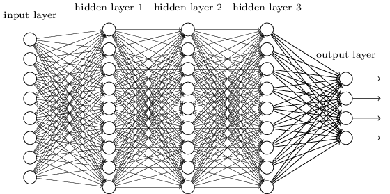
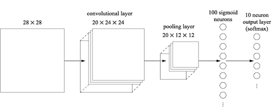
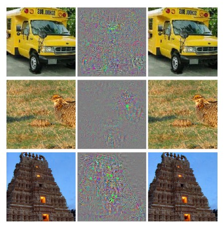

# Deep learning

# 深度学习

In the [last chapter](http://neuralnetworksanddeeplearning.com/chap5.html) we learned that deep neural networks are often much harder to train than shallow neural networks. That's unfortunate, since we have good reason to believe that *if* we could train deep nets they'd be much more powerful than shallow nets. But while the news from the last chapter is discouraging, we won't let it stop us. In this chapter, we'll develop techniques which can be used to train deep networks, and apply them in practice. We'll also look at the broader picture, briefly reviewing recent progress on using deep nets for image recognition, speech recognition, and other applications. And we'll take a brief, speculative look at what the future may hold for neural nets, and for artificial intelligence.

The chapter is a long one. To help you navigate, let's take a tour. The sections are only loosely coupled, so provided you have some basic familiarity with neural nets, you can jump to whatever most interests you.

The [main part of the chapter](http://neuralnetworksanddeeplearning.com/chap6.html#convolutional_networks) is an introduction to one of the most widely used types of deep network: deep convolutional networks. We'll work through a detailed example - code and all - of using convolutional nets to solve the problem of classifying handwritten digits from the MNIST data set:


We'll start our account of convolutional networks with the shallow networks used to attack this problem earlier in the book. Through many iterations we'll build up more and more powerful networks. As we go we'll explore many powerful techniques: convolutions, pooling, the use of GPUs to do far more training than we did with our shallow networks, the algorithmic expansion of our training data (to reduce overfitting), the use of the dropout technique (also to reduce overfitting), the use of ensembles of networks, and others. The result will be a system that offers near-human performance. Of the 10,000 MNIST test images - images not seen during training! - our system will classify 9,967 correctly. Here's a peek at the 33 images which are misclassified. Note that the correct classification is in the top right; our program's classification is in the bottom right:


Many of these are tough even for a human to classify. Consider, for example, the third image in the top row. To me it looks more like a "9" than an "8", which is the official classification. Our network also thinks it's a "9". This kind of "error" is at the very least understandable, and perhaps even commendable. We conclude our discussion of image recognition with a [survey of some of the spectacular recent progress](http://neuralnetworksanddeeplearning.com/chap6.html#recent_progress_in_image_recognition) using networks (particularly convolutional nets) to do image recognition.

The remainder of the chapter discusses deep learning from a broader and less detailed perspective. We'll [briefly survey other models of neural networks](http://neuralnetworksanddeeplearning.com/chap6.html#things_we_didn't_cover_but_which_you'll_eventually_want_to_know), such as recurrent neural nets and long short-term memory units, and how such models can be applied to problems in speech recognition, natural language processing, and other areas. And we'll [speculate about the future of neural networks and deep learning](http://neuralnetworksanddeeplearning.com/chap6.html#on_the_future_of_neural_networks), ranging from ideas like intention-driven user interfaces, to the role of deep learning in artificial intelligence.

The chapter builds on the earlier chapters in the book, making use of and integrating ideas such as backpropagation, regularization, the softmax function, and so on. However, to read the chapter you don't need to have worked in detail through all the earlier chapters. It will, however, help to have read [Chapter 1](http://neuralnetworksanddeeplearning.com/chap1.html), on the basics of neural networks. When I use concepts from Chapters 2 to 5, I provide links so you can familiarize yourself, if necessary.

It's worth noting what the chapter is not. It's not a tutorial on the latest and greatest neural networks libraries. Nor are we going to be training deep networks with dozens of layers to solve problems at the very leading edge. Rather, the focus is on understanding some of the core principles behind deep neural networks, and applying them in the simple, easy-to-understand context of the MNIST problem. Put another way: the chapter is not going to bring you right up to the frontier. Rather, the intent of this and earlier chapters is to focus on fundamentals, and so to prepare you to understand a wide range of current work.

## Introducing convolutional networks

## 介绍卷积网络

In earlier chapters, we taught our neural networks to do a pretty good job recognizing images of handwritten digits:

在前面的章节中，我们训练了一个工作起来还不错的神经网络，它可以从图片中识别手写的数字：


We did this using networks in which adjacent network layers are fully connected to one another. That is, every neuron in the network is connected to every neuron in adjacent layers:

我们是通过一个相邻的层之间都是全链接的网络来做到这一点的。就是，网络中的每个神经元都与相邻层中的所有神经元链接：




In particular, for each pixel in the input image, we encoded the pixel's intensity as the value for a corresponding neuron in the input layer. For the 28×28 pixel images we've been using, this means our network has 784 (=28×28) input neurons. We then trained the network's weights and biases so that the network's output would - we hope! - correctly identify the input image: '0', '1', '2', ..., '8', or '9'.

具体点说，对于输入图片中的每个像素，我们都将该像素的灰度编码为输入层中对应像素的神经元的值。我们采用28x28 的图片，这意味着我们的网络需要 784(=28x28) 个输入神经元。接着我们训练出网络的权重以及偏至，以便网络能像我们期待的那样争取区分输入的图片：’0‘，’1‘，’2‘，...’8‘，或者 ’9‘。

Our earlier networks work pretty well: we've [obtained a classification accuracy better than 98 percent](http://neuralnetworksanddeeplearning.com/chap3.html#98percent), using training and test data from the [MNIST handwritten digit data set](http://neuralnetworksanddeeplearning.com/chap1.html#learning_with_gradient_descent). But upon reflection, it's strange to use networks with fully-connected layers to classify images. The reason is that such a network architecture does not take into account the spatial structure of the images. For instance, it treats input pixels which are far apart and close together on exactly the same footing. Such concepts of spatial structure must instead be inferred from the training data. But what if, instead of starting with a network architecture which is *tabula rasa*, we used an architecture which tries to take advantage of the spatial structure? In this section I describe *convolutional neural networks* *. These networks use a special architecture which is particularly well-adapted to classify images. Using this architecture makes convolutional networks fast to train. This, in turn, helps us train deep, many-layer networks, which are very good at classifying images. Today, deep convolutional networks or some close variant are used in most neural networks for image recognition.

我们早前的网络工作得不错：我们使用[MNIST 手写数字数据集](http://neuralnetworksanddeeplearning.com/chap1.html#learning_with_gradient_descent)来训练和测试时，[取得了高于98%的识别率](http://neuralnetworksanddeeplearning.com/chap3.html#98percent)。不过值得反思的是，以层间全链接的网络来识别图像有点奇怪。理由是这样的网络架构没有考虑到图像的空间结构。举例来说，该架构对输入像素的处理方式，掩盖了它们的远近关系，然而，训练样本中的数据空间结构关系必须得到体现。我们如何白手起家地运用一个可以充分利用数据空间结构的网络架构呢？在本章节中，我将介绍*卷积神经网络* \*. 这些网络具有非常适合图像分类的特殊架构。应用这些架构使得卷积网络实现快速训练。这样可以帮组我们训练那种深度多层的网络，这种网络对于图像分类的效果很棒。今天，在神经网络图像识别领域中，*深度卷积网络*以及类似的变体应用得最多。

> The origins of convolutional neural networks go back to the 1970s. But the seminal paper establishing the modern subject of convolutional networks was a 1998 paper, ["Gradient-based learning applied to document recognition"](http://yann.lecun.com/exdb/publis/pdf/lecun-98.pdf), by Yann LeCun, Léon Bottou, Yoshua Bengio, and Patrick Haffner. LeCun has since made an interesting [remark](https://www.facebook.com/yann.lecun/posts/10152348155137143) on the terminology for convolutional nets: "The [biological] neural inspiration in models like convolutional nets is very tenuous. That's why I call them 'convolutional nets' not 'convolutional neural nets', and why we call the nodes 'units' and not 'neurons' ". Despite this remark, convolutional nets use many of the same ideas as the neural networks we've studied up to now: ideas such as backpropagation, gradient descent, regularization, non-linear activation functions, and so on. And so we will follow common practice, and consider them a type of neural network. I will use the terms "convolutional neural network" and "convolutional net(work)" interchangeably. I will also use the terms "[artificial] neuron" and "unit" interchangeably.
>
> 卷积神经网络的起源可以追索到20世纪70年代。不过奠定神经网络影响地位的开创性论文是1998年发表的 ["Gradient-based learning applied to document recognition"](http://yann.lecun.com/exdb/publis/pdf/lecun-98.pdf)，作者是 Yann LeCun, Léon Bottou, Yoshua Bengio, 与 Patrick Haffner。关于卷积网络这个术语，LeCun 曾经做过一个有趣的说明：“在卷积网络模型中，所包含的来自生物神经系统的灵感很少。这就是为什么我叫它们做‘卷积网络’而不是‘卷积神经网络’，以及我们称节点为‘单元’而不是‘神经元’的原因”。尽管如此，卷积网络使用的很多概念，与我们今天研究的神经网络相同：这些概念包括反向传播，梯度下降，正则化，非线性激活函数等等。所以，我们会跟随一般的惯例，都将它们看成是神经网络的一个类型。我会交替使用“卷积神经网络”与“卷积网络”作为术语，我也会交替使用“[人工]神经元”与“单元”作为术语。

Convolutional neural networks use three basic ideas: *local receptive fields*, *shared weights*, and *pooling*. Let's look at each of these ideas in turn.

卷积神经网络使用到三个基本思想：*局部接收域*，*共享权值*，以及*池化*。让我们依次了解一下这些思想。

**Local receptive fields:** In the fully-connected layers shown earlier, the inputs were depicted as a vertical line of neurons. In a convolutional net, it'll help to think instead of the inputs as a 28×28 square of neurons, whose values correspond to the 28×28 pixel intensities we're using as inputs:

**局部接受域：**在早前陈述的全链接层中，输入数据被展开到一个神经元的纵行之中。在卷积网络中，它帮助我们将28x28 个像素的灰度值的输入，看作是一个 28x28 个输入点的组成的方阵。


As per usual, we'll connect the input pixels to a layer of hidden neurons. But we won't connect every input pixel to every hidden neuron. Instead, we only make connections in small, localized regions of the input image.

和通常一样，我们将把输入像素链接到一个隐藏层的神经元当中。不过这次我们不将所有的输入到连接到所有的隐藏层神经元之中。去而代之的是，我们仅建立对输入图像的小范围的，局部的链接关系。

To be more precise, each neuron in the first hidden layer will be connected to a small region of the input neurons, say, for example, a 5×5 region, corresponding to 25 input pixels. So, for a particular hidden neuron, we might have connections that look like this:

更准确的描述是，每个在第一个隐藏层的神经元将链接到一个细小的输入区域，譬如说一个 5x5 的区域，对应于25个输入像素。所以，对于一个隐藏层神经元，我们的链接看起来如下图：


That region in the input image is called the *local receptive field* for the hidden neuron. It's a little window on the input pixels. Each connection learns a weight. And the hidden neuron learns an overall bias as well. You can think of that particular hidden neuron as learning to analyze its particular local receptive field.

对应于隐藏神经元的那个输入图像的细小区域，并称为*局部接收域*。它是一个输入像素的小窗口。每个链接都需要通过学习求得权重。同样地每个隐藏层神经元，也要通过学习求出偏至。你可以这样认为，这个特定的隐藏层神经元承担着学习如何分析它对应的局部接收域的作用。

We then slide the local receptive field across the entire input image. For each local receptive field, there is a different hidden neuron in the first hidden layer. To illustrate this concretely, let's start with a local receptive field in the top-left corner:

我们接着将局部接收域滑动扫描过整张输入图片。对于每个局部接收域，都在第一个隐藏层，有一个独立的神经元与之对应。为了具体地说明这个机制，让我们从左上角开始：


Then we slide the local receptive field over by one pixel to the right (i.e., by one neuron), to connect to a second hidden neuron:

我们将局部接收域向右滑动一个像素（这里是一个神经元），并连接到第二个隐藏层神经元：


And so on, building up the first hidden layer. Note that if we have a 28×28 input image, and 5×5 local receptive fields, then there will be 24×24 neurons in the hidden layer. This is because we can only move the local receptive field 23 neurons across (or 23 neurons down), before colliding with the right-hand side (or bottom) of the input image.

如此这般，我们就打造了第一个隐藏层。注意，如果我们的输入图像是 28x28，并且局部接收域是 5x5，那么就有 24x24 个神经元在隐藏层。这是因为我们只能将局部接收域滑动（或者下降 23 个神经元） 23 个像素，之后就会碰到输入图像的右边（或者是下面）。

I've shown the local receptive field being moved by one pixel at a time. In fact, sometimes a different *stride length* is used. For instance, we might move the local receptive field 2 pixels to the right (or down), in which case we'd say a stride length of 2 is used. In this chapter we'll mostly stick with stride length 1, but it's worth knowing that people sometimes experiment with different stride lengths *.

我介绍了将局部接收域每次移动一个像素的情况。事实上，有些时候不同的步长也会被用到。例如，我们可以将局部接收域每次向右（或向下）移动 2 个像素，这种情况下我们称为移动 2 个步长。在本章中，我们几乎总是使用 1 个步长，不过值得了解的是，实际应用中，人们会使用不同的步长 *。

> As was done in earlier chapters, if we're interested in trying different stride lengths then we can use validation data to pick out the stride length which gives the best performance. For more details, see the [earlier discussion](http://neuralnetworksanddeeplearning.com/chap3.html#how_to_choose_a_neural_network's_hyper-parameters) of how to choose hyper-parameters in a neural network. The same approach may also be used to choose the size of the local receptive field - there is, of course, nothing special about using a 5×5 local receptive field. In general, larger local receptive fields tend to be helpful when the input images are significantly larger than the 28×28 pixel MNIST images.
>
> 正如在早前的章节中所做的那样，如果我们有兴趣尝试不同的步长，那么我们需要用一些可靠的资料来确定步长，以便取得最佳性能。更多的信息，请参阅如何在神经网络中选择超参数的[早前讨论](http://neuralnetworksanddeeplearning.com/chap3.html#how_to_choose_a_neural_network's_hyper-parameters)。里面同样的方法可以用来选择局部接收域的大小 - 不必总是使用 5x5 的局部接收域的。总的来说，当输入的图像明显大于 MNIST 数据集的 28x28 的图像大小时，更大的局部接收域更加有用。

> > 译注：**超参数**（hyper-parameters）是指那些凭经验或者调试来确定的参数。譬如，这里讨论的局部接收域的大小是 5x5。有没有想过它或者可以是 8x8 呢？对于本文的 MNIST 数字识别范例，第一个卷积层的结构是 20x24x24，即抽取 20 个特征图等等。就译者所知，目前还没有任何一种成熟的理论体系来指导深度学习的体系架构的设计。

**Shared weights and biases:** I've said that each hidden neuron has a bias and 5×5 weights connected to its local receptive field. What I did not yet mention is that we're going to use the *same* weights and bias for each of the 24×24 hidden neurons. In other words, for the $j,k$th hidden neuron, the output is:

**共享权值与偏至：**我已经谈论过，每个隐藏层神经元有一个偏至以及 5x5 个权重链接到局部接收域。还有一点我没有指出的是，我们将会以相同的权重与偏至应用到 24x24 个隐藏神经元中。换言之，对于第 $j,k$ 个隐藏神经元，它的输出是：
$$
\sigma \biggl( b + \sum_{l=0}^4\sum_{m=0}^4 w_{l,m} a_{j+l,k+m} \biggr)  \tag{125}
$$
Here, $\sigma$ is the neural activation function - perhaps the [sigmoid function](http://neuralnetworksanddeeplearning.com/chap1.html#sigmoid_neurons) we used in earlier chapters. $b$ is the shared value for the bias. $w_{l,m}$ is a 5×5 array of shared weights. And, finally, we use $a_{x,y}$ to denote the input activation at position $x,y$.

这里，$\sigma$ 是神经激活函数 - 一般就是我们前面说到的 [sigmoid 函数](http://neuralnetworksanddeeplearning.com/chap1.html#sigmoid_neurons)。$b$ 是一个共享值用作偏至。$w_{l,m}$ 是一个 5x5 的共享权值数组。最后，我们用 $a_{x,y}$ 来表示在 $x,y$ 位置的输入值。

This means that all the neurons in the first hidden layer detect exactly the same feature *, just at different locations in the input image. 

这样意味着在第一个隐藏层的所有神经元，仅是侦测输入图像的不同位置上的同一个特性。

> I haven't precisely defined the notion of a feature. Informally, think of the feature detected by a hidden neuron as the kind of input pattern that will cause the neuron to activate: it might be an edge in the image, for instance, or maybe some other type of shape.
>
> 我还没有对特性下过准确的定义。非正式的说法是，通过隐藏神经元抽取的特征，就是足以使神经元激活的某种输入图像所包含的纹理：它也许是图像中的边缘，或者是其他什么形状。

To see why this makes sense, suppose the weights and bias are such that the hidden neuron can pick out, say, a vertical edge in a particular local receptive field. That ability is also likely to be useful at other places in the image. And so it is useful to apply the same feature detector everywhere in the image. To put it in slightly more abstract terms, convolutional networks are well adapted to the translation invariance of images: move a picture of a cat (say) a little ways, and it's still an image of a cat *.

看看个中的道理，假设隐藏层神经元可以通过权值与偏至，能够抽取特定局部接收域中的图像的垂直边缘。那这样的能力在图像的其他位置同样有用。在图像的每个地方都应用相同的特征感测器是很有用的。将它推广为稍微抽象点的概念，卷积网络很适合图像不变性信息的转换：改变图像中一只猫的姿态，它仍然是一只猫 *。

> In fact, for the MNIST digit classification problem we've been studying, the images are centered and size-normalized. So MNIST has less translation invariance than images found "in the wild", so to speak. Still, features like edges and corners are likely to be useful across much of the input space.
>
> 事实上，对于我们正在研究的 MNIST 数字分类问题，图形都是居中以及大小正常的。所以，说起来 MNIST 比那些“野外”的图片具有更少的转换不变性。尽管这样，边缘与转角特征的抽取在整个输入空间中仍然很有用。

For this reason, we sometimes call the map from the input layer to the hidden layer a *feature map*. We call the weights defining the feature map the *shared weights*. And we call the bias defining the feature map in this way the *shared bias*. The shared weights and bias are often said to define a *kernel* or *filter*. In the literature, people sometimes use these terms in slightly different ways, and for that reason I'm not going to be more precise; rather, in a moment, we'll look at some concrete examples.

基于这样的理由，我们有时候将从输入层到隐藏层的映射叫做*特征映射*。我将定义特征映射的权值叫*共享权值*。将定义特征映射的偏至叫做*共享偏至*。共享权值与共享偏至合并在一起通常被称为*内核*或者*滤镜*。在文字上，人们使用这些术语的时候会有一点点差异，因此，我不打算太多计较；在这一刻，我们宁愿看些实际的例子吧。

The network structure I've described so far can detect just a single kind of localized feature. To do image recognition we'll need more than one feature map. And so a complete convolutional layer consists of several different feature maps:

我一路以来介绍的网络结构都是抽取一个局部特征的。要做到图像识别，我们需要不止一个的特征映射。所以完善的卷积层会包含若干个特征图：


In the example shown, there are 3 feature maps. Each feature map is defined by a set of 5×5 shared weights, and a single shared bias. The result is that the network can detect 3 different kinds of features, with each feature being detectable across the entire image.

在上面的例子中，有三个特征图。每个特征图由 5x5 个共享权值，以及单个共享偏至来定义。结论是网络可以侦测 3 个不同的特征，并且特征的检测历遍了整个图像。

I've shown just 3 feature maps, to keep the diagram above simple. However, in practice convolutional networks may use more (and perhaps many more) feature maps. One of the early convolutional networks, LeNet-5, used 6 feature maps, each associated to a 5×5 local receptive field, to recognize MNIST digits. So the example illustrated above is actually pretty close to LeNet-5. In the examples we develop later in the chapter we'll use convolutional layers with 20 and 40 feature maps. Let's take a quick peek at some of the features which are learned * :

我仅是展示 3 个特征图，是为了保持使得示意图保持简洁。然而，在实际应用中，卷积网络会使用更多的特征图。LeNet-5 是其中一个早期的卷积网络，它使用 6 个特征图，每个关联一个 5x5 的局部接收域，去识别 MNIST 数字。所以上述给大家描述的例子，已经比较接近 LeNet-5 了。在本章后面对这个例子的发展中，我们将在卷积网络中使用 20 至 40 个特征图。现在让我们先窥视一下这些通过训练得到的特征是什么样子的：

> The feature maps illustrated come from the final convolutional network we train, see [here](http://neuralnetworksanddeeplearning.com/chap6.html#final_conv).
>
> 这里展示的特征图来自我们最后训练出来的卷积网络，看[这里](http://neuralnetworksanddeeplearning.com/chap6.html#final_conv) 。


The 20 images correspond to 20 different feature maps (or filters, or kernels). Each map is represented as a 5×5 block image, corresponding to the 5×5 weights in the local receptive field. Whiter blocks mean a smaller (typically, more negative) weight, so the feature map responds less to corresponding input pixels. Darker blocks mean a larger weight, so the feature map responds more to the corresponding input pixels. Very roughly speaking, the images above show the type of features the convolutional layer responds to.

这 20 个图片对应于 20 个不同的特征映射（或者叫滤镜，内核）。每个映射表现为一个 5x5 的方块图像，对应于 5x5 个在局部接收域中的权重。白色的方块表示更小的权重值（更加负面），所以特征映射对输入像素的相应更小。黑色的方块意味着更大的权重值，这样特征映射对于输入像素的相应更大。大体来说，上面的图型展示了卷积层对不同特征类型的响应。

So what can we conclude from these feature maps? It's clear there is spatial structure here beyond what we'd expect at random: many of the features have clear sub-regions of light and dark. That shows our network really is learning things related to the spatial structure. However, beyond that, it's difficult to see what these feature detectors are learning. Certainly, we're not learning (say) the [Gabor filters](http://en.wikipedia.org/wiki/Gabor_filter) which have been used in many traditional approaches to image recognition. In fact, there's now a lot of work on better understanding the features learnt by convolutional networks. If you're interested in following up on that work, I suggest starting with the paper [Visualizing and Understanding Convolutional Networks](http://arxiv.org/abs/1311.2901) by Matthew Zeiler and Rob Fergus (2013).

通过这些特征图，我们会有什么收获呢？很明显，这些空间结构超出了我们最大胆的想象：大部分的特征都有黑白分明的子区域。那就表明了我们的网络，的确是在学习一些与空间结构相关的东西。无论如何，除此之外，我们很难通过其他途径来看到特征感测器正在学习。十分肯定的是，我们并不是在训练 [Gabor 滤镜](http://en.wikipedia.org/wiki/Gabor_filter)，它在传统的图像识别技术中被广泛使用。事实上，要更好地理解卷积网络的特征学习，还需要做很多工作。如果你对接下来的这些工作有兴趣，我建议从这篇论文 [Visualizing and Understanding Convolutional Networks](http://arxiv.org/abs/1311.2901) 开始，它由 Matthew Zeiler 和 Rob Fergus 在 2013 年发表。

A big advantage of sharing weights and biases is that it greatly reduces the number of parameters involved in a convolutional network. For each feature map we need 25=5×5 shared weights, plus a single shared bias. So each feature map requires 26 parameters. If we have 20 feature maps that's a total of 20×26=520 parameters defining the convolutional layer. By comparison, suppose we had a fully connected first layer, with 784=28×28 input neurons, and a relatively modest 30 hidden neurons, as we used in many of the examples earlier in the book. That's a total of 784×30 weights, plus an extra 30 biases, for a total of 23,550 parameters. In other words, the fully-connected layer would have more than 40 times as many parameters as the convolutionual layer.

共享权值和偏至的优哦是它们可以极大地节省构建卷积网络的参数数量。对于每个特征图，我们仅需要 25=5x5 个共享权值，外加一个共享偏至。所以每个特征图需要 26 个参数。如果我们需要 20 个特征图，你定义这个卷积网络的参数就是 20x26=520。相比较而言，假如我们在第一个层使用全链接网络，则需要 784=28x28 个输入神经元，大致用 30 个隐藏神经元比较恰当，就如本书之前的很多例子那样。那样一共需要 784x30 个权值，外加 30 个偏至，总共 23,550 个参数。换言之，全链接网络使用的参数是卷积网络的 40 倍。

Of course, we can't really do a direct comparison between the number of parameters, since the two models are different in essential ways. But, intuitively, it seems likely that the use of translation invariance by the convolutional layer will reduce the number of parameters it needs to get the same performance as the fully-connected model. That, in turn, will result in faster training for the convolutional model, and, ultimately, will help us build deep networks using convolutional layers.

当然，我们不能机械地比较参数数量的差别，毕竟两个模型本质上采用不同的方法学。不过，直觉上，对于实现转换不变性这样的目的来说，卷积网络可以节省不少的参数而获得与全链接网络同等的性能。进一步讲，卷积网络能够有更快的训练速度，最终有利于我们以卷积层构建深度网络。

Incidentally, the name *convolutional* comes from the fact that the operation in Equation (125) is sometimes known as a *convolution*. A little more precisely, people sometimes write that equation as $a^1=\sigma(b + w * a^0)$, where $a^1$ denotes the set of output activations from one feature map, $a^0$ is the set of input activations, and $∗$ is called a convolution operation. We're not going to make any deep use of the mathematics of convolutions, so you don't need to worry too much about this connection. But it's worth at least knowing where the name comes from.

顺带说明一下，*卷积*这个词来自于算式（125），它有时候被当作是*卷积*算法。更精确地，大家有时候将算式写成 $a^1 = \sigma(b + w*a^0)$，这里 $a^1$ 表示其中一个特征图的激活输出值的集合，$a^0$ 表示有效输入值的集合，而 $*$ 被成为卷积运算符。我们将不会对数学意义上的卷积涉及太深，所以你也无需对他们之间的关联担心太多。不过，知道这个名称的由来总是有好处的。

**Pooling layers:** In addition to the convolutional layers just described, convolutional neural networks also contain *pooling layers*. Pooling layers are usually used immediately after convolutional layers. What the pooling layers do is simplify the information in the output from the convolutional layer.

**池化层：**除了刚刚介绍过的卷积层之外，卷积神经网络通常也包含*池化层*。卷积层之后通常立即使用池化层。池化层的作用就是简化卷积层中输出的信息。

In detail, a pooling layer takes each feature map * output from the convolutional layer and prepares a condensed feature map. For instance, each unit in the pooling layer may summarize a region of (say) 2×2 neurons in the previous layer. As a concrete example, one common procedure for pooling is known as *max-pooling*. In max-pooling, a pooling unit simply outputs the maximum activation in the 2×2 input region, as illustrated in the following diagram:

详细地说，池化层将卷积层中的输出再浓缩到一个特征图中。例如，每个池化层中的单元都是对前面一个层的某个区域（譬如，2x2 个像素）的汇总。举个实际的例子，一个常见的池化处理是*极值池化（max-pooling）*。在极值池化中，一个池化单元就只是简单地将 2x2 输入区域中的最大激活值输出。

> The nomenclature is being used loosely here. In particular, I'm using "feature map" to mean not the function computed by the convolutional layer, but rather the activation of the hidden neurons output from the layer. This kind of mild abuse of nomenclature is pretty common in the research literature.
>
> 这个术语在这里用得有点随意。特别地，相比于使用激活值这个术语，我会用“特征图”来表示通过卷积层来的计算方法获得的结果。这种术语的随意使用的情况，在科研类文章中很常见。


Note that since we have 24×24 neurons output from the convolutional layer, after pooling we have 12×12 neurons.

注意，当我们有一个 24x24 个输出神经元的卷积层时，经过池化处理之后，我们会得到一个 12x12 的神经元。

As mentioned above, the convolutional layer usually involves more than a single feature map. We apply max-pooling to each feature map separately. So if there were three feature maps, the combined convolutional and max-pooling layers would look like:

正如上面提及的那样，卷积网络通常包含一个以上的特征图。我们分别对每个特征图应用极值池化。所以，如果我们有三个特征图，卷积层和池化层结合后的样子应该像这样：


We can think of max-pooling as a way for the network to ask whether a given feature is found anywhere in a region of the image. It then throws away the exact positional information. The intuition is that once a feature has been found, its exact location isn't as important as its rough location relative to other features. A big benefit is that there are many fewer pooled features, and so this helps reduce the number of parameters needed in later layers.

我们可以将极值池化看作是一个查证的方法，它说明了在图像的某个区域中是否有某种给定的特征存在。它还会给出准确的位置信息。在直觉上就可知，一旦某个特征被发现，重要的是它与其他特征的大致的位置关联性，而不是它自己的确切位置。

Max-pooling isn't the only technique used for pooling. Another common approach is known as *L2 pooling*. Here, instead of taking the maximum activation of a 2×2 region of neurons, we take the square root of the sum of the squares of the activations in the 2×2 region. While the details are different, the intuition is similar to max-pooling: L2 pooling is a way of condensing information from the convolutional layer. In practice, both techniques have been widely used. And sometimes people use other types of pooling operation. If you're really trying to optimize performance, you may use validation data to compare several different approaches to pooling, and choose the approach which works best. But we're not going to worry about that kind of detailed optimization.

极值池化并非唯一的池化技术。常用的方法还有 *L2 池化*。这里，替代取 2x2 区域中激活值的最大值，我们取 2x2 区域中激活值的平方和的方根作为池化值。尽管细节上有不同，直觉上它与极值池化类似：L2 池化也是一个将卷积层的信息浓缩的方法。在实践中，两种技术都应用广泛。有时大家还会使用其他的池化操作。当你已经准备优化性能的话，你也许需要用些可靠的资料来比较不同的池化方法，以便取得最佳的方案。不过，在这里我们不打算纠结于各种优化的细节。

**Putting it all together:** We can now put all these ideas together to form a complete convolutional neural network. It's similar to the architecture we were just looking at, but has the addition of a layer of 10 output neurons, corresponding to the 10 possible values for MNIST digits ('0', '1', '2', *etc*):

**总体集成：**我们现在可以将所有的构思集结到一起形成完整的卷积神经网络了。它看起来很像我们刚刚看过的架构，不过还附加了 10 个神经元，对应于 MNIST 数字可能的值。


The network begins with 28×28 input neurons, which are used to encode the pixel intensities for the MNIST image. This is then followed by a convolutional layer using a 5×5 local receptive field and 3 feature maps. The result is a layer of 3×24×24 hidden feature neurons. The next step is a max-pooling layer, applied to 2×2 regions, across each of the 3 feature maps. The result is a layer of 3×12×12 hidden feature neurons.

网络开始时有 28x28 个输入神经元，它用于编码 MNIST 图像的像素灰度。接着会跟随着一个使用 5x5 局部接受域以及 3 个特征图的卷积层。结果是形成一个 3x24x24 个隐藏特征神经元的层。下一步就是一个极值池化层，使用 2x2 的区块，历遍 3 个特征图。这样再形成一个 3x12x12 个隐藏特征神经元。

The final layer of connections in the network is a fully-connected layer. That is, this layer connects *every* neuron from the max-pooled layer to every one of the 10 output neurons. This fully-connected architecture is the same as we used in earlier chapters. Note, however, that in the diagram above, I've used a single arrow, for simplicity, rather than showing all the connections. Of course, you can easily imagine the connections.

网络的最后一个链接层是一个全链接层。该层将所有的极值池化层中的所有神经元，都全链接到 10 个输出神经元中的每一个之中。这个全链接架构与我们之前的章节中使用的相同。注意，上面的示意图，我使用了单个箭头，这比画出所有的链接更简洁。当然了，你应该很容易想像这些链接的样子。

This convolutional architecture is quite different to the architectures used in earlier chapters. But the overall picture is similar: a network made of many simple units, whose behaviors are determined by their weights and biases. And the overall goal is still the same: to use training data to train the network's weights and biases so that the network does a good job classifying input digits.

这个卷积架构与之前章节中使用的完全不同。不过总体的场景是那么熟悉：一个有许多简单单元构成的网络，它的行为表现决定于它们的权值与偏至。总体的目标仍然相同：以样本数据去训练出网络的权值与偏至，使得网络对输入数字的分辨工作良好。

In particular, just as earlier in the book, we will train our network using stochastic gradient descent and backpropagation. This mostly proceeds in exactly the same way as in earlier chapters. However, we do need to make a few modifications to the backpropagation procedure. The reason is that our earlier [derivation of backpropagation](http://neuralnetworksanddeeplearning.com/chap2.html) was for networks with fully-connected layers. Fortunately, it's straightforward to modify the derivation for convolutional and max-pooling layers. If you'd like to understand the details, then I invite you to work through the following problem. Be warned that the problem will take some time to work through, unless you've really internalized the [earlier derivation of backpropagation](http://neuralnetworksanddeeplearning.com/chap2.html) (in which case it's easy).

特别是，我们将使用随机梯度下降以及反向传播来训练我们的网络，这就会像本文献中前面介绍的内容那样容易。绝大部分的步骤都和早前的章节介绍的一样。不过，我们需要对反向传播做一些调整。理由是我们之前的反向传播算法的推导是面向全链接网络的。幸运的是，对于卷积和极值池化层的反向转播推导很简单易懂。要是你希望了解详情，那么我邀请你为下面的问题做点事。下面提及的问题，需要花点时间才能搞定，除非你已经深入了解过[早前的反向传播的推导](http://neuralnetworksanddeeplearning.com/chap2.html)（在这种情况下就很容易了）。

#### Problem

#### 问题

- **Backpropagation in a convolutional network** The core equations of backpropagation in a network with fully-connected layers are (BP1)-(BP4) ([link](http://neuralnetworksanddeeplearning.com/chap2.html#backpropsummary)). Suppose we have a network containing a convolutional layer, a max-pooling layer, and a fully-connected output layer, as in the network discussed above. How are the equations of backpropagation modified?

- **卷积网络中的反向传播** 全链接网络中的反向传播的核心公式是 (BP1)-(BP4) ([link](http://neuralnetworksanddeeplearning.com/chap2.html#backpropsummary))。假设我们有一个网络，它包含一个卷积层，以及极值池化层，一个用于输出的全链接层，就像我们在上面讨论过的网络一样。如何调整反向传播的公式呢？

  > BP1:        $ \delta_j^L = \frac{\partial C}{\partial a_j^L} \sigma'(z_j^L)$
  >
  > BP4:        $\frac{\partial C}{\partial w_{jk}^l} = a_k^{l-1} \delta_j^l$


## Convolutional neural networks in practice

## 实战中的卷积神经网络

We've now seen the core ideas behind convolutional neural networks. Let's look at how they work in practice, by implementing some convolutional networks, and applying them to the MNIST digit classification problem. The program we'll use to do this is called `network3.py`, and it's an improved version of the programs `network.py` and `network2.py` developed in earlier chapters *. If you wish to follow along, the code is available [on GitHub](https://github.com/mnielsen/neural-networks-and-deep-learning/blob/master/src/network3.py). Note that we'll work through the code for `network3.py` itself in the next section. In this section, we'll use `network3.py` as a library to build convolutional networks.

我们现在已经看过卷积神经网络后面的核心思想。下面让我们通过实现一些卷积网络，以及将它们用于解决 MNIST 数字分辨的问题，看看它在实战中如何运作。我们将要使用到的程序叫 `network3.py`，以及它一个改进版本 `network.py` 与在早前的章节\*中发展起来的 `network2.py`。要是你希望跟踪这些程序，可以在 [on GitHub](https://github.com/mnielsen/neural-networks-and-deep-learning/blob/master/src/network3.py) 得到它们的源代码。在下一个段落中，我们将介绍 `network3.py` 源码本身。而在本段落中，我们将以 `network3.py` 作为一个函数库来构建一个卷积网络。

> Note also that `network3.py` incorporates ideas from the Theano library's documentation on convolutional neural nets (notably the implementation of [LeNet-5](http://deeplearning.net/tutorial/lenet.html)), from Misha Denil's [implementation of dropout](https://github.com/mdenil/dropout), and from [Chris Olah](http://colah.github.io/).
>
> 提示一下，`network3.py` 的实现思想来自卷积神经网络函数库 Theano 的文档（特别是 [LeNet-5](http://deeplearning.net/tutorial/lenet.html) 的实现部分），以及 Misha Denil 的论文 [implementation of dropout](https://github.com/mdenil/dropout)，还有 [Chris Olah](http://colah.github.io/)。

The programs `network.py` and `network2.py` were implemented using Python and the matrix library Numpy. Those programs worked from first principles, and got right down into the details of backpropagation, stochastic gradient descent, and so on. But now that we understand those details, for `network3.py` we're going to use a machine learning library known as [Theano](http://deeplearning.net/software/theano/)\*.  Using Theano makes it easy to implement backpropagation for convolutional neural networks, since it automatically computes all the mappings involved. Theano is also quite a bit faster than our earlier code (which was written to be easy to understand, not fast), and this makes it practical to train more complex networks. In particular, one great feature of Theano is that it can run code on either a CPU or, if available, a GPU. Running on a GPU provides a substantial speedup and, again, helps make it practical to train more complex networks.

程序 `network.py` 和 `network2.py` 都是基于 Python 以及矩阵库 Numpy 来实现的。程序从最基本的原则开始，直至一路展开各种细节，像反向传播，随机梯度下降等等。不过在我们已经明白了详情之后，对于程序 `network3.py` ，我们将会直接调用机器学习库 [Theano](http://deeplearning.net/software/theano/)\*。使用 Theano 可使卷积神经网络的反向传播更加容易实现，因为它能够自动计算所有被包含的映射。Theano 在速度上完胜我们早前的代码（那份代码是为了容易理解而写，不是追求速度），并且这使得更复杂的网络在训练上更有实效。特别是，Theano 的一个了不起的特性是它可以运行于 CPU 上，或者是 GPU 上。运行在 GPU 上使程序得到实质性的加速，这同样有助于训练更加复杂的网络。

> See [Theano: A CPU and GPU Math Expression Compiler in Python](http://www.iro.umontreal.ca/~lisa/pointeurs/theano_scipy2010.pdf), by James Bergstra, Olivier Breuleux, Frederic Bastien, Pascal Lamblin, Ravzan Pascanu, Guillaume Desjardins, Joseph Turian, David Warde-Farley, and Yoshua Bengio (2010). Theano is also the basis for the popular [Pylearn2](http://deeplearning.net/software/pylearn2/) and [Keras](http://keras.io/) neural networks libraries. Other popular neural nets libraries at the time of this writing include [Caffe](http://caffe.berkeleyvision.org/) and [Torch](http://torch.ch/).
>
> 参考 [Theano: A CPU and GPU Math Expression Compiler in Python](http://www.iro.umontreal.ca/~lisa/pointeurs/theano_scipy2010.pdf), 它由 James Bergstra, Olivier Breuleux, Frederic Bastien, Pascal Lamblin, Ravzan Pascanu, Guillaume Desjardins, Joseph Turian, David Warde-Farley, 与 Yoshua Bengio 在 2010 年发表。Theano 是流行的神经网络库 [Pylearn2](http://deeplearning.net/software/pylearn2/) 与 [Keras](http://keras.io/) 的基础。其他流行的神经网络库在本文撰写的时候也开始支持 Theano，包括 [Caffe](http://caffe.berkeleyvision.org/) 和 [Torch](http://torch.ch/)。

If you wish to follow along, then you'll need to get Theano running on your system. To install Theano, follow the instructions at the project's [homepage](http://deeplearning.net/software/theano/). The examples which follow were run using Theano 0.6*. Some were run under Mac OS X Yosemite, with no GPU. Some were run on Ubuntu 14.04, with an NVIDIA GPU. And some of the experiments were run under both. To get `network3.py` running you'll need to set the `GPU` flag to either `True` or `False` (as appropriate) in the `network3.py` source. Beyond that, to get Theano up and running on a GPU you may find [the instructions here](http://deeplearning.net/software/theano/tutorial/using_gpu.html) helpful. There are also tutorials on the web, easily found using Google, which can help you get things working. If you don't have a GPU available locally, then you may wish to look into [Amazon Web Services](http://aws.amazon.com/ec2/instance-types/) EC2 G2 spot instances. Note that even with a GPU the code will take some time to execute. Many of the experiments take from minutes to hours to run. On a CPU it may take days to run the most complex of the experiments. As in earlier chapters, I suggest setting things running, and continuing to read, occasionally coming back to check the output from the code. If you're using a CPU, you may wish to reduce the number of training epochs for the more complex experiments, or perhaps omit them entirely.

如果你打算跟着一起玩，那么你需要部署 Theano 运行在你的系统上。可以根据项目[主页](http://deeplearning.net/software/theano/)上的指引安装 Theano。接下来的范例需要运行在 Theano 0.6\* 上。有些需要运行在 Mac OS X Yosemite 上，无需 GPU 支持。有些运行在 Ubuntu 14.04 上，需要 NVIDIA GPU。而有些实习可以运行在上述两个系统上。要使 `network3.py` 正确运行，你需要在 `network3.py` 源码中（恰当地）将 `GPU` 这个标志设置为 `True` 或者 `False`。除此之外，要在 GPU 上正确配置和运行 Theano，你会发现 [这里的指引](http://deeplearning.net/software/theano/tutorial/using_gpu.html) 非常有用。网上还有很多的教程，很容易通过 Google 找到，它们会帮助你搞定很多事情。如果你自己没有可用的 GPU，你或者可以看看 [Amazon Web Services](http://aws.amazon.com/ec2/instance-types/) 的 EC2.G2 套餐。值得注意的是，即使使用 GPU，代码的执行还是会挺费时的。许多试验运行的时间长达几分钟到几个小时，仅是以 CPU 来运行复杂的实验的话，可能要花费数天的时间。就像前面中，我建议的那样，先配置运行某些作业，然后继续阅读文献，偶尔回头看看程序的输出。如果你只是使用 CPU，对于复杂的实验，你可能会希望减少训练的时间片段，或者宁愿整个忽略它们。

> As I release this chapter, the current version of Theano has changed to version 0.7. I've actually rerun the examples under Theano 0.7 and get extremely similar results to those reported in the text.
>
> 当我发表这个文章的时候，Theano 已经升级到 0.7 版本。我在 Theadno 0.7 上重新运行过那些例子，并且得到与官方的汇报非常近似的结果。

To get a baseline, we'll start with a shallow architecture using just a single hidden layer, containing 100 hidden neurons. We'll train for 60 epochs, using a learning rate of $\eta = 0.1$, a mini-batch size of 10, and no regularization. Here we go*:

先搞个入门级的，我们将以仅包含一个隐藏层的浅层网络作为起点，它包含100个隐藏神经元。我们将训练60个周期，学习步长 $\eta = 0.1$，小批量大小是 10 ，不考虑正则化。我们这就开始：

> > 译注：mini-batch size，每次梯度下降训练抽取的样本数据数量

```python
>>> import network3
>>> from network3 import Network
>>> from network3 import ConvPoolLayer, FullyConnectedLayer, SoftmaxLayer
>>> training_data, validation_data, test_data = network3.load_data_shared()
>>> mini_batch_size = 10
>>> net = Network([
        FullyConnectedLayer(n_in=784, n_out=100),
        SoftmaxLayer(n_in=100, n_out=10)], mini_batch_size)
>>> net.SGD(training_data, 60, mini_batch_size, 0.1, 
            validation_data, test_data)
```

> Code for the experiments in this section may be found [in this script](https://github.com/mnielsen/neural-networks-and-deep-learning/blob/master/src/conv.py). Note that the code in the script simply duplicates and parallels the discussion in this section.
>
> Note also that throughout the section I've explicitly specified the number of training epochs. I've done this for clarity about how we're training. In practice, it's worth using [early stopping](http://neuralnetworksanddeeplearning.com/chap3.html#early_stopping), that is, tracking accuracy on the validation set, and stopping training when we are confident the validation accuracy has stopped improving.
>
> 这一段中的实习代码可以[在这个脚本](https://github.com/mnielsen/neural-networks-and-deep-learning/blob/master/src/conv.py)里面找到。脚本中的代码与本段完全一致，并且与本段的讨论顺序是并行对应的。
>
> 还要注意，在整个段落中，我都明确定义了训练的周期。我这样做是为了标明我们是如何训练的。事实上， [提前终止](http://neuralnetworksanddeeplearning.com/chap3.html#early_stopping)是很有用。就是说，密切跟踪通过使用验证数据集测试得到的准确率，当我们确信验证的准确率不会再改善的时候，就可以停止训练了。

I obtained a best classification accuracy of 97.80 percent. This is the classification accuracy on the `test_data`, evaluated at the training epoch where we get the best classification accuracy on the `validation_data`. Using the validation data to decide when to evaluate the test accuracy helps avoid overfitting to the test data (see this [earlier discussion](http://neuralnetworksanddeeplearning.com/chap3.html#validation_explanation) of the use of validation data). We will follow this practice below. Your results may vary slightly, since the network's weights and biases are randomly initialized\*.

我取得了最高 97.80% 的最佳分类精度。这个是在`测试数据`上取得的分类精度，我们以`验证数据`在训练期间对网络进行评估，以便确定在哪里获得最佳的分类精度。使用验证数据来决定何时检测分类精度，以帮助避免出现对测试数据的过拟合（请参考有关验证数据的使用的[早前讨论](http://neuralnetworksanddeeplearning.com/chap3.html#validation_explanation)）。我们会伴随后续的内容进行练习，你得到的结果可能略有不同，原因是网络的权值和偏至是随机初始化\*的。

> In fact, in this experiment I actually did three separate runs training a network with this architecture. I then reported the test accuracy which corresponded to the best validation accuracy from any of the three runs. Using multiple runs helps reduce variation in results, which is useful when comparing many architectures, as we are doing. I've followed this procedure below, except where noted. In practice, it made little difference to the results obtained.
>
> 事实上，在这个实验当中，我是在相同架构下的一个网络上分开三个进程来训练。我给大家报告的那个最佳的分类率，就是在这三个进程中对应于最佳核实分类准确度的那个。多进程训练，有助于降低结果的不确定性，从而有利于比较各种架构，就如我们正在做的（各种深度学习的架构探索）那样。

This 97.80 percent accuracy is close to the 98.04 percent accuracy obtained back in [Chapter 3](http://neuralnetworksanddeeplearning.com/chap3.html#chap3_98_04_percent), using a similar network architecture and learning hyper-parameters. In particular, both examples used a shallow network, with a single hidden layer containing 100 hidden neurons. Both also trained for 60 epochs, used a mini-batch size of 10, and a learning rate of $\eta = 0.1$.

这里的 97.80% 的分辨精度已经接近第三章所取得的 98.04% 的分辨精度，两者用的是类似的架构以及学习参数。事实上，两个例子使用的都是浅层网络，包含一个 100 个隐藏神经元的隐藏层。两者都训练 60 个周期，小批量大小为 10，以及学习步长 $\eta = 0.1$ 。

There were, however, two differences in the earlier network. First, we [regularized](http://neuralnetworksanddeeplearning.com/chap3.html#overfitting_and_regularization) the earlier network, to help reduce the effects of overfitting. Regularizing the current network does improve the accuracies, but the gain is only small, and so we'll hold off worrying about regularization until later. Second, while the final layer in the earlier network used sigmoid activations and the cross-entropy cost function, the current network uses a softmax final layer, and the log-likelihood cost function. As [explained](http://neuralnetworksanddeeplearning.com/chap3.html#softmax) in Chapter 3 this isn't a big change. I haven't made this switch for any particularly deep reason - mostly, I've done it because softmax plus log-likelihood cost is more common in modern image classification networks.

无论如何，前面的两个网络还是存在两个差别。首先，我们[正则化](http://neuralnetworksanddeeplearning.com/chap3.html#overfitting_and_regularization)过更早的那个网络，以改善过拟合的影响。正则化的确是提高了准确率，不过所得很有限，所以在后面我们不要为正则化过于分心。第二，在更早的网络中，最后一层是使用 sigmoid（反曲函数） 激活函数以及 cross-entropy（交叉熵）代价函数，当前的这个网络中，最后一层使用的是 softmax（逻辑多分类）以及 log-likelihood（对数似然函数）代价函数。正如在第三章中[说明](http://neuralnetworksanddeeplearning.com/chap3.html#softmax)的那样，这并不是什么大的改变。我其实并没有什么特别深入的理由来做这个转变的，我之所以这样做，只是因为在当代的图像分类网络中，softmax 比 log-likelihood 使用得更为广泛。

Can we do better than these results using a deeper network architecture?

我们能够通过更深的网络架构得到更好的结果吗？

Let's begin by inserting a convolutional layer, right at the beginning of the network. We'll use 5 by 5 local receptive fields, a stride length of 1, and 20 feature maps. We'll also insert a max-pooling layer, which combines the features using 2 by 2 pooling windows. So the overall network architecture looks much like the architecture discussed in the last section, but with an extra fully-connected layer:

让我们从插入一个卷积层开始，亦即在网络开始处的右边插入。我们将使用一个 5 乘 5 的局部接收域，步长为 1，以及 20 个特征图。我们当然还需要插入一个极值池化层，它以一个 2 乘 2 的池化窗口进行特征合并。网络的整体架构，看起来就像我们在上一段讨论的那样，除了还外挂了一个全链接层之外。



In this architecture, we can think of the convolutional and pooling layers as learning about local spatial structure in the input training image, while the later, fully-connected layer learns at a more abstract level, integrating global information from across the entire image. This is a common pattern in convolutional neural networks.

在这个架构中，我们可以认为卷积层和池化层承担着学习输入图像的空间结构的任务，紧接着，全链接层承担着更抽象的任务，抽取整张图片的全局信息。这个就是卷积神经网络的大体脉络。

Let's train such a network, and see how it performs*:

让我们来训练这样一个网络吧，看看它的表现如何\*：

```python
>>> net = Network([
        ConvPoolLayer(image_shape=(mini_batch_size, 1, 28, 28), 
                      filter_shape=(20, 1, 5, 5), 
                      poolsize=(2, 2)),
        FullyConnectedLayer(n_in=20*12*12, n_out=100),
        SoftmaxLayer(n_in=100, n_out=10)], mini_batch_size)
>>> net.SGD(training_data, 60, mini_batch_size, 0.1, 
            validation_data, test_data)   
```

> I've continued to use a mini-batch size of 10 here. In fact, as we [discussed earlier](http://neuralnetworksanddeeplearning.com/chap3.html#mini_batch_size) it may be possible to speed up training using larger mini-batches. I've continued to use the same mini-batch size mostly for consistency with the experiments in earlier chapters.
>
> 我继续使用 10 作为微型批量。事实上，就如我们的[早前的讨论](http://neuralnetworksanddeeplearning.com/chap3.html#mini_batch_size)，相比于更大尺寸的微型批量，它可能会加速训练速度。我会一直使用与前面的实验中一样大小的微型批量尺寸。

That gets us to 98.78 percent accuracy, which is a considerable improvement over any of our previous results. Indeed, we've reduced our error rate by better than a third, which is a great improvement.

现在我们取得了 98.78% 的准确率，相比之前的结果，这是一个可观的进步。事实上，我们将错误率降低了三分之一，这是一个巨大的进步。

In specifying the network structure, I've treated the convolutional and pooling layers as a single layer. Whether they're regarded as separate layers or as a single layer is to some extent a matter of taste. `network3.py`treats them as a single layer because it makes the code for `network3.py` a little more compact. However, it is easy to modify `network3.py` so the layers can be specified separately, if desired.

在规划网络结构时，我将卷积层和池化层当成一个单层来处理了。是否将它们分层处理还是单层处理，纯粹就是因为外部因素的考虑。`network3.py` 将它们视为单层，是因为这样可以使得 `network3.py` 的源码更加紧凑。如果需要的话，通过修改 `network3.py` 的源码，将它进行分层处理，也是很容易的。

> > 译注：在后面，当卷积层和池化层作为一个层来看待时，我们将“convolutional-pooling layer”简称做“卷积池”。

#### Exercise

### 练习

- What classification accuracy do you get if you omit the fully-connected layer, and just use the convolutional-pooling layer and softmax layer? Does the inclusion of the fully-connected layer help?
- 如果忽略全链接层，仅使用卷积池和逻辑多分类层（softmax），你会得到什么样的分类精度呢？包含全链接层有帮助吗？

Can we improve on the 98.78 percent classification accuracy?

我们还能进一步改进 98.78% 的分类精度吗？

Let's try inserting a second convolutional-pooling layer. We'll make the insertion between the existing convolutional-pooling layer and the fully-connected hidden layer. Again, we'll use a 5×5 local receptive field, and pool over 2×2 regions. Let's see what happens when we train using similar hyper-parameters to before:

让我们试试插入第二个卷积池。我们将它插入到现存的卷积池和全链接隐藏层之间。再次使用 5x5 的局部接收域，以及 2x2 的池化窗口。让我们看看用与之前类似的超参数进行训练时，会发生什么：

```python
>>> net = Network([
        ConvPoolLayer(image_shape=(mini_batch_size, 1, 28, 28), 
                      filter_shape=(20, 1, 5, 5), 
                      poolsize=(2, 2)),
        ConvPoolLayer(image_shape=(mini_batch_size, 20, 12, 12), 
                      filter_shape=(40, 20, 5, 5), 
                      poolsize=(2, 2)),
        FullyConnectedLayer(n_in=40*4*4, n_out=100),
        SoftmaxLayer(n_in=100, n_out=10)], mini_batch_size)
>>> net.SGD(training_data, 60, mini_batch_size, 0.1, 
            validation_data, test_data)        
```

Once again, we get an improvement: we're now at 99.06 percent classification accuracy!

我们在一场取得了进步：现在我们取得了 99.06% 的分类精度！

There's two natural questions to ask at this point. The first question is: what does it even mean to apply a second convolutional-pooling layer? In fact, you can think of the second convolutional-pooling layer as having as input 12×12 "images", whose "pixels" represent the presence (or absence) of particular localized features in the original input image. So you can think of this layer as having as input a version of the original input image. That version is abstracted and condensed, but still has a lot of spatial structure, and so it makes sense to use a second convolutional-pooling layer.

关于这一点，很自然需要提两个问题。第一个问题是：采用第二个卷积池意味著什么？事实上，你可以将第二个卷积池当作它具有一个 12x12 的输入“图像”，它的“像素”表示了原始输入图像的某个局部特征是否存在（或者缺失）。所以，你可以将这个层视为具有一个来自原始图像的输入版本。这个版本含有很多空间结构的抽象与浓缩信息，这个就是使用第二个卷积池的理由。

That's a satisfying point of view, but gives rise to a second question. The output from the previous layer involves 20 separate feature maps, and so there are 20×12×12 inputs to the second convolutional-pooling layer. It's as though we've got 20 separate images input to the convolutional-pooling layer, not a single image, as was the case for the first convolutional-pooling layer. How should neurons in the second convolutional-pooling layer respond to these multiple input images? In fact, we'll allow each neuron in this layer to learn from *all* 20×5×5 input neurons in its local receptive field. More informally: the feature detectors in the second convolutional-pooling layer have access to *all* the features from the previous layer, but only within their particular local receptive field *.

这是一个令人满意的观点，不过也带出了第二个问题。上一层的输出包含 20 个分立的特征图，也就是有 20x12x12 个输入到第二个卷积池。亦即我们有 20 个分立的图像输入到卷积池，不像是第一个卷积池那样，只有一个图像输入。那么，在第二个卷积池中的神经元，应该如何应对这些并列的输入图像呢？事实上，我们容许每个在这一层中的神经元，从所有它自己的局部接收域中的 20x5x5 个输入神经元中学习。不是很正规的说法是：在第二个卷积池中的特征探测器，将会访问来自前一个层中的所有特征，不过仅限于他们专有的局部接收域\*。

> This issue would have arisen in the first layer if the input images were in color. In that case we'd have 3 input features for each pixel, corresponding to red, green and blue channels in the input image. So we'd allow the feature detectors to have access to all color information, but only within a given local receptive field.
>
> 如果输入的图像是彩色的，我们在第一层就引发这样的问题。在这样的情形下，对于每个像素，我们将有三个特征，对应于输入图像的红，绿，蓝通道。我们允许特征侦测器访问所有的颜色信息，不过仅限于给定的局部接收域。

#### Problem

#### 问题

* **Using the tanh activation function** Several times earlier in the book I've mentioned arguments that the [tanh function](http://neuralnetworksanddeeplearning.com/chap3.html#other_models_of_artificial_neuron) may be a better activation function than the sigmoid function. We've never acted on those suggestions, since we were already making plenty of progress with the sigmoid. But now let's try some experiments with tanh as our activation function. Try training the network with tanh activations in the convolutional and fully-connected layers *.

  **使用 tanh 激活函数** 在前面的章节中，我多次提到以 [tanh 函数](http://neuralnetworksanddeeplearning.com/chap3.html#other_models_of_artificial_neuron)作为激活函数，要比 sigmoid 函数要好。我们仍然没有按这些建议行动起来，是因为采用 sigmoid 我们已经取得了很大的进步。不过，现在让我们尝试在一些练习中使用 tanh 作为激活函数。并且在卷积层和全连层中都尝试以 tanh 激活函数来训练\*。

* > Note that you can pass `activation_fn=tanh`as a parameter to the `ConvPoolLayer` and `FullyConnectedLayer` classes.
  >
  > 你可以 `activation_fn=tanh` 作为参数传递给 `ConvPoolLayer` 和 `FullyConnectedLayer` 类。

  Begin with the same hyper-parameters as for the sigmoid network, but train for 20 epochs instead of 60. How well does your network perform? What if you continue out to 60 epochs? Try plotting the per-epoch validation accuracies for both tanh- and sigmoid-based networks, all the way out to 60 epochs. If your results are similar to mine, you'll find the tanh networks train a little faster, but the final accuracies are very similar. Can you explain why the tanh network might train faster? Can you get a similar training speed with the sigmoid, perhaps by changing the learning rate, or doing some rescaling * ?

  开始时，就像 sigmoid 网络一样，以相同的超参数训练 20 个周期而不是 60 个周期。你的网络表现的还好吗？要是连续训练至 60 个周期呢？试着描述出 tanh 与 sigmoid 网络的全部 60 个训练周期的验证精度，如果你的结果与我的近似，你会发现 tanh 网络的训练速度要快一点，不过最终的精度是非常相似的。你可以解释为什么 tanh 网络会训练的更快一些呢？你可以在 sigmoid 网络中取得类似的训练速度吗？应该改变学习步长，还是做点其他的什么调整呢\*？

  > You may perhaps find inspiration in recalling that  $\sigma(z) = \frac{1 + \text{tanh}(\frac{z}{2})}{2}$
  >
  > 你也许会发现重新调整的秘笈是这个 $\sigma(z) = \frac{1 + \text{tanh} (\frac{z}{2})}{2}$

  Try a half-dozen iterations on the learning hyper-parameters or network architecture, searching for ways that tanh may be superior to the sigmoid. *Note: This is an open-ended problem. Personally, I did not find much advantage in switching to tanh, although I haven't experimented exhaustively, and perhaps you may find a way. In any case, in a moment we will find an advantage in switching to the rectified linear activation function, and so we won't go any deeper into the use of tanh*.

  尝试对超参数或者网络进行六次迭代训练，发掘一下 tanh 可能优于 sigmoid 的各种理由。*注意一下：这是一个没完没了的问题。就个人而言，我还找不到切换到 tanh 的很多好处，尽管我还没有尽全力试验过，或者你能发现一些东西吧。无论如何，我们都可以在切换到修正线性激活函数（rectified linear activation function）中找到好处，所以我们不会再在 tanh 上探讨太多。*

**Using rectified linear units:** The network we've developed at this point is actually a variant of one of the networks used in the seminal 1998 paper* introducing the MNIST problem, a network known as LeNet-5.  It's a good foundation for further experimentation, and for building up understanding and intuition. In particular, there are many ways we can vary the network in an attempt to improve our results.

> ["Gradient-based learning applied to document recognition"](http://yann.lecun.com/exdb/publis/pdf/lecun-98.pdf), by Yann LeCun, Léon Bottou, Yoshua Bengio, and Patrick Haffner (1998). There are many differences of detail, but broadly speaking our network is quite similar to the networks described in the paper.

As a beginning, let's change our neurons so that instead of using a sigmoid activation function, we use [rectified linear units](http://neuralnetworksanddeeplearning.com/chap3.html#other_models_of_artificial_neuron). That is, we'll use the activation function $f(z) = \text{max}(0,z)$. We'll train for 60 epochs, with a learning rate of $\eta = 0.03$. I also found that it helps a little to use some [l2 regularization](http://neuralnetworksanddeeplearning.com/chap3.html#overfitting_and_regularization), with regularization parameter $\lambda = 0.01$:

```python
>>> from network3 import ReLU
>>> net = Network([
        ConvPoolLayer(image_shape=(mini_batch_size, 1, 28, 28), 
                      filter_shape=(20, 1, 5, 5), 
                      poolsize=(2, 2), 
                      activation_fn=ReLU),
        ConvPoolLayer(image_shape=(mini_batch_size, 20, 12, 12), 
                      filter_shape=(40, 20, 5, 5), 
                      poolsize=(2, 2), 
                      activation_fn=ReLU),
        FullyConnectedLayer(n_in=40*4*4, n_out=100, activation_fn=ReLU),
        SoftmaxLayer(n_in=100, n_out=10)], mini_batch_size)
>>> net.SGD(training_data, 60, mini_batch_size, 0.03, 
            validation_data, test_data, lmbda=0.1)
```

I obtained a classification accuracy of 99.23 percent. It's a modest improvement over the sigmoid results (99.06). However, across all my experiments I found that networks based on rectified linear units consistently outperformed networks based on sigmoid activation functions. There appears to be a real gain in moving to rectified linear units for this problem.

What makes the rectified linear activation function better than the sigmoid or tanh functions? At present, we have a poor understanding of the answer to this question. Indeed, rectified linear units have only begun to be widely used in the past few years. The reason for that recent adoption is empirical: a few people tried rectified linear units, often on the basis of hunches or heuristic arguments*.

> A common justification is that $\text{max}(0,z)$ doesn't saturate in the limit of large $z$, unlike sigmoid neurons, and this helps rectified linear units continue learning. The argument is fine, as far it goes, but it's hardly a detailed justification, more of a just-so story. Note that we discussed the problems with saturation back in [Chapter 2](http://neuralnetworksanddeeplearning.com/chap2.html#saturation).

They got good results classifying benchmark data sets, and the practice has spread. In an ideal world we'd have a theory telling us which activation function to pick for which application. But at present we're a long way from such a world. I should not be at all surprised if further major improvements can be obtained by an even better choice of activation function. And I also expect that in coming decades a powerful theory of activation functions will be developed. Today, we still have to rely on poorly understood rules of thumb and experience.

**Expanding the training data:** Another way we may hope to improve our results is by algorithmically expanding the training data. A simple way of expanding the training data is to displace each training image by a single pixel, either up one pixel, down one pixel, left one pixel, or right one pixel. We can do this by running the program `expand_mnist.py` from the shell prompt*:

> The code for `expand_mnist.py` is available[here](https://github.com/mnielsen/neural-networks-and-deep-learning/blob/master/src/expand_mnist.py).

```bash
$ python expand_mnist.py
```

Running this program takes the 50,000 MNIST training images, and prepares an expanded training set, with 250,000 training images. We can then use those training images to train our network. We'll use the same network as above, with rectified linear units. In my initial experiments I reduced the number of training epochs - this made sense, since we're training with 5 times as much data. But, in fact, expanding the data turned out to considerably reduce the effect of overfitting. And so, after some experimentation, I eventually went back to training for 60 epochs. In any case, let's train:

```python
>>> expanded_training_data, _, _ = network3.load_data_shared(
        "../data/mnist_expanded.pkl.gz")
>>> net = Network([
        ConvPoolLayer(image_shape=(mini_batch_size, 1, 28, 28), 
                      filter_shape=(20, 1, 5, 5), 
                      poolsize=(2, 2), 
                      activation_fn=ReLU),
        ConvPoolLayer(image_shape=(mini_batch_size, 20, 12, 12), 
                      filter_shape=(40, 20, 5, 5), 
                      poolsize=(2, 2), 
                      activation_fn=ReLU),
        FullyConnectedLayer(n_in=40*4*4, n_out=100, activation_fn=ReLU),
        SoftmaxLayer(n_in=100, n_out=10)], mini_batch_size)
>>> net.SGD(expanded_training_data, 60, mini_batch_size, 0.03, 
            validation_data, test_data, lmbda=0.1)
```

Using the expanded training data I obtained a 99.37 percent training accuracy. So this almost trivial change gives a substantial improvement in classification accuracy. Indeed, as we [discussed earlier](http://neuralnetworksanddeeplearning.com/chap3.html#other_techniques_for_regularization) this idea of algorithmically expanding the data can be taken further. Just to remind you of the flavour of some of the results in that earlier discussion: in 2003 Simard, Steinkraus and Platt* improved their MNIST performance to 99.6 percent using a neural network otherwise very similar to ours, using two convolutional-pooling layers, followed by a hidden fully-connected layer with 100 neurons. There were a few differences of detail in their architecture - they didn't have the advantage of using rectified linear units, for instance - but the key to their improved performance was expanding the training data. They did this by rotating, translating, and skewing the MNIST training images. They also developed a process of "elastic distortion", a way of emulating the random oscillations hand muscles undergo when a person is writing. By combining all these processes they substantially increased the effective size of their training data, and that's how they achieved 99.6 percent accuracy.

> [Best Practices for Convolutional Neural Networks Applied to Visual Document Analysis](http://dx.doi.org/10.1109/ICDAR.2003.1227801), by Patrice Simard, Dave Steinkraus, and John Platt (2003).

#### Problem

- The idea of convolutional layers is to behave in an invariant way across images. It may seem surprising, then, that our network can learn more when all we've done is translate the input data. Can you explain why this is actually quite reasonable?

**Inserting an extra fully-connected layer:** Can we do even better? One possibility is to use exactly the same procedure as above, but to expand the size of the fully-connected layer. I tried with 300 and 1,000 neurons, obtaining results of 99.46 and 99.43 percent, respectively. That's interesting, but not really a convincing win over the earlier result (99.37 percent).

What about adding an extra fully-connected layer? Let's try inserting an extra fully-connected layer, so that we have two 100-hidden neuron fully-connected layers:

```python
>>> net = Network([
        ConvPoolLayer(image_shape=(mini_batch_size, 1, 28, 28), 
                      filter_shape=(20, 1, 5, 5), 
                      poolsize=(2, 2), 
                      activation_fn=ReLU),
        ConvPoolLayer(image_shape=(mini_batch_size, 20, 12, 12), 
                      filter_shape=(40, 20, 5, 5), 
                      poolsize=(2, 2), 
                      activation_fn=ReLU),
        FullyConnectedLayer(n_in=40*4*4, n_out=100, activation_fn=ReLU),
        FullyConnectedLayer(n_in=100, n_out=100, activation_fn=ReLU),
        SoftmaxLayer(n_in=100, n_out=10)], mini_batch_size)
>>> net.SGD(expanded_training_data, 60, mini_batch_size, 0.03, 
            validation_data, test_data, lmbda=0.1)
```

Doing this, I obtained a test accuracy of 99.43 percent. Again, the expanded net isn't helping so much. Running similar experiments with fully-connected layers containing 300 and 1,000 neurons yields results of 99.48 and 99.47 percent. That's encouraging, but still falls short of a really decisive win.

What's going on here? Is it that the expanded or extra fully-connected layers really don't help with MNIST? Or might it be that our network has the capacity to do better, but we're going about learning the wrong way? For instance, maybe we could use stronger regularization techniques to reduce the tendency to overfit. One possibility is the [dropout](http://neuralnetworksanddeeplearning.com/chap3.html#other_techniques_for_regularization) technique introduced back in Chapter 3. Recall that the basic idea of dropout is to remove individual activations at random while training the network. This makes the model more robust to the loss of individual pieces of evidence, and thus less likely to rely on particular idiosyncracies of the training data. Let's try applying dropout to the final fully-connected layers:

```python
>>> net = Network([
        ConvPoolLayer(image_shape=(mini_batch_size, 1, 28, 28), 
                      filter_shape=(20, 1, 5, 5), 
                      poolsize=(2, 2), 
                      activation_fn=ReLU),
        ConvPoolLayer(image_shape=(mini_batch_size, 20, 12, 12), 
                      filter_shape=(40, 20, 5, 5), 
                      poolsize=(2, 2), 
                      activation_fn=ReLU),
        FullyConnectedLayer(
            n_in=40*4*4, n_out=1000, activation_fn=ReLU, p_dropout=0.5),
        FullyConnectedLayer(
            n_in=1000, n_out=1000, activation_fn=ReLU, p_dropout=0.5),
        SoftmaxLayer(n_in=1000, n_out=10, p_dropout=0.5)], 
        mini_batch_size)
>>> net.SGD(expanded_training_data, 40, mini_batch_size, 0.03, 
            validation_data, test_data)
```

Using this, we obtain an accuracy of 99.60 percent, which is a substantial improvement over our earlier results, especially our main benchmark, the network with 100 hidden neurons, where we achieved 99.37 percent.

There are two changes worth noting.

First, I reduced the number of training epochs to 40: dropout reduced overfitting, and so we learned faster.

Second, the fully-connected hidden layers have 1,000 neurons, not the 100 used earlier. Of course, dropout effectively omits many of the neurons while training, so some expansion is to be expected. In fact, I tried experiments with both 300 and 1,000 hidden neurons, and obtained (very slightly) better validation performance with 1,000 hidden neurons.

**Using an ensemble of networks:** An easy way to improve performance still further is to create several neural networks, and then get them to vote to determine the best classification. Suppose, for example, that we trained 5 different neural networks using the prescription above, with each achieving accuracies near to 99.6 percent. Even though the networks would all have similar accuracies, they might well make different errors, due to the different random initializations. It's plausible that taking a vote amongst our 5 networks might yield a classification better than any individual network.

This sounds too good to be true, but this kind of ensembling is a common trick with both neural networks and other machine learning techniques. And it does in fact yield further improvements: we end up with 99.67percent accuracy. In other words, our ensemble of networks classifies all but 33 of the 10,000 test images correctly.

The remaining errors in the test set are shown below. The label in the top right is the correct classification, according to the MNIST data, while in the bottom right is the label output by our ensemble of nets:


It's worth looking through these in detail. The first two digits, a 6 and a 5, are genuine errors by our ensemble. However, they're also understandable errors, the kind a human could plausibly make. That 6 really does look a lot like a 0, and the 5 looks a lot like a 3. The third image, supposedly an 8, actually looks to me more like a 9. So I'm siding with the network ensemble here: I think it's done a better job than whoever originally drew the digit. On the other hand, the fourth image, the 6, really does seem to be classified badly by our networks.

And so on. In most cases our networks' choices seem at least plausible, and in some cases they've done a better job classifying than the original person did writing the digit. Overall, our networks offer exceptional performance, especially when you consider that they correctly classified 9,967 images which aren't shown. In that context, the few clear errors here seem quite understandable. Even a careful human makes the occasional mistake. And so I expect that only an extremely careful and methodical human would do much better. Our network is getting near to human performance.

**Why we only applied dropout to the fully-connected layers:** If you look carefully at the code above, you'll notice that we applied dropout only to the fully-connected section of the network, not to the convolutional layers. In principle we could apply a similar procedure to the convolutional layers. But, in fact, there's no need: the convolutional layers have considerable inbuilt resistance to overfitting. The reason is that the shared weights mean that convolutional filters are forced to learn from across the entire image. This makes them less likely to pick up on local idiosyncracies in the training data. And so there is less need to apply other regularizers, such as dropout.

**Going further:** It's possible to improve performance on MNIST still further. Rodrigo Benenson has compiled an [informative summary page](http://rodrigob.github.io/are_we_there_yet/build/classification_datasets_results.html), showing progress over the years, with links to papers. Many of these papers use deep convolutional networks along lines similar to the networks we've been using. If you dig through the papers you'll find many interesting techniques, and you may enjoy implementing some of them. If you do so it's wise to start implementation with a simple network that can be trained quickly, which will help you more rapidly understand what is going on.

For the most part, I won't try to survey this recent work. But I can't resist making one exception. It's a 2010 paper by Cireșan, Meier, Gambardella, and Schmidhuber \*.  What I like about this paper is how simple it is. The network is a many-layer neural network, using only fully-connected layers (no convolutions). Their most successful network had hidden layers containing 2,500, 2,000, 1,500, 1,000, and 500 neurons, respectively. They used ideas similar to Simard *et al* to expand their training data. But apart from that, they used few other tricks, including no convolutional layers: it was a plain, vanilla network, of the kind that, with enough patience, could have been trained in the 1980s (if the MNIST data set had existed), given enough computing power. They achieved a classification accuracy of 99.65 percent, more or less the same as ours. The key was to use a very large, very deep network, and to use a GPU to speed up training. This let them train for many epochs. They also took advantage of their long training times to gradually decrease the learning rate from $10^{−3}$ to $10^{−6}$. It's a fun exercise to try to match these results using an architecture like theirs.

> [Deep, Big, Simple Neural Nets Excel on Handwritten Digit Recognition](http://arxiv.org/abs/1003.0358), by Dan Claudiu Cireșan, Ueli Meier, Luca Maria Gambardella, and Jürgen Schmidhuber (2010).

**Why are we able to train?** We saw in [the last chapter](http://neuralnetworksanddeeplearning.com/chap5.html) that there are fundamental obstructions to training in deep, many-layer neural networks. In particular, we saw that the gradient tends to be quite unstable: as we move from the output layer to earlier layers the gradient tends to either vanish (the vanishing gradient problem) or explode (the exploding gradient problem). Since the gradient is the signal we use to train, this causes problems.

How have we avoided those results?

Of course, the answer is that we haven't avoided these results. Instead, we've done a few things that help us proceed anyway. In particular: (1) Using convolutional layers greatly reduces the number of parameters in those layers, making the learning problem much easier; (2) Using more powerful regularization techniques (notably dropout and convolutional layers) to reduce overfitting, which is otherwise more of a problem in more complex networks; (3) Using rectified linear units instead of sigmoid neurons, to speed up training - empirically, often by a factor of 3-5; (4) Using GPUs and being willing to train for a long period of time. In particular, in our final experiments we trained for 40 epochs using a data set 5 times larger than the raw MNIST training data. Earlier in the book we mostly trained for 30 epochs using just the raw training data. Combining factors (3) and (4) it's as though we've trained a factor perhaps 30 times longer than before.

Your response may be "Is that it? Is that all we had to do to train deep networks? What's all the fuss about?"

Of course, we've used other ideas, too: making use of sufficiently large data sets (to help avoid overfitting); using the right cost function (to [avoid a learning slowdown](http://neuralnetworksanddeeplearning.com/chap3.html#the_cross\-entropy_cost_function)); using [good weight initializations](http://neuralnetworksanddeeplearning.com/chap3.html#weight_initialization) (also to avoid a learning slowdown, due to neuron saturation); [algorithmically expanding the training data](http://neuralnetworksanddeeplearning.com/chap3.html#other_techniques_for_regularization). We discussed these and other ideas in earlier chapters, and have for the most part been able to reuse these ideas with little comment in this chapter.

With that said, this really is a rather simple set of ideas. Simple, but powerful, when used in concert. Getting started with deep learning has turned out to be pretty easy!

**How deep are these networks, anyway?** Counting the convolutional-pooling layers as single layers, our final architecture has 44 hidden layers. Does such a network really deserve to be called a *deep* network? Of course, 4 hidden layers is many more than in the shallow networks we studied earlier. Most of those networks only had a single hidden layer, or occasionally 2 hidden layers. On the other hand, as of 2015 state-of-the-art deep networks sometimes have dozens of hidden layers. I've occasionally heard people adopt a deeper-than-thou attitude, holding that if you're not keeping-up-with-the-Joneses in terms of number of hidden layers, then you're not really doing deep learning. I'm not sympathetic to this attitude, in part because it makes the definition of deep learning into something which depends upon the result-of-the-moment. The real breakthrough in deep learning was to realize that it's practical to go beyond the shallow 1- and 2-hidden layer networks that dominated work until the mid-2000s. That really was a significant breakthrough, opening up the exploration of much more expressive models. But beyond that, the number of layers is not of primary fundamental interest. Rather, the use of deeper networks is a tool to use to help achieve other goals - like better classification accuracies.

**A word on procedure:** In this section, we've smoothly moved from single hidden-layer shallow networks to many-layer convolutional networks. It all seemed so easy! We make a change and, for the most part, we get an improvement. If you start experimenting, I can guarantee things won't always be so smooth. The reason is that I've presented a cleaned-up narrative, omitting many experiments - including many failed experiments. This cleaned-up narrative will hopefully help you get clear on the basic ideas. But it also runs the risk of conveying an incomplete impression. Getting a good, working network can involve a lot of trial and error, and occasional frustration. In practice, you should expect to engage in quite a bit of experimentation. To speed that process up you may find it helpful to revisit Chapter 3's discussion of [how to choose a neural network's hyper-parameters](http://neuralnetworksanddeeplearning.com/chap3.html#how_to_choose_a_neural_network's_hyper-parameters), and perhaps also to look at some of the further reading suggested in that section.

### The code for our convolutional networks

Alright, let's take a look at the code for our program, `network3.py`. Structurally, it's similar to `network2.py`, the program we developed in [Chapter 3](http://neuralnetworksanddeeplearning.com/chap3.html), although the details differ, due to the use of Theano. We'll start by looking at the `FullyConnectedLayer` class, which is similar to the layers studied earlier in the book. Here's the code (discussion below)*.

> Note added November 2016: several readers have noted that in the line initializing `self.w`, I set`scale=np.sqrt(1.0/n_out)`, when the arguments of Chapter 3 suggest a better initialization may be `scale=np.sqrt(1.0/n_in)`. This was simply a mistake on my part. In an ideal world I'd rerun all the examples in this chapter with the correct code. Still, I've moved on to other projects, so am going to let the error go.

```python
class FullyConnectedLayer(object):

    def __init__(self, n_in, n_out, activation_fn=sigmoid, p_dropout=0.0):
        self.n_in = n_in
        self.n_out = n_out
        self.activation_fn = activation_fn
        self.p_dropout = p_dropout
        # Initialize weights and biases
        self.w = theano.shared(
            np.asarray(
                np.random.normal(
                    loc=0.0, scale=np.sqrt(1.0/n_out), size=(n_in, n_out)),
                dtype=theano.config.floatX),
            name='w', borrow=True)
        self.b = theano.shared(
            np.asarray(np.random.normal(loc=0.0, scale=1.0, size=(n_out,)),
                       dtype=theano.config.floatX),
            name='b', borrow=True)
        self.params = [self.w, self.b]

    def set_inpt(self, inpt, inpt_dropout, mini_batch_size):
        self.inpt = inpt.reshape((mini_batch_size, self.n_in))
        self.output = self.activation_fn(
            (1-self.p_dropout)*T.dot(self.inpt, self.w) + self.b)
        self.y_out = T.argmax(self.output, axis=1)
        self.inpt_dropout = dropout_layer(
            inpt_dropout.reshape((mini_batch_size, self.n_in)), self.p_dropout)
        self.output_dropout = self.activation_fn(
            T.dot(self.inpt_dropout, self.w) + self.b)

    def accuracy(self, y):
        "Return the accuracy for the mini-batch."
        return T.mean(T.eq(y, self.y_out))
```

Much of the `__init__` method is self-explanatory, but a few remarks may help clarify the code. As per usual, we randomly initialize the weights and biases as normal random variables with suitable standard deviations. The lines doing this look a little forbidding. However, most of the complication is just loading the weights and biases into what Theano calls shared variables. This ensures that these variables can be processed on the GPU, if one is available. We won't get too much into the details of this. If you're interested, you can dig into the [Theano documentation](http://deeplearning.net/software/theano/index.html). Note also that this weight and bias initialization is designed for the sigmoid activation function (as [discussed earlier](http://neuralnetworksanddeeplearning.com/chap3.html#weight_initialization)). Ideally, we'd initialize the weights and biases somewhat differently for activation functions such as the tanh and rectified linear function. This is discussed further in problems below. The`__init__` method finishes with `self.params = [self.w, self.b]`. This is a handy way to bundle up all the learnable parameters associated to the layer. Later on, the `Network.SGD` method will use `params` attributes to figure out what variables in a `Network` instance can learn.

The `set_inpt` method is used to set the input to the layer, and to compute the corresponding output. I use the name `inpt` rather than `input` because `input` is a built-in function in Python, and messing with built-ins tends to cause unpredictable behavior and difficult-to-diagnose bugs. Note that we actually set the input in two separate ways: as `self.inpt` and`self.inpt_dropout`. This is done because during training we may want to use dropout. If that's the case then we want to remove a fraction `self.p_dropout` of the neurons. That's what the function `dropout_layer`in the second-last line of the `set_inpt` method is doing. So `self.inpt_dropout` and `self.output_dropout` are used during training, while `self.inpt` and `self.output` are used for all other purposes, e.g., evaluating accuracy on the validation and test data.

The `ConvPoolLayer` and `SoftmaxLayer` class definitions are similar to `FullyConnectedLayer`. Indeed, they're so close that I won't excerpt the code here. If you're interested you can look at the full listing for `network3.py`, later in this section.

However, a couple of minor differences of detail are worth mentioning. Most obviously, in both `ConvPoolLayer` and `SoftmaxLayer` we compute the output activations in the way appropriate to that layer type. Fortunately, Theano makes that easy, providing built-in operations to compute convolutions, max-pooling, and the softmax function.

Less obviously, when we [introduced the softmax layer](http://neuralnetworksanddeeplearning.com/chap3.html#softmax), we never discussed how to initialize the weights and biases. Elsewhere we've argued that for sigmoid layers we should initialize the weights using suitably parameterized normal random variables. But that heuristic argument was specific to sigmoid neurons (and, with some amendment, to tanh neurons). However, there's no particular reason the argument should apply to softmax layers. So there's no *a priori* reason to apply that initialization again. Rather than do that, I shall initialize all the weights and biases to be 0. This is a rather *ad hoc* procedure, but works well enough in practice.

Okay, we've looked at all the layer classes. What about the `Network` class? Let's start by looking at the `__init__` method:

```python
class Network(object):
    
    def __init__(self, layers, mini_batch_size):
        """Takes a list of `layers`, describing the network architecture, and
        a value for the `mini_batch_size` to be used during training
        by stochastic gradient descent.

        """
        self.layers = layers
        self.mini_batch_size = mini_batch_size
        self.params = [param for layer in self.layers for param in layer.params]
        self.x = T.matrix("x")  
        self.y = T.ivector("y")
        init_layer = self.layers[0]
        init_layer.set_inpt(self.x, self.x, self.mini_batch_size)
        for j in xrange(1, len(self.layers)):
            prev_layer, layer  = self.layers[j-1], self.layers[j]
            layer.set_inpt(
                prev_layer.output, prev_layer.output_dropout, self.mini_batch_size)
        self.output = self.layers[-1].output
        self.output_dropout = self.layers[-1].output_dropout
```

Most of this is self-explanatory, or nearly so. The line `self.params = [param for layer in ...]` bundles up the parameters for each layer into a single list. As anticipated above, the `Network.SGD` method will use `self.params` to figure out what variables in the `Network` can learn. The lines `self.x = T.matrix("x")` and `self.y = T.ivector("y")` define Theano symbolic variables named `x` and `y`. These will be used to represent the input and desired output from the network.

Now, this isn't a Theano tutorial, and so we won't get too deeply into what it means that these are symbolic variables*.

> The [Theano documentation](http://deeplearning.net/software/theano/index.html) provides a good introduction to Theano. And if you get stuck, you may find it helpful to look at one of the other tutorials available online. For instance, [this tutorial](http://nbviewer.ipython.org/github/craffel/theano-tutorial/blob/master/Theano%20Tutorial.ipynb) covers many basics.

But the rough idea is that these represent mathematical variables, *not* explicit values. We can do all the usual things one would do with such variables: add, subtract, and multiply them, apply functions, and so on. Indeed, Theano provides many ways of manipulating such symbolic variables, doing things like convolutions, max-pooling, and so on. But the big win is the ability to do fast symbolic differentiation, using a very general form of the backpropagation algorithm. This is extremely useful for applying stochastic gradient descent to a wide variety of network architectures. In particular, the next few lines of code define symbolic outputs from the network. We start by setting the input to the initial layer, with the line

```pyton
        init_layer.set_inpt(self.x, self.x, self.mini_batch_size)
```

Note that the inputs are set one mini-batch at a time, which is why the mini-batch size is there. Note also that we pass the input `self.x` in twice: this is because we may use the network in two different ways (with or without dropout). The `for` loop then propagates the symbolic variable `self.x` forward through the layers of the `Network`. This allows us to define the final `output` and `output_dropout` attributes, which symbolically represent the output from the `Network`.

Now that we've understood how a `Network` is initialized, let's look at how it is trained, using the `SGD` method. The code looks lengthy, but its structure is actually rather simple. Explanatory comments after the code.

```python
def SGD(self, training_data, epochs, mini_batch_size, eta, 
            validation_data, test_data, lmbda=0.0):
        """Train the network using mini-batch stochastic gradient descent."""
        training_x, training_y = training_data
        validation_x, validation_y = validation_data
        test_x, test_y = test_data

        # compute number of minibatches for training, validation and testing
        num_training_batches = size(training_data)/mini_batch_size
        num_validation_batches = size(validation_data)/mini_batch_size
        num_test_batches = size(test_data)/mini_batch_size

        # define the (regularized) cost function, symbolic gradients, and updates
        l2_norm_squared = sum([(layer.w**2).sum() for layer in self.layers])
        cost = self.layers[-1].cost(self)+\
               0.5*lmbda*l2_norm_squared/num_training_batches
        grads = T.grad(cost, self.params)
        updates = [(param, param-eta*grad) 
                   for param, grad in zip(self.params, grads)]

        # define functions to train a mini-batch, and to compute the
        # accuracy in validation and test mini-batches.
        i = T.lscalar() # mini-batch index
        train_mb = theano.function(
            [i], cost, updates=updates,
            givens={
                self.x:
                training_x[i*self.mini_batch_size: (i+1)*self.mini_batch_size],
                self.y: 
                training_y[i*self.mini_batch_size: (i+1)*self.mini_batch_size]
            })
        validate_mb_accuracy = theano.function(
            [i], self.layers[-1].accuracy(self.y),
            givens={
                self.x: 
                validation_x[i*self.mini_batch_size: (i+1)*self.mini_batch_size],
                self.y: 
                validation_y[i*self.mini_batch_size: (i+1)*self.mini_batch_size]
            })
        test_mb_accuracy = theano.function(
            [i], self.layers[-1].accuracy(self.y),
            givens={
                self.x: 
                test_x[i*self.mini_batch_size: (i+1)*self.mini_batch_size],
                self.y: 
                test_y[i*self.mini_batch_size: (i+1)*self.mini_batch_size]
            })
        self.test_mb_predictions = theano.function(
            [i], self.layers[-1].y_out,
            givens={
                self.x: 
                test_x[i*self.mini_batch_size: (i+1)*self.mini_batch_size]
            })
        # Do the actual training
        best_validation_accuracy = 0.0
        for epoch in xrange(epochs):
            for minibatch_index in xrange(num_training_batches):
                iteration = num_training_batches*epoch+minibatch_index
                if iteration 
                    print("Training mini-batch number {0}".format(iteration))
                cost_ij = train_mb(minibatch_index)
                if (iteration+1) 
                    validation_accuracy = np.mean(
                        [validate_mb_accuracy(j) for j in xrange(num_validation_batches)])
                    print("Epoch {0}: validation accuracy {1:.2
                        epoch, validation_accuracy))
                    if validation_accuracy >= best_validation_accuracy:
                        print("This is the best validation accuracy to date.")
                        best_validation_accuracy = validation_accuracy
                        best_iteration = iteration
                        if test_data:
                            test_accuracy = np.mean(
                                [test_mb_accuracy(j) for j in xrange(num_test_batches)])
                            print('The corresponding test accuracy is {0:.2
                                test_accuracy))
        print("Finished training network.")
        print("Best validation accuracy of {0:.2
            best_validation_accuracy, best_iteration))
        print("Corresponding test accuracy of {0:.2
```

In these lines we symbolically set up the regularized log-likelihood cost function, compute the corresponding derivatives in the gradient function, as well as the corresponding parameter updates. Theano lets us achieve all of this in just these few lines. The only thing hidden is that computing the `cost` involves a call to the `cost` method for the output layer; that code is elsewhere in `network3.py`. But that code is short and simple, anyway. With all these things defined, the stage is set to define the `train_mb`function, a Theano symbolic function which uses the `updates` to update the `Network` parameters, given a mini-batch index. Similarly, `validate_mb_accuracy` and `test_mb_accuracy` compute the accuracy of the `Network` on any given mini-batch of validation or test data. By averaging over these functions, we will be able to compute accuracies on the entire validation and test data sets.

The remainder of the `SGD` method is self-explanatory - we simply iterate over the epochs, repeatedly training the network on mini-batches of training data, and computing the validation and test accuracies.

Okay, we've now understood the most important pieces of code in`network3.py`. Let's take a brief look at the entire program. You don't need to read through this in detail, but you may enjoy glancing over it, and perhaps diving down into any pieces that strike your fancy. The best way to really understand it is, of course, by modifying it, adding extra features, or refactoring anything you think could be done more elegantly. After the code, there are some problems which contain a few starter suggestions for things to do. Here's the code*.

> Using Theano on a GPU can be a little tricky. In particular, it's easy to make the mistake of pulling data off the GPU, which can slow things down a lot. I've tried to avoid this. With that said, this code can certainly be sped up quite a bit further with careful optimization of Theano's configuration. See the Theano documentation for more details.

```python
"""network3.py
​~~~~~~~~~~~~~~

A Theano-based program for training and running simple neural
networks.

Supports several layer types (fully connected, convolutional, max
pooling, softmax), and activation functions (sigmoid, tanh, and
rectified linear units, with more easily added).

When run on a CPU, this program is much faster than network.py and
network2.py.  However, unlike network.py and network2.py it can also
be run on a GPU, which makes it faster still.

Because the code is based on Theano, the code is different in many
ways from network.py and network2.py.  However, where possible I have
tried to maintain consistency with the earlier programs.  In
particular, the API is similar to network2.py.  Note that I have
focused on making the code simple, easily readable, and easily
modifiable.  It is not optimized, and omits many desirable features.

This program incorporates ideas from the Theano documentation on
convolutional neural nets (notably,
http://deeplearning.net/tutorial/lenet.html ), from Misha Denil's
implementation of dropout (https://github.com/mdenil/dropout ), and
from Chris Olah (http://colah.github.io ).

Written for Theano 0.6 and 0.7, needs some changes for more recent
versions of Theano.

"""

#### Libraries
# Standard library
import cPickle
import gzip

# Third-party libraries
import numpy as np
import theano
import theano.tensor as T
from theano.tensor.nnet import conv
from theano.tensor.nnet import softmax
from theano.tensor import shared_randomstreams
from theano.tensor.signal import downsample

# Activation functions for neurons
def linear(z): return z
def ReLU(z): return T.maximum(0.0, z)
from theano.tensor.nnet import sigmoid
from theano.tensor import tanh


#### Constants
GPU = True
if GPU:
    print "Trying to run under a GPU.  If this is not desired, then modify "+\
        "network3.py\nto set the GPU flag to False."
    try: theano.config.device = 'gpu'
    except: pass # it's already set
    theano.config.floatX = 'float32'
else:
    print "Running with a CPU.  If this is not desired, then the modify "+\
        "network3.py to set\nthe GPU flag to True."

#### Load the MNIST data
def load_data_shared(filename="../data/mnist.pkl.gz"):
    f = gzip.open(filename, 'rb')
    training_data, validation_data, test_data = cPickle.load(f)
    f.close()
    def shared(data):
        """Place the data into shared variables.  This allows Theano to copy
        the data to the GPU, if one is available.

        """
        shared_x = theano.shared(
            np.asarray(data[0], dtype=theano.config.floatX), borrow=True)
        shared_y = theano.shared(
            np.asarray(data[1], dtype=theano.config.floatX), borrow=True)
        return shared_x, T.cast(shared_y, "int32")
    return [shared(training_data), shared(validation_data), shared(test_data)]

#### Main class used to construct and train networks
class Network(object):

    def __init__(self, layers, mini_batch_size):
        """Takes a list of `layers`, describing the network architecture, and
        a value for the `mini_batch_size` to be used during training
        by stochastic gradient descent.

        """
        self.layers = layers
        self.mini_batch_size = mini_batch_size
        self.params = [param for layer in self.layers for param in layer.params]
        self.x = T.matrix("x")
        self.y = T.ivector("y")
        init_layer = self.layers[0]
        init_layer.set_inpt(self.x, self.x, self.mini_batch_size)
        for j in xrange(1, len(self.layers)):
            prev_layer, layer  = self.layers[j-1], self.layers[j]
            layer.set_inpt(
                prev_layer.output, prev_layer.output_dropout, self.mini_batch_size)
        self.output = self.layers[-1].output
        self.output_dropout = self.layers[-1].output_dropout

    def SGD(self, training_data, epochs, mini_batch_size, eta,
            validation_data, test_data, lmbda=0.0):
        """Train the network using mini-batch stochastic gradient descent."""
        training_x, training_y = training_data
        validation_x, validation_y = validation_data
        test_x, test_y = test_data

        # compute number of minibatches for training, validation and testing
        num_training_batches = size(training_data)/mini_batch_size
        num_validation_batches = size(validation_data)/mini_batch_size
        num_test_batches = size(test_data)/mini_batch_size

        # define the (regularized) cost function, symbolic gradients, and updates
        l2_norm_squared = sum([(layer.w**2).sum() for layer in self.layers])
        cost = self.layers[-1].cost(self)+\
               0.5*lmbda*l2_norm_squared/num_training_batches
        grads = T.grad(cost, self.params)
        updates = [(param, param-eta*grad)
                   for param, grad in zip(self.params, grads)]

        # define functions to train a mini-batch, and to compute the
        # accuracy in validation and test mini-batches.
        i = T.lscalar() # mini-batch index
        train_mb = theano.function(
            [i], cost, updates=updates,
            givens={
                self.x:
                training_x[i*self.mini_batch_size: (i+1)*self.mini_batch_size],
                self.y:
                training_y[i*self.mini_batch_size: (i+1)*self.mini_batch_size]
            })
        validate_mb_accuracy = theano.function(
            [i], self.layers[-1].accuracy(self.y),
            givens={
                self.x:
                validation_x[i*self.mini_batch_size: (i+1)*self.mini_batch_size],
                self.y:
                validation_y[i*self.mini_batch_size: (i+1)*self.mini_batch_size]
            })
        test_mb_accuracy = theano.function(
            [i], self.layers[-1].accuracy(self.y),
            givens={
                self.x:
                test_x[i*self.mini_batch_size: (i+1)*self.mini_batch_size],
                self.y:
                test_y[i*self.mini_batch_size: (i+1)*self.mini_batch_size]
            })
        self.test_mb_predictions = theano.function(
            [i], self.layers[-1].y_out,
            givens={
                self.x:
                test_x[i*self.mini_batch_size: (i+1)*self.mini_batch_size]
            })
        # Do the actual training
        best_validation_accuracy = 0.0
        for epoch in xrange(epochs):
            for minibatch_index in xrange(num_training_batches):
                iteration = num_training_batches*epoch+minibatch_index
                if iteration % 1000 == 0:
                    print("Training mini-batch number {0}".format(iteration))
                cost_ij = train_mb(minibatch_index)
                if (iteration+1) % num_training_batches == 0:
                    validation_accuracy = np.mean(
                        [validate_mb_accuracy(j) for j in xrange(num_validation_batches)])
                    print("Epoch {0}: validation accuracy {1:.2%}".format(
                        epoch, validation_accuracy))
                    if validation_accuracy >= best_validation_accuracy:
                        print("This is the best validation accuracy to date.")
                        best_validation_accuracy = validation_accuracy
                        best_iteration = iteration
                        if test_data:
                            test_accuracy = np.mean(
                                [test_mb_accuracy(j) for j in xrange(num_test_batches)])
                            print('The corresponding test accuracy is {0:.2%}'.format(
                                test_accuracy))
        print("Finished training network.")
        print("Best validation accuracy of {0:.2%} obtained at iteration {1}".format(
            best_validation_accuracy, best_iteration))
        print("Corresponding test accuracy of {0:.2%}".format(test_accuracy))

#### Define layer types

class ConvPoolLayer(object):
    """Used to create a combination of a convolutional and a max-pooling
    layer.  A more sophisticated implementation would separate the
    two, but for our purposes we'll always use them together, and it
    simplifies the code, so it makes sense to combine them.

    """

    def __init__(self, filter_shape, image_shape, poolsize=(2, 2),
                 activation_fn=sigmoid):
        """`filter_shape` is a tuple of length 4, whose entries are the number
        of filters, the number of input feature maps, the filter height, and the
        filter width.

        `image_shape` is a tuple of length 4, whose entries are the
        mini-batch size, the number of input feature maps, the image
        height, and the image width.

        `poolsize` is a tuple of length 2, whose entries are the y and
        x pooling sizes.

        """
        self.filter_shape = filter_shape
        self.image_shape = image_shape
        self.poolsize = poolsize
        self.activation_fn=activation_fn
        # initialize weights and biases
        n_out = (filter_shape[0]*np.prod(filter_shape[2:])/np.prod(poolsize))
        self.w = theano.shared(
            np.asarray(
                np.random.normal(loc=0, scale=np.sqrt(1.0/n_out), size=filter_shape),
                dtype=theano.config.floatX),
            borrow=True)
        self.b = theano.shared(
            np.asarray(
                np.random.normal(loc=0, scale=1.0, size=(filter_shape[0],)),
                dtype=theano.config.floatX),
            borrow=True)
        self.params = [self.w, self.b]

    def set_inpt(self, inpt, inpt_dropout, mini_batch_size):
        self.inpt = inpt.reshape(self.image_shape)
        conv_out = conv.conv2d(
            input=self.inpt, filters=self.w, filter_shape=self.filter_shape,
            image_shape=self.image_shape)
        pooled_out = downsample.max_pool_2d(
            input=conv_out, ds=self.poolsize, ignore_border=True)
        self.output = self.activation_fn(
            pooled_out + self.b.dimshuffle('x', 0, 'x', 'x'))
        self.output_dropout = self.output # no dropout in the convolutional layers

class FullyConnectedLayer(object):

    def __init__(self, n_in, n_out, activation_fn=sigmoid, p_dropout=0.0):
        self.n_in = n_in
        self.n_out = n_out
        self.activation_fn = activation_fn
        self.p_dropout = p_dropout
        # Initialize weights and biases
        self.w = theano.shared(
            np.asarray(
                np.random.normal(
                    loc=0.0, scale=np.sqrt(1.0/n_out), size=(n_in, n_out)),
                dtype=theano.config.floatX),
            name='w', borrow=True)
        self.b = theano.shared(
            np.asarray(np.random.normal(loc=0.0, scale=1.0, size=(n_out,)),
                       dtype=theano.config.floatX),
            name='b', borrow=True)
        self.params = [self.w, self.b]

    def set_inpt(self, inpt, inpt_dropout, mini_batch_size):
        self.inpt = inpt.reshape((mini_batch_size, self.n_in))
        self.output = self.activation_fn(
            (1-self.p_dropout)*T.dot(self.inpt, self.w) + self.b)
        self.y_out = T.argmax(self.output, axis=1)
        self.inpt_dropout = dropout_layer(
            inpt_dropout.reshape((mini_batch_size, self.n_in)), self.p_dropout)
        self.output_dropout = self.activation_fn(
            T.dot(self.inpt_dropout, self.w) + self.b)

    def accuracy(self, y):
        "Return the accuracy for the mini-batch."
        return T.mean(T.eq(y, self.y_out))

class SoftmaxLayer(object):

    def __init__(self, n_in, n_out, p_dropout=0.0):
        self.n_in = n_in
        self.n_out = n_out
        self.p_dropout = p_dropout
        # Initialize weights and biases
        self.w = theano.shared(
            np.zeros((n_in, n_out), dtype=theano.config.floatX),
            name='w', borrow=True)
        self.b = theano.shared(
            np.zeros((n_out,), dtype=theano.config.floatX),
            name='b', borrow=True)
        self.params = [self.w, self.b]

    def set_inpt(self, inpt, inpt_dropout, mini_batch_size):
        self.inpt = inpt.reshape((mini_batch_size, self.n_in))
        self.output = softmax((1-self.p_dropout)*T.dot(self.inpt, self.w) + self.b)
        self.y_out = T.argmax(self.output, axis=1)
        self.inpt_dropout = dropout_layer(
            inpt_dropout.reshape((mini_batch_size, self.n_in)), self.p_dropout)
        self.output_dropout = softmax(T.dot(self.inpt_dropout, self.w) + self.b)

    def cost(self, net):
        "Return the log-likelihood cost."
        return -T.mean(T.log(self.output_dropout)[T.arange(net.y.shape[0]), net.y])

    def accuracy(self, y):
        "Return the accuracy for the mini-batch."
        return T.mean(T.eq(y, self.y_out))


#### Miscellanea
def size(data):
    "Return the size of the dataset `data`."
    return data[0].get_value(borrow=True).shape[0]

def dropout_layer(layer, p_dropout):
    srng = shared_randomstreams.RandomStreams(
        np.random.RandomState(0).randint(999999))
    mask = srng.binomial(n=1, p=1-p_dropout, size=layer.shape)
    return layer*T.cast(mask, theano.config.floatX)
```

#### Problems

* At present, the `SGD` method requires the user to manually choose the number of epochs to train for. Earlier in the book we discussed an automated way of selecting the number of epochs to train for, known as [early stopping](http://neuralnetworksanddeeplearning.com/chap3.html#early_stopping). Modify `network3.py` to implement early stopping.
* Add a `Network` method to return the accuracy on an arbitrary data set.
* Modify the `SGD` method to allow the learning rate ηη to be a function of the epoch number. *Hint: After working on this problem for a while, you may find it useful to see the discussion at this link.*
* Earlier in the chapter I described a technique for expanding the training data by applying (small) rotations, skewing, and translation. Modify `network3.py` to incorporate all these techniques. *Note: Unless you have a tremendous amount of memory, it is not practical to explicitly generate the entire expanded data set. So you should consider alternate approaches.*
* Add the ability to load and save networks to `network3.py`.
* A shortcoming of the current code is that it provides few diagnostic tools. Can you think of any diagnostics to add that would make it easier to understand to what extent a network is overfitting? Add them.
* We've used the same initialization procedure for rectified linear units as for sigmoid (and tanh) neurons. Our [argument for that initialization](http://neuralnetworksanddeeplearning.com/chap3.html#weight_initialization) was specific to the sigmoid function. Consider a network made entirely of rectified linear units (including outputs). Show that rescaling all the weights in the network by a constant factor $c>0$ simply rescales the outputs by a factor $c^{L−1}$, where $L$ is the number of layers. How does this change if the final layer is a softmax? What do you think of using the sigmoid initialization procedure for the rectified linear units? Can you think of a better initialization procedure? *Note: This is a very open-ended problem, not something with a simple self-contained answer. Still, considering the problem will help you better understand networks containing rectified linear units.*
* Our [analysis](http://neuralnetworksanddeeplearning.com/chap5.html#what's_causing_the_vanishing_gradient_problem_unstable_gradients_in_deep_neural_nets) of the unstable gradient problem was for sigmoid neurons. How does the analysis change for networks made up of rectified linear units? Can you think of a good way of modifying such a network so it doesn't suffer from the unstable gradient problem? *Note: The word good in the second part of this makes the problem a research problem. It's actually easy to think of ways of making such modifications. But I haven't investigated in enough depth to know of a really good technique.*

### Recent progress in image recognition

In 1998, the year MNIST was introduced, it took weeks to train a state-of-the-art workstation to achieve accuracies substantially worse than those we can achieve using a GPU and less than an hour of training. Thus, MNIST is no longer a problem that pushes the limits of available technique; rather, the speed of training means that it is a problem good for teaching and learning purposes. Meanwhile, the focus of research has moved on, and modern work involves much more challenging image recognition problems. In this section, I briefly describe some recent work on image recognition using neural networks.

The section is different to most of the book. Through the book I've focused on ideas likely to be of lasting interest - ideas such as backpropagation, regularization, and convolutional networks. I've tried to avoid results which are fashionable as I write, but whose long-term value is unknown. In science, such results are more often than not ephemera which fade and have little lasting impact. Given this, a skeptic might say: "well, surely the recent progress in image recognition is an example of such ephemera? In another two or three years, things will have moved on. So surely these results are only of interest to a few specialists who want to compete at the absolute frontier? Why bother discussing it?"

Such a skeptic is right that some of the finer details of recent papers will gradually diminish in perceived importance. With that said, the past few years have seen extraordinary improvements using deep nets to attack extremely difficult image recognition tasks. Imagine a historian of science writing about computer vision in the year 2100. They will identify the years 2011 to 2015 (and probably a few years beyond) as a time of huge breakthroughs, driven by deep convolutional nets. That doesn't mean deep convolutional nets will still be used in 2100, much less detailed ideas such as dropout, rectified linear units, and so on. But it does mean that an important transition is taking place, right now, in the history of ideas. It's a bit like watching the discovery of the atom, or the invention of antibiotics: invention and discovery on a historic scale. And so while we won't dig down deep into details, it's worth getting some idea of the exciting discoveries currently being made.

**The 2012 LRMD paper:** Let me start with a 2012 paper* from a group of researchers from Stanford and Google. I'll refer to this paper as LRMD, after the last names of the first four authors. LRMD used a neural network to classify images from [ImageNet](http://www.image-net.org/), a very challenging image recognition problem. The 2011 ImageNet data that they used included 16 million full color images, in 20 thousand categories. The images were crawled from the open net, and classified by workers from Amazon's Mechanical Turk service. Here's a few ImageNet images*:

   


>[Building high-level features using large scale unsupervised learning](http://research.google.com/pubs/pub38115.html), by Quoc Le, Marc'Aurelio Ranzato, Rajat Monga, Matthieu Devin, Kai Chen, Greg Corrado, Jeff Dean, and Andrew Ng (2012). Note that the detailed architecture of the network used in the paper differed in many details from the deep convolutional networks we've been studying. Broadly speaking, however, LRMD is based on many similar ideas.

> These are from the 2014 dataset, which is somewhat changed from 2011. Qualitatively, however, the dataset is extremely similar. Details about ImageNet are available in the original ImageNet paper,[ImageNet: a large-scale hierarchical image database](http://www.image-net.org/papers/imagenet_cvpr09.pdf), by Jia Deng, Wei Dong, Richard Socher, Li-Jia Li, Kai Li, and Li Fei-Fei (2009).

These are, respectively, in the categories for beading plane, brown root rot fungus, scalded milk, and the common roundworm. If you're looking for a challenge, I encourage you to visit ImageNet's list of [hand tools](http://www.image-net.org/synset?wnid=n03489162), which distinguishes between beading planes, block planes, chamfer planes, and about a dozen other types of plane, amongst other categories. I don't know about you, but I cannot confidently distinguish between all these tool types. This is obviously a much more challenging image recognition task than MNIST! LRMD's network obtained a respectable 15.8 percent accuracy for correctly classifying ImageNet images. That may not sound impressive, but it was a huge improvement over the previous best result of 9.3 percent accuracy. That jump suggested that neural networks might offer a powerful approach to very challenging image recognition tasks, such as ImageNet.

**The 2012 KSH paper:** The work of LRMD was followed by a 2012 paper of Krizhevsky, Sutskever and Hinton (KSH)*. KSH trained and tested a deep convolutional neural network using a restricted subset of the ImageNet data. The subset they used came from a popular machine learning competition - the ImageNet Large-Scale Visual Recognition Challenge (ILSVRC). Using a competition dataset gave them a good way of comparing their approach to other leading techniques. The ILSVRC-2012 training set contained about 1.2 million ImageNet images, drawn from 1,000 categories. The validation and test sets contained 50,000 and 150,000 images, respectively, drawn from the same 1,000 categories.

> [ImageNet classification with deep convolutional neural networks](http://www.cs.toronto.edu/~fritz/absps/imagenet.pdf), by Alex Krizhevsky, Ilya Sutskever, and Geoffrey E. Hinton (2012).

One difficulty in running the ILSVRC competition is that many ImageNet images contain multiple objects. Suppose an image shows a labrador retriever chasing a soccer ball. The so-called "correct" ImageNet classification of the image might be as a labrador retriever. Should an algorithm be penalized if it labels the image as a soccer ball? Because of this ambiguity, an algorithm was considered correct if the actual ImageNet classification was among the 5 classifications the algorithm considered most likely. By this top-5 criterion, KSH's deep convolutional network achieved an accuracy of 84.7 percent, vastly better than the next-best contest entry, which achieved an accuracy of 73.8 percent. Using the more restrictive metric of getting the label exactly right, KSH's network achieved an accuracy of 63.3 percent.

It's worth briefly describing KSH's network, since it has inspired much subsequent work. It's also, as we shall see, closely related to the networks we trained earlier in this chapter, albeit more elaborate. KSH used a deep convolutional neural network, trained on two GPUs. They used two GPUs because the particular type of GPU they were using (an NVIDIA GeForce GTX 580) didn't have enough on-chip memory to store their entire network. So they split the network into two parts, partitioned across the two GPUs.

The KSH network has 7 layers of hidden neurons. The first 5 hidden layers are convolutional layers (some with max-pooling), while the next 2 layers are fully-connected layers. The output layer is a 1,000-unit softmax layer, corresponding to the 1,000 image classes. Here's a sketch of the network, taken from the KSH paper*. The details are explained below. Note that many layers are split into 2 parts, corresponding to the 2 GPUs.

> Thanks to Ilya Sutskever.


The input layer contains 3×224×224 neurons, representing the RGB values for a 224×224 image. Recall that, as mentioned earlier, ImageNet contains images of varying resolution. This poses a problem, since a neural network's input layer is usually of a fixed size. KSH dealt with this by rescaling each image so the shorter side had length 256. They then cropped out a 256×256 area in the center of the rescaled image. Finally, KSH extracted random 224×224 subimages (and horizontal reflections) from the 256×256 images. They did this random cropping as a way of expanding the training data, and thus reducing overfitting. This is particularly helpful in a large network such as KSH's. It was these 224×224 images which were used as inputs to the network. In most cases the cropped image still contains the main object from the uncropped image.

Moving on to the hidden layers in KSH's network, the first hidden layer is a convolutional layer, with a max-pooling step. It uses local receptive fields of size 11×11, and a stride length of 4 pixels. There are a total of 96 feature maps. The feature maps are split into two groups of 48 each, with the first 48 feature maps residing on one GPU, and the second 48 feature maps residing on the other GPU. The max-pooling in this and later layers is done in 3×3 regions, but the pooling regions are allowed to overlap, and are just 2 pixels apart.

The second hidden layer is also a convolutional layer, with a max-pooling step. It uses 5×5 local receptive fields, and there's a total of 256 feature maps, split into 128 on each GPU. Note that the feature maps only use 48 input channels, not the full 96 output from the previous layer (as would usually be the case). This is because any single feature map only uses inputs from the same GPU. In this sense the network departs from the convolutional architecture we described earlier in the chapter, though obviously the basic idea is still the same.

The third, fourth and fifth hidden layers are convolutional layers, but unlike the previous layers, they 		do not involve max-pooling. Their respectives parameters are: (3) 384 feature maps, with 3×3 local receptive fields, and 256 input channels; (4) 384 feature maps, with 3×3 local receptive fields, and 192 input channels; and (5) 256 feature maps, with 3×3 local receptive fields, and 192 input channels. Note that the third layer involves some inter-GPU communication (as depicted in the figure) in order that the feature maps use all 256 input channels.

The sixth and seventh hidden layers are fully-connected layers, with 4,096 neurons in each layer.

The output layer is a 1,000-unit softmax layer.

The KSH network takes advantage of many techniques. Instead of using the sigmoid or tanh activation functions, KSH use rectified linear units, which sped up training significantly. KSH's network had roughly 60 million learned parameters, and was thus, even with the large training set, susceptible to overfitting. To overcome this, they expanded the training set using the random cropping strategy we discussed above. They also further addressed overfitting by using a variant of [l2 regularization](http://neuralnetworksanddeeplearning.com/chap3.html#regularization), and [dropout](http://neuralnetworksanddeeplearning.com/chap3.html#other_techniques_for_regularization). The network itself was trained using [momentum-based](http://neuralnetworksanddeeplearning.com/chap3.html#variations_on_stochastic_gradient_descent) mini-batch stochastic gradient descent.

That's an overview of many of the core ideas in the KSH paper. I've omitted some details, for which you should look at the paper. You can also look at Alex Krizhevsky's [cuda-convnet](https://code.google.com/p/cuda-convnet/) (and successors), which contains code implementing many of the ideas. A Theano-based implementation has also been developed*,  with the code available [here](https://github.com/uoguelph-mlrg/theano_alexnet). The code is recognizably along similar lines to that developed in this chapter, although the use of multiple GPUs complicates things somewhat. The Caffe neural nets framework also includes a version of the KSH network, see their [Model Zoo](http://caffe.berkeleyvision.org/model_zoo.html) for details.

> [Theano-based large-scale visual recognition with multiple GPUs](http://arxiv.org/abs/1412.2302), by Weiguang Ding, Ruoyan Wang, Fei Mao, and Graham Taylor (2014).

**The 2014 ILSVRC competition:** Since 2012, rapid progress continues to be made. Consider the 2014 ILSVRC competition. As in 2012, it involved a training set of 1.2 million images, in 1,000 categories, and the figure of merit was whether the top 5 predictions included the correct category. The winning team, based primarily at Google*, used a deep convolutional network with 22 layers of neurons. They called their network GoogLeNet, as a homage to LeNet-5. GoogLeNet achieved a top-5 accuracy of 93.33 percent, a giant improvement over the 2013 winner ([Clarifai](http://www.clarifai.com/), with 88.3 percent), and the 2012 winner (KSH, with 84.7 percent).

> [Going deeper with convolutions](http://arxiv.org/abs/1409.4842), by Christian Szegedy, Wei Liu, Yangqing Jia, Pierre Sermanet, Scott Reed, Dragomir Anguelov, Dumitru Erhan, Vincent Vanhoucke, and Andrew Rabinovich (2014).

Just how good is GoogLeNet's 93.33 percent accuracy? In 2014 a team of researchers wrote a survey paper about the ILSVRC competition*. One of the questions they address is how well humans perform on ILSVRC. To do this, they built a system which lets humans classify ILSVRC images. As one of the authors, Andrej Karpathy, explains in an informative [blog post](http://karpathy.github.io/2014/09/02/what-i-learned-from-competing-against-a-convnet-on-imagenet/), it was a lot of trouble to get the humans up to GoogLeNet's performance:

> > ...the task of labeling images with 5 out of 1000 categories quickly turned out to be extremely challenging, even for some friends in the lab who have been working on ILSVRC and its classes for a while. First we thought we would put it up on [Amazon Mechanical Turk]. Then we thought we could recruit paid undergrads. Then I organized a labeling party of intense labeling effort only among the (expert labelers) in our lab. Then I developed a modified interface that used GoogLeNet predictions to prune the number of categories from 1000 to only about 100. It was still too hard - people kept missing categories and getting up to ranges of 13-15% error rates. In the end I realized that to get anywhere competitively close to GoogLeNet, it was most efficient if I sat down and went through the painfully long training process and the subsequent careful annotation process myself... The labeling happened at a rate of about 1 per minute, but this decreased over time... Some images are easily recognized, while some images (such as those of fine-grained breeds of dogs, birds, or monkeys) can require multiple minutes of concentrated effort. I became very good at identifying breeds of dogs... Based on the sample of images I worked on, the GoogLeNet classification error turned out to be 6.8%... My own error in the end turned out to be 5.1%, approximately 1.7% better.

> *[ImageNet large scale visual recognition challenge](http://arxiv.org/abs/1409.0575), by Olga Russakovsky, Jia Deng, Hao Su, Jonathan Krause, Sanjeev Satheesh, Sean Ma, Zhiheng Huang, Andrej Karpathy, Aditya Khosla, Michael Bernstein, Alexander C. Berg, and Li Fei-Fei (2014).

In other words, an expert human, working painstakingly, was with great effort able to narrowly beat the deep neural network. In fact, Karpathy reports that a second human expert, trained on a smaller sample of images, was only able to attain a 12.0 percent top-5 error rate, significantly below GoogLeNet's performance. About half the errors were due to the expert "failing to spot and consider the ground truth label as an option".

These are astonishing results. Indeed, since this work, several teams have reported systems whose top-5 error rate is actually *better* than 5.1%. This has sometimes been reported in the media as the systems having better-than-human vision. While the results are genuinely exciting, there are many caveats that make it misleading to think of the systems as having better-than-human vision. The ILSVRC challenge is in many ways a rather limited problem - a crawl of the open web is not necessarily representative of images found in applications! And, of course, the top-5 criterion is quite artificial. We are still a long way from solving the problem of image recognition or, more broadly, computer vision. Still, it's extremely encouraging to see so much progress made on such a challenging problem, over just a few years.

**Other activity:** I've focused on ImageNet, but there's a considerable amount of other activity using neural nets to do image recognition. Let me briefly describe a few interesting recent results, just to give the flavour of some current work.

One encouraging practical set of results comes from a team at Google, who applied deep convolutional networks to the problem of recognizing street numbers in Google's Street View imagery*. In their paper, they report detecting and automatically transcribing nearly 100 million street numbers at an accuracy similar to that of a human operator. The system is fast: their system transcribed all of Street View's images of street numbers in France in less than an hour! They say: "Having this new dataset significantly increased the geocoding quality of Google Maps in several countries especially the ones that did not already have other sources of good geocoding." And they go on to make the broader claim: "We believe with this model we have solved [optical character recognition] for short sequences [of characters] for many applications."

> [Multi-digit Number Recognition from Street View Imagery using Deep Convolutional Neural Networks](http://arxiv.org/abs/1312.6082), by Ian J. Goodfellow, Yaroslav Bulatov, Julian Ibarz, Sacha Arnoud, and Vinay Shet (2013).

I've perhaps given the impression that it's all a parade of encouraging results. Of course, some of the most interesting work reports on fundamental things we don't yet understand. For instance, a 2013 paper* showed that deep networks may suffer from  what are effectively blind spots. Consider the lines of images below. On the left is an ImageNet image classified correctly by their network. On the right is a slightly perturbed image (the perturbation is in the middle) which is classified *incorrectly* by the network. The authors found that there are such "adversarial" images for every sample image, not just a few special ones.



> [Intriguing properties of neural networks](http://arxiv.org/abs/1312.6199), by Christian Szegedy, Wojciech Zaremba, Ilya Sutskever, Joan Bruna, Dumitru Erhan, Ian Goodfellow, and Rob Fergus (2013)

This is a disturbing result. The paper used a network based on the same code as KSH's network - that is, just the type of network that is being increasingly widely used. While such neural networks compute functions which are, in principle, continuous, results like this suggest that in practice they're likely to compute functions which are very nearly discontinuous. Worse, they'll be discontinuous in ways that violate our intuition about what is reasonable behavior. That's concerning. Furthermore, it's not yet well understood what's causing the discontinuity: is it something about the loss function? The activation functions used? The architecture of the network? Something else? We don't yet know.

Now, these results are not quite as bad as they sound. Although such adversarial images are common, they're also unlikely in practice. As the paper notes:

> > The existence of the adversarial negatives appears to be in contradiction with the network’s ability to achieve high generalization performance. Indeed, if the network can generalize well, how can it be confused by these adversarial negatives, which are indistinguishable from the regular examples? The explanation is that the set of adversarial negatives is of extremely low probability, and thus is never (or rarely) observed in the test set, yet it is dense (much like the rational numbers), and so it is found near virtually every test case.

Nonetheless, it is distressing that we understand neural nets so poorly that this kind of result should be a recent discovery. Of course, a major benefit of the results is that they have stimulated much followup work. For example, one recent paper* shows that given a trained network it's possible to generate images which look to a human like white noise, but which the network classifies as being in a known category with a very high degree of confidence. This is another demonstration that we have a long way to go in understanding neural networks and their use in image recognition.

> [Deep Neural Networks are Easily Fooled: High Confidence Predictions for Unrecognizable Images](http://arxiv.org/abs/1412.1897), by Anh Nguyen, Jason Yosinski, and Jeff Clune (2014).

Despite results like this, the overall picture is encouraging. We're seeing rapid progress on extremely difficult benchmarks, like ImageNet. We're also seeing rapid progress in the solution of real-world problems, like recognizing street numbers in StreetView. But while this is encouraging it's not enough just to see improvements on benchmarks, or even real-world applications. There are fundamental phenomena which we still understand poorly, such as the existence of adversarial images. When such fundamental problems are still being discovered (never mind solved), it is premature to say that we're near solving the problem of image recognition. At the same time such problems are an exciting stimulus to further work.

### Other approaches to deep neural nets

Through this book, we've concentrated on a single problem: classifying the MNIST digits. It's a juicy problem which forced us to understand many powerful ideas: stochastic gradient descent, backpropagation, convolutional nets, regularization, and more. But it's also a narrow problem. If you read the neural networks literature, you'll run into many ideas we haven't discussed: recurrent neural networks, Boltzmann machines, generative models, transfer learning, reinforcement learning, and so on, on and on … and on! Neural networks is a vast field. However, many important ideas are variations on ideas we've already discussed, and can be understood with a little effort. In this section I provide a glimpse of these as yet unseen vistas. The discussion isn't detailed, nor comprehensive - that would greatly expand the book. Rather, it's impressionistic, an attempt to evoke the conceptual richness of the field, and to relate some of those riches to what we've already seen. Through the section, I'll provide a few links to other sources, as entrees to learn more. Of course, many of these links will soon be superseded, and you may wish to search out more recent literature. That point notwithstanding, I expect many of the underlying ideas to be of lasting interest.

**Recurrent neural networks (RNNs):** In the feedforward nets we've been using there is a single input which completely determines the activations of all the neurons through the remaining layers. It's a very static picture: everything in the network is fixed, with a frozen, crystalline quality to it. But suppose we allow the elements in the network to keep changing in a dynamic way. For instance, the behaviour of hidden neurons might not just be determined by the activations in previous hidden layers, but also by the activations at earlier times. Indeed, a neuron's activation might be determined in part by its own activation at an earlier time. That's certainly not what happens in a feedforward network. Or perhaps the activations of hidden and output neurons won't be determined just by the current input to the network, but also by earlier inputs.

Neural networks with this kind of time-varying behaviour are known as*recurrent neural networks* or *RNNs*. There are many different ways of mathematically formalizing the informal description of recurrent nets given in the last paragraph. You can get the flavour of some of these mathematical models by glancing at [the Wikipedia article on RNNs](http://en.wikipedia.org/wiki/Recurrent_neural_network). As I write, that page lists no fewer than 13 different models. But mathematical details aside, the broad idea is that RNNs are neural networks in which there is some notion of dynamic change over time. And, not surprisingly, they're particularly useful in analysing data or processes that change over time. Such data and processes arise naturally in problems such as speech or natural language, for example.

One way RNNs are currently being used is to connect neural networks more closely to traditional ways of thinking about algorithms, ways of thinking based on concepts such as Turing machines and (conventional) programming languages. [A 2014 paper](http://arxiv.org/abs/1410.4615) developed an RNN which could take as input a character-by-character description of a (very, very simple!) Python program, and use that description to predict the output. Informally, the network is learning to "understand" certain Python programs. [A second paper, also from 2014](http://arxiv.org/abs/1410.5401), used RNNs as a starting point to develop what they called a neural Turing machine (NTM). This is a universal computer whose entire structure can be trained using gradient descent. They trained their NTM to infer algorithms for several simple problems, such as sorting and copying.

As it stands, these are extremely simple toy models. Learning to execute the Python program `print(398345+42598)` doesn't make a network into a full-fledged Python interpreter! It's not clear how much further it will be possible to push the ideas. Still, the results are intriguing. Historically, neural networks have done well at pattern recognition problems where conventional algorithmic approaches have trouble. Vice versa, conventional algorithmic approaches are good at solving problems that neural nets aren't so good at. No-one today implements a web server or a database program using a neural network! It'd be great to develop unified models that integrate the strengths of both neural networks and more traditional approaches to algorithms. RNNs and ideas inspired by RNNs may help us do that.

RNNs have also been used in recent years to attack many other problems. They've been particularly useful in speech recognition. Approaches based on RNNs have, for example, [set records for the accuracy of phoneme recognition](http://arxiv.org/abs/1303.5778). They've also been used to develop [improved models of the language people use while speaking](http://www.fit.vutbr.cz/~imikolov/rnnlm/thesis.pdf). Better language models help disambiguate utterances that otherwise sound alike. A good language model will, for example, tell us that "to infinity and beyond" is much more likely than "two infinity and beyond", despite the fact that the phrases sound identical. RNNs have been used to set new records for certain language benchmarks.

This work is, incidentally, part of a broader use of deep neural nets of all types, not just RNNs, in speech recognition. For example, an approach based on deep nets has achieved [outstanding results on large vocabulary continuous speech recognition](http://arxiv.org/abs/1309.1501). And another system based on deep nets has been deployed in [Google's Android operating system](http://www.wired.com/2013/02/android-neural-network/) (for related technical work, see [Vincent Vanhoucke's 2012-2015 papers](http://research.google.com/pubs/VincentVanhoucke.html)).

I've said a little about what RNNs can do, but not so much about how they work. It perhaps won't surprise you to learn that many of the ideas used in feedforward networks can also be used in RNNs. In particular, we can train RNNs using straightforward modifications to gradient descent and backpropagation. Many other ideas used in feedforward nets, ranging from regularization techniques to convolutions to the activation and cost functions used, are also useful in recurrent nets. And so many of the techniques we've developed in the book can be adapted for use with RNNs.

**Long short-term memory units (LSTMs):** One challenge affecting RNNs is that early models turned out to be very difficult to train, harder even than deep feedforward networks. The reason is the unstable gradient problem discussed in [Chapter 5](http://neuralnetworksanddeeplearning.com/chap5.html). Recall that the usual manifestation of this problem is that the gradient gets smaller and smaller as it is propagated back through layers. This makes learning in early layers extremely slow. The problem actually gets worse in RNNs, since gradients aren't just propagated backward through layers, they're propagated backward through time. If the network runs for a long time that can make the gradient extremely unstable and hard to learn from. Fortunately, it's possible to incorporate an idea known as long short-term memory units (LSTMs) into RNNs. The units were introduced by [Hochreiter and Schmidhuber in 1997](http://dx.doi.org/10.1162/neco.1997.9.8.1735)with the explicit purpose of helping address  the unstable gradient problem. LSTMs make it much easier to get good results when training RNNs, and many recent papers (including many that I linked above) make use of LSTMs or related ideas.

**Deep belief nets, generative models, and Boltzmann machines:** Modern interest in deep learning began in 2006, with papers explaining how to train a type of neural network known as a *deep belief network* (DBN)*. DBNs were influential for several years, but have since lessened in popularity, while models such as feedforward networks and recurrent neural nets have become fashionable. Despite this, DBNs have several properties that make them interesting.

> See [A fast learning algorithm for deep belief nets](http://www.cs.toronto.edu/~hinton/absps/fastnc.pdf), by Geoffrey Hinton, Simon Osindero, and Yee-Whye Teh (2006), as well as the related work in [Reducing the dimensionality of data with neural networks](http://www.sciencemag.org/content/313/5786/504.short), by Geoffrey Hinton and Ruslan Salakhutdinov (2006).

One reason DBNs are interesting is that they're an example of what's called a *generative model*. In a feedforward network, we specify the input activations, and they determine the activations of the feature neurons later in the network. A generative model like a DBN can be used in a similar way, but it's also possible to specify the values of some of the feature neurons and then "run the network backward", generating values for the input activations. More concretely, a DBN trained on images of handwritten digits can (potentially, and with some care) also be used to generate images that look like handwritten digits. In other words, the DBN would in some sense be learning to write. In this, a generative model is much like the human brain: not only can it read digits, it can also write them. In Geoffrey Hinton's memorable phrase, [to recognize shapes, first learn to generate images](http://www.sciencedirect.com/science/article/pii/S0079612306650346).

A second reason DBNs are interesting is that they can do unsupervised and semi-supervised learning. For instance, when trained with image data, DBNs can learn useful features for understanding other images, even if the training images are unlabelled. And the ability to do unsupervised learning is extremely interesting both for fundamental scientific reasons, and - if it can be made to work well enough - for practical applications.

Given these attractive features, why have DBNs lessened in popularity as models for deep learning? Part of the reason is that models such as feedforward and recurrent nets have achieved many spectacular results, such as their breakthroughs on image and speech recognition benchmarks. It's not surprising and quite right that there's now lots of attention being paid to these models. There's an unfortunate corollary, however. The marketplace of ideas often functions in a winner-take-all fashion, with nearly all attention going to the current fashion-of-the-moment in any given area. It can become extremely difficult for people to work on momentarily unfashionable ideas, even when those ideas are obviously of real long-term interest. My personal opinion is that DBNs and other generative models likely deserve more attention than they are currently receiving. And I won't be surprised if DBNs or a related model one day surpass the currently fashionable models. For an introduction to DBNs, see [this overview](http://www.scholarpedia.org/article/Deep_belief_networks). I've also found [this article](http://www.cs.toronto.edu/~hinton/absps/guideTR.pdf) helpful. It isn't primarily about deep belief nets, *per se*, but does contain much useful information about restricted Boltzmann machines, which are a key component of DBNs.

**Other ideas:** What else is going on in neural networks and deep learning? Well, there's a huge amount of other fascinating work. Active areas of research include using neural networks to do [natural language processing](http://machinelearning.org/archive/icml2008/papers/391.pdf) (see [also this informative review paper](http://arxiv.org/abs/1103.0398)), [machine translation](http://neuralnetworksanddeeplearning.com/assets/MachineTranslation.pdf), as well as perhaps more surprising applications such as [music informatics](http://yann.lecun.com/exdb/publis/pdf/humphrey-jiis-13.pdf). There are, of course, many other areas too. In many cases, having read this book you should be able to begin following recent work, although (of course) you'll need to fill in gaps in presumed background knowledge.

Let me finish this section by mentioning a particularly fun paper. It combines deep convolutional networks with a technique known as reinforcement learning in order to learn to [play video games well](http://www.cs.toronto.edu/~vmnih/docs/dqn.pdf) (see also[this followup](http://www.nature.com/nature/journal/v518/n7540/abs/nature14236.html)). The idea is to use the convolutional network to simplify the pixel data from the game screen, turning it into a simpler set of features, which can be used to decide which action to take: "go left", "go down", "fire", and so on. What is particularly interesting is that a single network learned to play seven different classic video games pretty well, outperforming human experts on three of the games. Now, this all sounds like a stunt, and there's no doubt the paper was well marketed, with the title "Playing Atari with reinforcement learning". But looking past the surface gloss, consider that this system is taking raw pixel data - it doesn't even know the game rules! - and from that data learning to do high-quality decision-making in several very different and very adversarial environments, each with its own complex set of rules. That's pretty neat.

### On the future of neural networks

**Intention-driven user interfaces:** There's an old joke in which an impatient professor tells a confused student: "don't listen to what I say; listen to what I *mean*". Historically, computers have often been, like the confused student, in the dark about what their users mean. But this is changing. I still remember my surprise the first time I misspelled a Google search query, only to have Google say "Did you mean [corrected query]?" and to offer the corresponding search results. Google CEO Larry Page[once described the perfect search engine as understanding exactly what [your queries\] mean and giving you back exactly what you want](http://googleblog.blogspot.ca/2012/08/building-search-engine-of-future-one.html).

This is a vision of an *intention-driven user interface*. In this vision, instead of responding to users' literal queries, search will use machine learning to take vague user input, discern precisely what was meant, and take action on the basis of those insights.

The idea of intention-driven interfaces can be applied far more broadly than search. Over the next few decades, thousands of companies will build products which use machine learning to make user interfaces that can tolerate imprecision, while discerning and acting on the user's true intent. We're already seeing early examples of such intention-driven interfaces: Apple's Siri; Wolfram Alpha; IBM's Watson; systems which can [annotate photos and videos](http://arxiv.org/abs/1411.4555); and much more.

Most of these products will fail. Inspired user interface design is hard, and I expect many companies will take powerful machine learning technology and use it to build insipid user interfaces. The best machine learning in the world won't help if your user interface concept stinks. But there will be a residue of products which succeed. Over time that will cause a profound change in how we relate to computers. Not so long ago - let's say, 2005 - users took it for granted that they needed precision in most interactions with computers. Indeed, computer literacy to a great extent meant internalizing the idea that computers are extremely literal; a single misplaced semi-colon may completely change the nature of an interaction with a computer. But over the next few decades I expect we'll develop many successful intention-driven user interfaces, and that will dramatically change what we expect when interacting with computers.

**Machine learning, data science, and the virtuous circle of innovation:**Of course, machine learning isn't just being used to  build intention-driven interfaces. Another notable application is in data science, where machine learning is used to find the "known unknowns" hidden in data. This is already a fashionable area, and much has been written about it, so I won't say much. But I do want to mention one consequence of this fashion that is not so often remarked: over the long run it's possible the biggest breakthrough in machine learning won't be any single conceptual breakthrough. Rather, the biggest breakthrough will be that machine learning research becomes profitable, through applications to data science and other areas. If a company can invest 1 dollar in machine learning research and get 1 dollar and 10 cents back reasonably rapidly, then a lot of money will end up in machine learning research. Put another way, machine learning is an engine driving the creation of several major new markets and areas of growth in technology. The result will be large teams of people with deep subject expertise, and with access to extraordinary resources. That will propel machine learning further forward, creating more markets and opportunities, a virtuous circle of innovation.

**The role of neural networks and deep learning:** I've been talking broadly about machine learning as a creator of new opportunities for technology. What will be the specific role of neural networks and deep learning in all this?

To answer the question, it helps to look at history. Back in the 1980s there was a great deal of excitement and optimism about neural networks, especially after backpropagation became widely known. That excitement faded, and in the 1990s the machine learning baton passed to other techniques, such as support vector machines. Today, neural networks are again riding high, setting all sorts of records, defeating all comers on many problems. But who is to say that tomorrow some new approach won't be developed that sweeps neural networks away again? Or perhaps progress with neural networks will stagnate, and nothing will immediately arise to take their place?

For this reason, it's much easier to think broadly about the future of machine learning than about neural networks specifically. Part of the problem is that we understand neural networks so poorly. Why is it that neural networks can generalize so well? How is it that they avoid overfitting as well as they do, given the very large number of parameters they learn? Why is it that stochastic gradient descent works as well as it does? How well will neural networks perform as data sets are scaled? For instance, if ImageNet was expanded by a factor of 10, would neural networks' performance improve more or less than other machine learning techniques? These are all simple, fundamental questions. And, at present, we understand the answers to these questions very poorly. While that's the case, it's difficult to say what role neural networks will play in the future of machine learning.

I will make one prediction: I believe deep learning is here to stay. The ability to learn hierarchies of concepts, building up multiple layers of abstraction, seems to be fundamental to making sense of the world. This doesn't mean tomorrow's deep learners won't be radically different than today's. We could see major changes in the constituent units used, in the architectures, or in the learning algorithms. Those changes may be dramatic enough that we no longer think of the resulting systems as neural networks. But they'd still be doing deep learning.

**Will neural networks and deep learning soon lead to artificial intelligence?** In this book we've focused on using neural nets to do specific tasks, such as classifying images. Let's broaden our ambitions, and ask: what about general-purpose thinking computers? Can neural networks and deep learning help us solve the problem of (general) artificial intelligence (AI)? And, if so, given the rapid recent progress of deep learning, can we expect general AI any time soon?

Addressing these questions comprehensively would take a separate book. Instead, let me offer one observation. It's based on an idea known as[Conway's law](http://en.wikipedia.org/wiki/Conway%27s_law):

> > Any organization that designs a system... will inevitably produce a design whose structure is a copy of the organization's communication structure.

So, for example, Conway's law suggests that the design of a Boeing 747 aircraft will mirror the extended organizational structure of Boeing and its contractors at the time the 747 was designed. Or for a simple, specific example, consider a company building a complex software application. If the application's dashboard is supposed to be integrated with some machine learning algorithm, the person building the dashboard better be talking to the company's machine learning expert. Conway's law is merely that observation, writ large.

What about the other objection, that Conway's law is banal and obvious? This may perhaps be true, but I don't think so, for organizations too often act with disregard for Conway's law. Teams building new products are often bloated with legacy hires or, contrariwise, lack a person with some crucial expertise. Think of all the products which have useless complicating features. Or think of all the products which have obvious major deficiencies - e.g., a terrible user interface. Problems in both classes are often caused by a mismatch between the team that was needed to produce a good product, and the team that was actually assembled. Conway's law may be obvious, but that doesn't mean people don't routinely ignore it.

Conway's law applies to the design and engineering of systems where we start out with a pretty good understanding of the likely constituent parts, and how to build them. It can't be applied directly to the development of artificial intelligence, because AI isn't (yet) such a problem: we don't know what the constituent parts are. Indeed, we're not even sure what basic questions to be asking. In others words, at this point AI is more a problem of science than of engineering. Imagine beginning the design of the 747 without knowing about jet engines or the principles of aerodynamics. You wouldn't know what kinds of experts to hire into your organization. As Wernher von Braun put it, "basic research is what I'm doing when I don't know what I'm doing". Is there a version of Conway's law that applies to problems which are more science than engineering?

To gain insight into this question, consider the history of medicine. In the early days, medicine was the domain of practitioners like Galen and Hippocrates, who studied the entire body. But as our knowledge grew, people were forced to specialize. We discovered many deep new ideas*: think of things like the germ theory of disease, for instance, or the understanding of how antibodies work, or the understanding that the heart, lungs, veins and arteries form a complete cardiovascular system. Such deep insights formed the basis for subfields such as epidemiology, immunology, and the cluster of inter-linked fields around the cardiovascular system. And so the structure of our knowledge has shaped the social structure of medicine. This is particularly striking in the case of immunology: realizing the immune system exists and is a system worthy of study is an extremely non-trivial insight. So we have an entire field of medicine - with specialists, conferences, even prizes, and so on - organized around something which is not just invisible, it's arguably not a distinct thing at all.

> My apologies for overloading "deep". I won't define "deep ideas" precisely, but loosely I mean the kind of idea which is the basis for a rich field of enquiry. The backpropagation algorithm and the germ theory of disease are both good examples.

This is a common pattern that has been repeated in many well-established sciences: not just medicine, but physics, mathematics, chemistry, and others. The fields start out monolithic, with just a few deep ideas. Early experts can master all those ideas. But as time passes that monolithic character changes. We discover many deep new ideas, too many for any one person to really master. As a result, the social structure of the field re-organizes and divides around those ideas. Instead of a monolith, we have fields within fields within fields, a complex, recursive, self-referential social structure, whose organization mirrors the connections between our deepest insights. *And so the structure of our knowledge shapes the social organization of science. But that social shape in turn constrains and helps determine what we can discover.* This is the scientific analogue of Conway's law.

So what's this got to do with deep learning or AI?

Well, since the early days of AI there have been arguments about it that go, on one side, "Hey, it's not going to be so hard, we've got [super-special weapon] on our side", countered by "[super-special weapon] won't be enough". Deep learning is the latest super-special weapon I've heard used in such arguments*; earlier versions of the argument used logic, or Prolog, or expert systems, or whatever the most powerful technique of the day was. The problem with such arguments is that they don't give you any good way of saying just how powerful any given candidate super-special weapon is. Of course, we've just spent a chapter reviewing evidence that deep learning can solve extremely challenging problems. It certainly looks very exciting and promising. But that was also true of systems like Prolog or [Eurisko](http://en.wikipedia.org/wiki/Eurisko) or expert systems in their day. And so the mere fact that a set of ideas looks very promising doesn't mean much. How can we tell if deep learning is truly different from these earlier ideas? Is there some way of measuring how powerful and promising a set of ideas is? Conway's law suggests that as a rough and heuristic proxy metric we can evaluate the complexity of the social structure associated to those ideas.

> Interestingly, often not by leading experts in deep learning, who have been quite restrained. See, for example, this [thoughtful post](https://www.facebook.com/yann.lecun/posts/10152348155137143) by Yann LeCun. This is a difference from many earlier incarnations of the argument.

So, there are two questions to ask. First, how powerful a set of ideas are associated to deep learning, according to this metric of social complexity? Second, how powerful a theory will we need, in order to be able to build a general artificial intelligence?

As to the first question: when we look at deep learning today, it's an exciting and fast-paced but also relatively monolithic field. There are a few deep ideas, and a few main conferences, with substantial overlap between several of the conferences. And there is paper after paper leveraging the same basic set of ideas: using stochastic gradient descent (or a close variation) to optimize a cost function. It's fantastic those ideas are so successful. But what we don't yet see is lots of well-developed subfields, each exploring their own sets of deep ideas, pushing deep learning in many directions. And so, according to the metric of social complexity, deep learning is, if you'll forgive the play on words, still a rather shallow field. It's still possible for one person to master most of the deepest ideas in the field.

On the second question: how complex and powerful a set of ideas will be needed to obtain AI? Of course, the answer to this question is: no-one knows for sure. But in the [appendix](http://neuralnetworksanddeeplearning.com/sai.html) I examine some of the existing evidence on this question. I conclude that, even rather optimistically, it's going to take many, many deep ideas to build an AI. And so Conway's law suggests that to get to such a point we will necessarily see the emergence of many interrelating disciplines, with a complex and surprising structure mirroring the structure in our deepest insights. We don't yet see this rich social structure in the use of neural networks and deep learning. And so, I believe that we are several decades (at least) from using deep learning to develop general AI.

I've gone to a lot of trouble to construct an argument which is tentative, perhaps seems rather obvious, and which has an indefinite conclusion. This will no doubt frustrate people who crave certainty. Reading around online, I see many people who loudly assert very definite, very strongly held opinions about AI, often on the basis of flimsy reasoning and non-existent evidence. My frank opinion is this: it's too early to say. As the old joke goes, if you ask a scientist how far away some discovery is and they say "10 years" (or more), what they mean is "I've got no idea". AI, like controlled fusion and a few other technologies, has been 10 years away for 60 plus years. On the flipside, what we definitely do have in deep learning is a powerful technique whose limits have not yet been found, and many wide-open fundamental problems. That's an exciting creative opportunity.