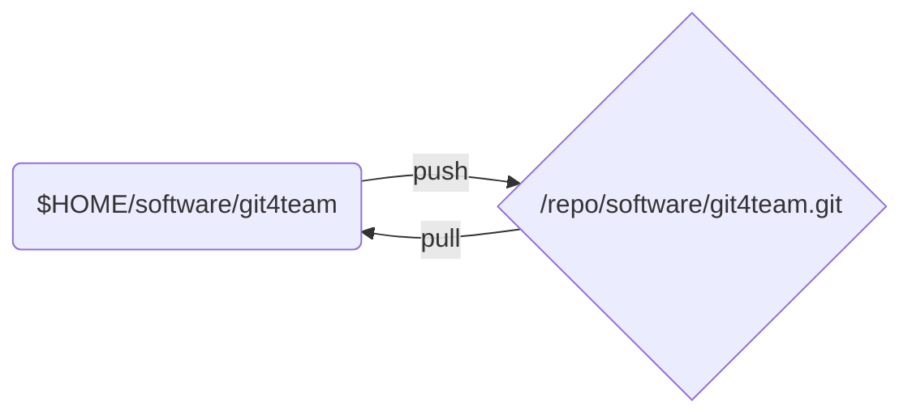

# 用 Git 进行小团队协同开发
本文说明一个以 Git 进行小团队开发的组织管理模板。模板以分布式方式进行管理。为了表述方便，我们假设一个项目的名称，以及参与项目开发及管理的成员名称。

- 项目的代号：git4team

* 项目的成员：
  * 老张 -- 团队领导，项目负责人（假设 IP 地址为：192.168.1.100）
  * 大李 -- 软件组组长，负责领导软件开发（假设 IP 地址为：192.168.1.101）
  * 小明 -- 软件组工程师（假设 IP 地址为：192.168.1.102）
  * 小芳 -- 软件组工程师（假设 IP 地址为：192.168.1.103）

预备知识：

* [Git 教程][git_book]

* [Git 守护进程][git_daemon] / [如何快速分享一个 Git 库][share_repo]
* [Git 的分支操作][git_branch]

## 源码的管理约定

- 原则上，不要在 `master` 分支下进行编码工作，而是将其他的工作分支上的代码和并入 `master` 分支；
- 一般情况下，项目组中的所有成员必须通过组长合并源代码；
- 每个人确定一个固定的虚拟 IP 地址，用于 Git 网络服务。参考[如何快速分享一个 Git 库][share_repo]；
- 每个人必须创建一个项目的工作库。建议在个人的根目录下，如 `~/git`；
- 每个人必须创建一个项目的裸库。建议这个裸库放在一个专门的分区之中，而这个分区以 `/repo` 作为挂载点；

下图是每个项目成员的源码管理布局：



## 项目领导对源码库管理工作

这里主要介绍老张的工作与操作。

* 创建项目的起始库；
* 为项目的 Release 版本打标签；

### 创建项目的起始库

**项目的起始库由公司的项目负责人创建**。老张的工作机上，至少有两个 git4team 项目相关的 Git 库：

老张首先创建自己的工作库：

``` shell
$ mkdir ~/git/software/git4team
$ cd ~/git/software/git4team
$ echo '这是 git4team 项目的源码库' > README.md
$ git init .
$ git add .
$ git commit -m 'initial commit of project git4team'
```

接着创建项目的裸库：

```shell
$ mkdir -p /repo/software
$ cd /repo/software
$ git clone --bare ~/git/sotfware/git4team
$ ls
git4team.git
```

返回工作库，设定工作库的源头：

```shell
$ cd ~/git/software/git4team
$ git remote add origin /repo/software/git4team.git
$ git remote -v														# 确认一下
origin	/repo/software/git4team.git (fetch)
origin	/repo/software/git4team.git (push)
```

设置了新的 remote 之后，必须将远程库的信息更新到工作库：

```shell
$ git fetch origin
```

并且将裸库的 `master` 分支，设定为工作库的上游分支：

```shell
$ git branch --set-upstream-to=origin/master master
Branch master set up to track remote branch master from origin.

$ git pull															# 确认一下
Already up-to-date.
```

准备好上述工作后，可以向对应的专业工作组发布网络 Git 服务。

### 启动 Git 协议网络服务

这里，我们采用 Git 自带的协议作为代码交换的网络协议。

老张准备好自己的工作库和裸库后，就可以将项目的裸库以 git 协议建立网络服务：

``` shell
$ git daemon --export-all \
             --enable=receive-pack \
             --base-path=/repo /repo
```

打开了网络 git 协议服务后，老张可以通知大李克隆项目。并且应该在大李克隆完之后，关闭 git 服务。这里，我们设置打开 git daemon 的 `receive-pack` 服务项，以便大李可以向老张以 `git push` 命令来提交代码。

## 专业小组的工作以组长的裸库为中心

各个专业组的组长全权负责对应的专业源码库维护工作。

* 以专项任务分支的形式，查看各个工程师的工作；
* 对各个开发节点打标签；
* 提出 Release 标签建议；

### 搭建专业组的源码库

每个专业组长，就是对应专业源码管理的核心。

首先大李需要从老张那里克隆项目的源头代码库：

```shell
$ mkdir -p ~/git/software
$ cd ~/git/software
$ git clone git://192.168.1.100:/software/git4team.git
```

这个时候，大李可以保持项目的远程库的名称 `origin` 不变。

```shell
$ cd ~/git/software/git4team
$ git remote -v
origin	git://192.168.1.100:/software/git4team.git (fetch)
origin	git://192.168.1.100:/software/git4team.git (push)
```

**大李需要创建自己的本地裸库**。实际上，每个专业组长的裸库，才是对应专业的源码中心。

```shell
$ mkdir -p /repo/software
$ git clone --bare ~/git/software/git4team
```

大李再在自己的工作库上增加一个名为 `local` 的远程库栏目，指向自己的本地裸库：

```shell
$ cd ~/git/software/git4team
$ git remote add local /repo/software/git4team.git
$ git remote -v
origin	git://192.168.1.100:/software/git4team.git (fetch)
origin	git://192.168.1.100:/software/git4team.git (push)
local	/repo/software/git4team.git (fetch)
local	/repo/software/git4team.git (push)
```

为着交换代码方便，大李可能还需要增加各个专业工程师的裸库，作为远程库。这个将在下一章中介绍。

### 发布专业小组的 git 网络服务

大李以自己的裸库为基础发布小组的 git 网络服务：

```shell
$ git daemon --export-all \
			 --disable=receive-pack \
             --base-path=/repo /repo
```

注意，这里设置了 `--disable=receive-pack` 服务选项，亦即这个 git 库是网络只读的。这个问题，将在下一章讲述。

大李的 git 网络服务假设好后，可以通知小组成员克隆他的裸库了。

## 如何用 Git 进行协同工作

专业组的工作，以组长的裸库为中心，有组长进行统一管理。这里先为以 git 为基础的协同工作做一些约定：

* 所有成员，都必须以相同的源码库配备进行工作。即，在 `$HOME/git` 目录下的工作库，以及在 `/repo` 目录下的裸库；
* 除项目负责人外，小组所有成员的 git 网络服务设置为只读，即 `--disable=receive-pack` ；
* 永远不用 `master` 分支进行编码、测试等工作，保证 `master` 总是用于代码的整合；
* 所有不同性质的工作应该放在不同的分支中进行；
* 以专业组长的裸库的 `master` 分支，作为整个专业组开发工作的同步基准；
* 原则上，代码的合并有组长负责。各个分部责任工程师之间，不进行代码的合并；

下面我们以一个分部功能的开放来说明如何协同工作。

### 总是在分部开发分支上编码

我们以项目组的软件工程师小明为例，他接到大李的通知之后，克隆大李的裸库，并且也按照上述的约定在自己的工作机上配备好了自己的工作库和裸库。

小明克隆大李的裸库：

```shell
$ cd ~/git/software/
$ git clone git://192.168.1.101:/software/git4team.git				# 大李的裸库地址
```

默认地，git 库将克隆的远程库命名为 `origin` 。为了避免混乱，小明应该将它重命名：

```shell
$ cd ~/git/software/git4team
$ git remote rename origin dali								# 以大李（dali）来命名
$ git remote -v
dali	git://192.168.1.101:/software/git4team.git (fetch)
dali	git://192.168.1.101:/software/git4team.git (push)
$ git branch
* master
$ git branch --set-upstream-to=dali/master			# 重新定向 master 分支的上游分支
```

按照约定，小明也应该创建一个自己的本地裸库 `/repo/software/git4team.git` 。

并且，创建一个指向自己裸库的远程库名，按照约定统一命名为 `local` 。

```shell
$ git remote add local /repo/software/git4team.git
$ git remote -v
dali	git://192.168.1.101:/software/git4team.git (fetch)
dali	git://192.168.1.101:/software/git4team.git (push)
local	/repo/software/git4team.git (fetch)
local	/repo/software/git4team.git (push)
```

假设，小明现在负责实现软件的一个图像渲染功能。此时，小明应该创建一个以 `master` 分支为起点的，专门的分支来进行图像渲染的开发，并且大李和小明约定这个分支名叫 `image_rendering`：

```shell
$ cd ~/git/software/git4team
$ git branch
* master
$ git checkout -b image_rendering
$ git branch
* image_rendering
  master
```

小明可以将这个分支 `poush` 到本地裸库 `local` 上：

``` shell
$ git push local image_rendering
Total 0 (delta 0), reused 0 (delta 0)
To /repo/software/git4team.git
 * [new branch]      image_rendering -> image_rendering 
```

此时小明的裸库上，同样有了一个叫 `image_rendering` 的分支。小明可以随时利用这个分支来备份工作：

```shell
$ git branch
* image_rendering
$ git push local image_rendering
```

> 今后，当小明认为已经不需要 `local` 上的 `image_rendering` 分支时，可以通过以下的命令将它删除：
>
> ``` shell
> $ git push local --delete image_rendering
> ```

至此，小明可以在这个 `image_rendering` 分支上，持续工作达到满意的效果后，他可以打开 git 网络服务，与大李交换代码。

### 代码的交换与合并

代码的查阅与合并，是各个专业组长的责任。

当大李被小明告知可以接收图像渲染的代码后，他应该首先抓取小明的这部分代码进行审查：

```shell
$ cd ~/git/software/git4team
$ git remote add xiaoming git://192.168.1.102:/software/git4team.git
$ git fetch xiaoming image_rendering				# 将小明的裸库中的分支，抓取到本地工作库
From git://192.168.1.108:/software/git4team
 * branch            image_rendering -> FETCH_HEAD
 * [new branch]      image_rendering -> xiaoming/image_rendering
```

此时，在本地取出小明的图像渲染分支的代码，进行审核：

```shell
$ git checkout -b xiaoming_image_rendering xiaoming/image_rendering
Branch 'xiaoming_image_rendering' set up to track remote branch 'image_rendering' from 'xiaoming'.
Switched to a new branch 'xiaoming_image_rendering'

$ git branch
  master
* xiaoming_image_rendering
```

大李对小明的工作审核无误后，可以将小明的工作合并进项目的主分支：

```shell
$ git checkout master
$ git merge xiaoming_image_rendering
$ git push local master						# 记得更新裸库
```

### 代码的全局协同

大李对整个专业小组的工作进行整合后，可以向老张汇报项目的源码：

```shell
$ git checkout master
$ git push -u origin master
```

> **注意**：此处的参数 `-u` 指示老张的主分支才是上游分支，如果老张的主分支存在与大李不同的内容，命令会提示首先更新合并上游分支的内容。

小明和小芳也可以拉入大李的主分支，并且合并到合适的分支上，开始新的工作：

```shell
$ git checkout master
$ git pull
$ git push local master						# 将项目组的其他人的工作，更新到本地裸库
```

如果小明还需要进行图像渲染的其他工作，那么：

```shell
$ git checkout image_rendering
$ git merge master
```

至此，专业小组的完成了一个轮次的协同工作。

## 思考题

* `git pull` 与 `git fetch` 两个命令的区别？
* `git merge` 与 `git-rebase` 两个命令的区别？

## 参考资料

[git_book]:  https://git-scm.com/book/zh/v2	"Git 中文教程"
[git_daemon]: https://git-scm.com/docs/git-daemon)    "Git daemon 文档"
[share_repo]: ./quickly_sharing_a_git_repo.md   "快速分享一个 git 库"
[git_branch]: https://git-scm.com/book/en/v2/Git-Branching-Remote-Branches  "Git 分支管理"
