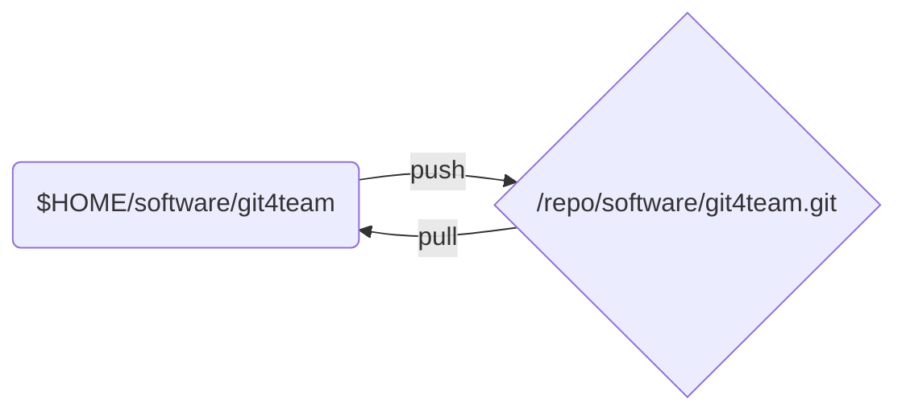

# 用 Git 进行小团队合作开发
本文说明一个以 Git 进行小团队开发的组织管理模板。模板以分布式方式进行管理。

为了表述方便，我们假设一个项目的名称，以及参与项目开发及管理的成员名称。

- 项目的代号：git4team

* 项目的成员：
  * 老张 -- 团队领导，项目负责人（假设 IP 地址为：192.168.1.100）
  * 大李 -- 软件组组长，负责领导软件开发（假设 IP 地址为：192.168.1.101）
  * 小明 -- 软件组工程师（假设 IP 地址为：192.168.1.102）
  * 小芳 -- 软件组工程师（假设 IP 地址为：192.168.1.103）

## 源码的管理约定

- **参与项目的所有成员，永远只用自己本地的裸库的 `master` 分支与外界交换源码**；
- 一般情况下，项目组中的所有成员必须通过组长合并源代码；
- 每个人确定一个固定的虚拟 IP 地址，用于 Git 网络服务。参考[如何快速分享一个 Git 库](./quickly_sharing_a_git_repo.md)；
- 每个人必须创建一个项目的工作库。建议在个人的根目录下，如 `~/git`；
- 每个人必须创建一个项目的裸库。建议这个裸库放在一个专门的分区之中，而这个分区以 `/repo` 作为挂载点；

下图是每个项目成员的源码管理布局：



## 项目领导对源码库管理工作

这里主要介绍大李的工作与操作。

* 创建项目的起始库；
* 为项目的 Release 版本打标签；

### 创建项目的起始库

**项目的起始库由公司的项目负责人创建**。老张的工作机上，至少有两个 git4team 项目相关的 Git 库：

老张首先创建自己的工作库：

``` shell
$ mkdir ~/git/sotfware/git4team
$ cd ~/git/sotfware/git4team
$ echo '这是 git4team 项目的源码库' > README.md
$ git init .
$ git add .
$ git commit -m 'initial commit of project git4team'
```

## 各个专业组长对源码库的管理工作

* 以专项任务分支的形式，查看各个工程师的工作；