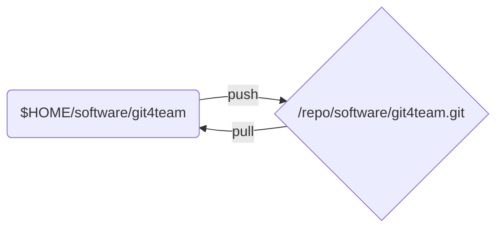

# 用 Git 进行小团队合作开发
本文说明一个以 Git 进行小团队开发的组织管理模板。模板以分布式方式进行管理。

为了表述方便，我们假设一个项目的名称，以及参与项目开发及管理的成员名称。

- 项目的代号：git4team

* 项目的成员：
  * 老张 -- 团队领导，项目负责人（假设 IP 地址为：192.168.1.100）
  * 大李 -- 软件组组长，负责领导软件开发（假设 IP 地址为：192.168.1.101）
  * 小明 -- 软件组工程师（假设 IP 地址为：192.168.1.102）
  * 小芳 -- 软件组工程师（假设 IP 地址为：192.168.1.103）

## 源码的管理约定

- 原则上，不要在 `master` 分支下进行编码工作，而是将其他的工作分支上的代码和并入 `master` 分支；
- 一般情况下，项目组中的所有成员必须通过组长合并源代码；
- 每个人确定一个固定的虚拟 IP 地址，用于 Git 网络服务。参考[如何快速分享一个 Git 库](./quickly_sharing_a_git_repo.md)；
- 每个人必须创建一个项目的工作库。建议在个人的根目录下，如 `~/git`；
- 每个人必须创建一个项目的裸库。建议这个裸库放在一个专门的分区之中，而这个分区以 `/repo` 作为挂载点；

下图是每个项目成员的源码管理布局：



## 项目领导对源码库管理工作

这里主要介绍大李的工作与操作。

* 创建项目的起始库；
* 为项目的 Release 版本打标签；

### 创建项目的起始库

**项目的起始库由公司的项目负责人创建**。老张的工作机上，至少有两个 git4team 项目相关的 Git 库：

老张首先创建自己的工作库：

``` shell
$ mkdir ~/git/software/git4team
$ cd ~/git/software/git4team
$ echo '这是 git4team 项目的源码库' > README.md
$ git init .
$ git add .
$ git commit -m 'initial commit of project git4team'
```

接着创建项目的裸库：

```shell
$ mkdir -p /repo/software
$ cd /repo/software
$ git clone --bare ~/git/sotfware/git4team
$ ls
git4team.git
```

返回工作库，设定工作库的源头：

```shell
$ cd ~/git/software/git4team
$ git remote add origin /repo/software/git4team.git
$ git remote -v														# 确认一下
origin	/repo/software/git4team.git (fetch)
origin	/repo/software/git4team.git (push)
```

并且将裸库的 `master` 分支，设定为工作库的上游分支：

```shell
$ git branch --set-upstream-to=origin/master master
Branch master set up to track remote branch master from origin.
$ git pull															# 确认一下
Already up-to-date.
```

准备好上述工作后，可以向对应的专业工作组发布网络 Git 服务。

### 启动 Git 协议网络服务

这里，我们采用 Git 自带的协议作为代码交换的网络协议。

老张准备好自己的工作库和裸库后，就可以将项目的裸库以 git 协议建立网络服务：

``` shell
$ git daemon --export-all \
             --enable=receive-pack \
             --base-path=/repo /repo
```

打开了网络 git 协议服务后，老张可以通知大李克隆项目。并且应该在大李克隆完之后，关闭 git 服务。

## 专业组长对源码库的管理工作

各个专业组的组长全权负责对应的专业源码库维护工作。

* 以专项任务分支的形式，查看各个工程师的工作；
* 对各个开发节点打标签；
* 提出 Release 标签建议；